<div align="center">

<h3>Universidad Peruana de Ciencias Aplicadas</h3>

<br>

<strong>Ingeniería de Software - 202602</strong><br>
<strong>1ASI0728 - Arquitecturas De Software Emergentes - Virtual</strong><br>
<strong>Sección: 2620-9046</strong><br>
<strong>Profesores:Rojas Malásquez, Royer Edelwer</strong><br>

<br><strong>Informe del Trabajo Final</strong><br><br>

<strong>Startup: LatiFi</strong><br>
<strong>Producto: LatiFi Wallet</strong><br>

### Team Members

| Apellidos y Nombres | Código |
|---|---|
| Angulo Abud Juan Carlos | U202317692 |
| Quiroz Zambrano Fabrizio Javier | U202213406 |
| Burga Loarte Anaely | U202118264 |
| Vilca Valverde Fiorella Angela | U20211e417 |

<strong>16 de septiembre de 2026</strong><br>
</div>
<div style="page-break-after: always;"></div>

# Registro de Versiones del Informe

| Versión | Fecha | Autor | Descripción de modificación |
|---|---|---|---|
| 1.0 | 16/09/2026 | Juan Angulo | Creación del repositorio e inicialización del informe. Redacción del avance de TB1 con los Capítulos I a IV, datos del curso y primer perfil de integrante. |
| 1.1 | 19/09/2026 | Fabrizio Quiroz | Registro de la entrevista 1 del segmento prestatario, User Persona y Empathy Map del prestatario, y estructura inicial de Student Outcome 3. |
| 1.2 | 19/09/2026 | Anaely Burga | Nombres de integrantes, As-Is y To-Be Scenario Mapping, y diagramas de EventStorming, Domain Storytelling, Bounded Context Canvases y Context Map del Capítulo IV. |
| 1.3 | 19/09/2026 | Fiorella Vilca | Entrevista 1 del segmento prestamista, User Persona, User Task Matrix y Empathy Map del prestamista, y perfil de integrante. |
| 1.4 | 19/09/2026 | Juan Angulo | Rediseño de la carátula, revisión de estilo y de cumplimiento del enunciado, entradas de Student Outcome 3, integración de los aportes de Fiorella Vilca, Registro de Versiones y Avance de Conclusiones. |
| 1.5 | 04/10/2026 | Fabrizio Quiroz | Registro de las entrevistas 2 y 3 del segmento prestatario con sus capturas. |
| 1.6 | 08/10/2026 | Juan Angulo | Análisis de entrevistas (2.2.3), System Landscape y Deployment Diagram del Capítulo IV, ajuste a Android como única plataforma móvil, actualización del Avance de Conclusiones, capturas de Collaboration Insights, Anexo de Videos de Exposiciones y foto de Juan Angulo en el perfil de integrante. |
| 1.7 | 04/10/2026 | Fabrizio Quiroz | Style Guidelines (6.1) y Navigation Systems (6.2.5) del Capítulo VI (avance de TP1). |
| 1.8 | 08/10/2026 | Juan Angulo | Labeling Systems, Searching Systems y SEO Tags and Meta Tags (6.2.2 a 6.2.4) del Capítulo VI (avance de TP1). |
| 1.9 | 08/10/2026 | Juan Angulo | Organization Systems (6.2.1) del Capítulo VI (avance de TP1). |
| 2.0 | 08/10/2026 | Anaely Burga | Landing Page Mock-up (6.3.2), con las tres secciones de la landing page (avance de TP1). |
| 2.1 | 08/10/2026 | Anaely Burga | Landing Page Wireframe (6.3.1), con la distribución de las tres secciones de la landing page (avance de TP1). |
| 2.2 | 09/10/2026 | Juan Angulo | Capítulo V completo: diseño táctico de los cinco bounded contexts, con diccionario de clases por capa, diagramas de componentes C4, diagramas de clases y esquemas de base de datos. |

# Project Report Collaboration Insights

URL del repositorio: https://github.com/Arquitectura-de-Softwares-Emergentes/latifi-report

El Project Report se redacta en Markdown, con `README.md` como archivo principal, dentro de un repositorio público de la organización del equipo en GitHub. El equipo aplica GitFlow: `develop` concentra la integración del informe, `main` recibe las versiones entregables y cada integrante avanza sus secciones en ramas propias que se integran mediante pull requests. Los mensajes de commit siguen la convención Conventional Commits, y el PDF de cada entrega se genera a partir de este repositorio.

**TB1.** Juan Angulo redactó el avance de los Capítulos I a IV y mantiene el flujo de ramas. Fabrizio Quiroz registró las entrevistas 1, 2 y 3 del segmento prestatario y elaboró su User Persona y su Empathy Map. Anaely Burga elaboró los As-Is y To-Be Scenario Mapping y los diagramas de dominio del Capítulo IV. Fiorella Vilca registró la entrevista del segmento prestamista y elaboró su User Persona, el User Task Matrix y el Empathy Map correspondiente. Cada aporte queda registrado por commit y es coherente con el Registro de Versiones.

**TP1.** Fabrizio Quiroz redactó las Style Guidelines (6.1) y los Navigation Systems (6.2.5). Juan Angulo elaboró el Capítulo V completo y los Organization Systems, Labeling Systems, Searching Systems y SEO Tags and Meta Tags (6.2.1 a 6.2.4). Anaely Burga elaboró el Wireframe y el Mock-up de la landing page (6.3). Cada aporte queda registrado por commit y es coherente con el Registro de Versiones.

Las capturas siguientes muestran los analíticos del repositorio del informe en GitHub al 8 de octubre de 2026. En ellas aparecen los cuatro integrantes del equipo como contribuidores: Sve-nnN (Juan Angulo), Relycloud (Fabrizio Quiroz), userxx1000 (Anaely Burga) y fiore-prac (Fiorella Vilca).

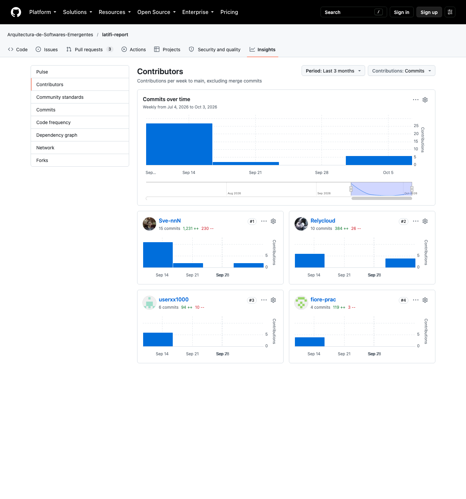

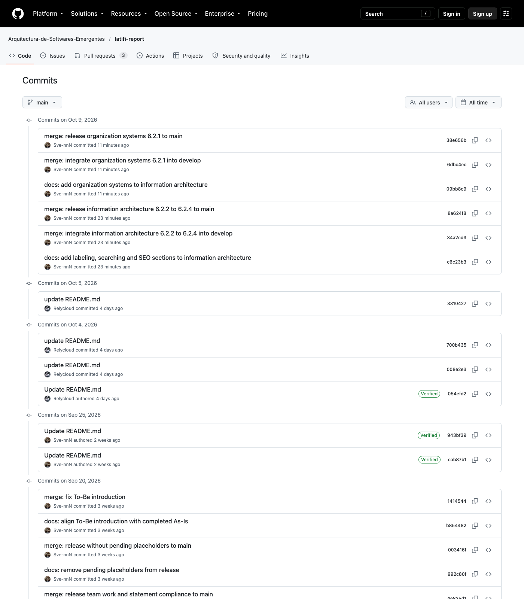

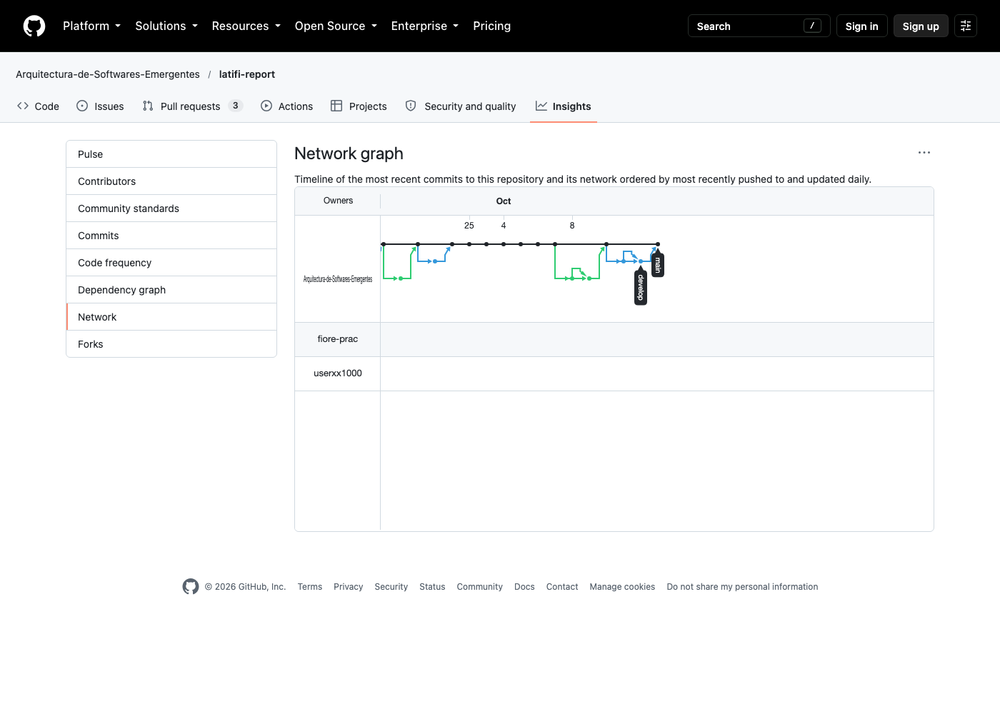

<div style="page-break-after: always;"></div>

# Contenido

- [Registro de Versiones del Informe](#registro-de-versiones-del-informe)
- [Project Report Collaboration Insights](#project-report-collaboration-insights)
- [Student Outcome](#student-outcome)
- [Capítulo I: Introducción](#capítulo-i-introducción)
  - [1.1. Startup Profile](#11-startup-profile)
    - [1.1.1. Descripción de la Startup](#111-descripción-de-la-startup)
    - [1.1.2. Perfiles de integrantes del equipo](#112-perfiles-de-integrantes-del-equipo)
  - [1.2. Solution Profile](#12-solution-profile)
    - [1.2.1. Antecedentes y problemática](#121-antecedentes-y-problemática)
    - [1.2.2. Lean UX Process](#122-lean-ux-process)
  - [1.3. Segmentos objetivo](#13-segmentos-objetivo)
    - [Segmento 1: Prestatario, Emprendedor o Independiente No Bancarizado (segmento principal)](#segmento-1-prestatario-emprendedor-o-independiente-no-bancarizado-segmento-principal)
    - [Segmento 2: Prestamista, Persona con Capital Ocioso (segmento secundario, lado de la oferta)](#segmento-2-prestamista-persona-con-capital-ocioso-segmento-secundario-lado-de-la-oferta)
- [Capítulo II: Requirements Elicitation & Analysis](#capítulo-ii-requirements-elicitation--analysis)
  - [2.1. Competidores](#21-competidores)
    - [2.1.1. Análisis competitivo](#211-análisis-competitivo)
    - [2.1.2. Estrategias y tácticas frente a competidores](#212-estrategias-y-tácticas-frente-a-competidores)
  - [2.2. Entrevistas](#22-entrevistas)
    - [2.2.1. Diseño de entrevistas](#221-diseño-de-entrevistas)
    - [2.2.2. Registro de entrevistas](#222-registro-de-entrevistas)
    - [2.2.3. Análisis de entrevistas](#223-análisis-de-entrevistas)
  - [2.3. Needfinding](#23-needfinding)
    - [2.3.1. User Personas](#231-user-personas)
    - [2.3.2. User Task Matrix](#232-user-task-matrix)
    - [2.3.3. Empathy Mapping](#233-empathy-mapping)
    - [2.3.4. As-is Scenario Mapping](#234-as-is-scenario-mapping)
  - [2.4. Ubiquitous Language](#24-ubiquitous-language)
- [Capítulo III: Requirements Specification](#capítulo-iii-requirements-specification)
  - [3.1. To-Be Scenario Mapping](#31-to-be-scenario-mapping)
    - [Carriles de Arquitectura / Capas (Swimlanes / Bounded Context Layers)](#carriles-de-arquitectura--capas-swimlanes--bounded-context-layers)
    - [Descripción Secuencial del Flujo (TO-BE Steps)](#descripción-secuencial-del-flujo-to-be-steps)
    - [Ventajas Clave / Mejora frente al AS-IS (Value Proposition)](#ventajas-clave--mejora-frente-al-as-is-value-proposition)
    - [Tabla Comparativa Resumen: AS-IS vs. TO-BE](#tabla-comparativa-resumen-as-is-vs-to-be)
  - [3.2. User Stories](#32-user-stories)
  - [3.3. Impact Mapping](#33-impact-mapping)
  - [3.4. Product Backlog](#34-product-backlog)
- [Capítulo IV: Strategic-Level Software Design](#capítulo-iv-strategic-level-software-design)
  - [4.1. Strategic-Level Attribute-Driven Design](#41-strategic-level-attribute-driven-design)
    - [Design Purpose](#design-purpose)
    - [Attribute-Driven Design Inputs](#attribute-driven-design-inputs)
    - [Architectural Design Decisions](#architectural-design-decisions)
    - [Quality Attribute Scenario Refinements](#quality-attribute-scenario-refinements)
  - [4.2. Strategic-Level Domain-Driven Design](#42-strategic-level-domain-driven-design)
    - [Bounded Contexts](#bounded-contexts)
    - [EventStorming](#eventstorming)
    - [Candidate Context Discovery](#candidate-context-discovery)
    - [Domain Message Flows Modeling](#domain-message-flows-modeling)
    - [Bounded Context Canvases](#bounded-context-canvases)
    - [Context Mapping](#context-mapping)
    - [Software Architecture](#software-architecture)
- [Capítulo V: Tactical-Level Software Design](#capítulo-v-tactical-level-software-design)
  - [5.1. Bounded Context: Lending](#51-bounded-context-lending)
  - [5.2. Bounded Context: Identity/Wallet](#52-bounded-context-identitywallet)
  - [5.3. Bounded Context: Reputation](#53-bounded-context-reputation)
  - [5.4. Bounded Context: Exchange Rate](#54-bounded-context-exchange-rate)
  - [5.5. Bounded Context: Marketing/Landing](#55-bounded-context-marketinglanding)
- [Capítulo VI: Solution UX Design](#capítulo-vi-solution-ux-design)
  - [6.1. Style Guidelines](#61-style-guidelines)
    - [6.1.1. General Style Guidelines](#611-general-style-guidelines)
    - [6.1.2. Web, Mobile & Devices Style Guidelines](#612-web-mobile--devices-style-guidelines)
  - [6.2. Information Architecture](#62-information-architecture)
    - [6.2.1. Organization Systems](#621-organization-systems)
    - [6.2.2. Labeling Systems](#622-labeling-systems)
    - [6.2.3. Searching Systems](#623-searching-systems)
    - [6.2.4. SEO Tags and Meta Tags](#624-seo-tags-and-meta-tags)
    - [6.2.5. Navigation Systems](#625-navigation-systems)
  - [6.3. Landing Page UI Design](#63-landing-page-ui-design)
    - [6.3.1. Landing Page Wireframe](#631-landing-page-wireframe)
    - [6.3.2. Landing Page Mock-up](#632-landing-page-mock-up)
- [Avance de Conclusiones](#avance-de-conclusiones)
- [Bibliografía](#bibliografía)
- [Anexos](#anexos)
  - [Anexo A. Videos de Exposiciones](#anexo-a-videos-de-exposiciones)

<div style="page-break-after: always;"></div>

# Student Outcome

El curso contribuye al cumplimiento del Student Outcome ABET:

**ABET – EAC - Student Outcome 3**

Criterio: Capacidad de comunicarse efectivamente con un rango de audiencias.

En el siguiente cuadro se describe las acciones realizadas y enunciados de conclusiones por parte del grupo, que permiten sustentar el haber alcanzado el logro del ABET – EAC - Student Outcome 3.

| Criterio específico | Acciones realizadas | Conclusiones                                                                                                                                                                                                                                                                                                                                                               |
|---|---|----------------------------------------------------------------------------------------------------------------------------------------------------------------------------------------------------------------------------------------------------------------------------------------------------------------------------------------------------------------------------|
| **Comunica oralmente sus ideas y/o resultados con objetividad a público de diferentes especialidades y niveles jerárquicos, en el marco del desarrollo de un proyecto en ingeniería.** | Quiroz Zambrano, Fabrizio Javier<br>*TB1*<br>Contribuí a la preparación y exposición oral de la parte correspondiente del proyecto, comunicando de forma clara y objetiva los resultados obtenidos ante un público con distintos niveles de familiaridad con el tema, adaptando el lenguaje técnico según la audiencia.<br><br>Angulo, Juan Carlos<br>*TB1*<br>*Expuse el problema que motiva a LatiFi y la solución que el equipo propone: la dificultad de los emprendedores no bancarizados para acceder a un microcrédito y cómo una billetera con préstamos sobre blockchain reduce esa barrera. Adapté el nivel de detalle técnico al público, usando ejemplos cotidianos con quienes no conocen blockchain y términos más precisos con quienes sí.*<br><br>Burga Loarte, Anaely<br>*TB1*<br>*Presenté y defendí de manera síncrona la arquitectura de dominios, el mapeo estratégico y los flujos asíncronos on-chain/off-chain de LatiFi frente al equipo de proyecto, traduciendo diagramas de EventStorming y acoplamientos (U/D ACL, Conformist) a lenguaje de negocio para evaluadores técnicos y de producto.* | Quiroz Zambrano, Fabrizio Javier<br>*TB1*<br> La exposición oral me permitió reforzar mi capacidad de transmitir resultados de forma clara y objetiva a audiencias diversas, ajustando el nivel de detalle técnico según el público.<br><br>Angulo, Juan Carlos<br>*Exponer el problema completo me obligó a explicarlo con claridad y sin rodeos, y a reconocer qué conceptos de blockchain necesitan más contexto según quién escucha. Concluyo que comunicar bien el porqué de la solución es tan importante como describir cómo funciona.*<br><br>Burga Loarte, Anaely<br>*Sustentar la topología de Bounded Contexts y los flujos cross-boundary permitió alinear la visión táctica/estratégica del equipo, validando que las restricciones Web3 (Polygon Amoy) se comuniquen sin ruido conceptual a perfiles no especializados en blockchain* |
| **Comunica en forma escrita ideas y/o resultados con objetividad a público de diferentes especialidades y niveles jerárquicos, en el marco del desarrollo de un proyecto en ingeniería.** | Quiroz Zambrano, Fabrizio Javier<br>*TB1*<br>Participé en la redacción de secciones del informe TB1, cuidando que el contenido fuera claro, objetivo y comprensible para lectores con diferentes niveles de conocimiento técnico del proyecto.<br><br>Angulo, Juan Carlos<br>*TB1*<br>*Redacté las secciones del informe que me correspondieron: Startup Profile, Solution Profile con el proceso Lean UX, segmentos objetivo, análisis de competidores y diseño de entrevistas. Escribí cada apartado para que lo entienda tanto un lector técnico como uno de negocio, y mantuve el repositorio con GitFlow para que los aportes del equipo queden ordenados y trazables.*<br><br>Burga Loarte, Anaely<br>*TB1*<br>*Redacté y estructuré formalmente en Markdown los apartados del Capítulo IV (arquitectura de dominio, modelado estratégico/táctico, justificación start-with-value de los 5 bounded contexts y especificación de flujos de mensajes), integrando especificaciones técnicas rigurosas legibles por perfiles de ingeniería y stakeholders.* | Quiroz Zambrano, Fabrizio Javier<br>*TB1*<br>La redacción de estas secciones contribuyó a fortalecer mi habilidad de comunicar resultados por escrito de manera clara y objetiva, adaptando el lenguaje a distintos tipos de lector.<br><br>Angulo, Juan Carlos<br>*Redactar mi parte del informe me mostró que un documento técnico funciona cuando cada afirmación se sustenta y el lenguaje se ajusta al lector. Concluyo que una redacción ordenada y consistente facilita que el equipo y los evaluadores sigan el razonamiento del proyecto.*<br><br>Burga Loarte, Anaely<br>*La estructuración del documento técnico con rigor formal consolidó la trazabilidad entre los drivers de arquitectura (DR-01) y la modelación de dominios, facilitando la auditoría y replicabilidad del diseño del sistema LatiFi.* |
<div style="page-break-after: always;"></div>

## Capítulo I: Introducción

### 1.1. Startup Profile

#### 1.1.1. Descripción de la Startup

LatiFi es una startup peruana de base tecnológica orientada a cerrar la brecha de acceso al crédito que enfrentan los emprendedores e independientes no bancarizados de la región, mediante una plataforma de microcréditos peer-to-peer (P2P) construida sobre tecnología blockchain. A diferencia de una fintech de crédito tradicional, LatiFi no actúa como intermediario financiero centralizado: conecta directamente a prestamistas con capital ocioso y prestatarios sin historial crediticio formal a través de Smart Contracts desplegados en una red pública, de modo que las condiciones del préstamo (monto, tasa de interés, plazo, liberación de fondos) se ejecutan de forma automática e inmutable, sin que LatiFi custodie el dinero ni las llaves privadas de sus usuarios en ningún momento del proceso.

El producto insignia de LatiFi es LatiFi Wallet, una aplicación móvil nativa que permite a un prestatario publicar una solicitud de préstamo en una stablecoin y a un prestamista revisar esa solicitud junto con la reputación on-chain y off-chain del solicitante antes de decidir si la fondea. La plataforma se completa con LatiFi API, un backend propio que no participa en la lógica de otorgamiento ni cobro del préstamo, ya que esa responsabilidad vive exclusivamente en el Smart Contract, pero que sí gestiona el perfil ligero del usuario, el historial de reputación y la conversión del monto del préstamo a moneda local, de forma que un prestatario que nunca ha usado criptomonedas pueda entender cuánto debe y cuánto le prestan en soles y no solo en una unidad de stablecoin. Un Landing Page institucional explica el modelo de negocio y dirige a ambos segmentos hacia la descarga de la aplicación.

La motivación de LatiFi nace de una observación simple: la banca tradicional evalúa el riesgo de un solicitante a partir de historial crediticio formal, planillas y garantías, lo que excluye por diseño a quien trabaja de manera informal o independiente, aun cuando esa persona pague puntualmente sus compromisos cotidianos. LatiFi reemplaza esa exigencia por un modelo de reputación que combina el comportamiento de repago verificable en la blockchain con señales complementarias registradas en su propio backend, sin exigir colateral bloqueado como sí lo hacen los protocolos DeFi de sobrecolateralización, que por definición excluyen a quien no tiene activos cripto que dejar en garantía.

El alcance de LatiFi en este informe es acotado: se trata del proyecto final del curso SI728 Arquitecturas de Software Emergentes de la UPC, por lo que no existe un modelo de ingresos real ni manejo de dinero efectivo. Todo el flujo de solicitud, fondeo, ejecución del Smart Contract, repago y actualización de reputación se demuestra de principio a fin sobre la testnet Polygon Amoy, utilizando una stablecoin de prueba sin valor monetario real. El objetivo del equipo no es validar la viabilidad comercial de LatiFi como negocio, sino demostrar competencias de arquitectura de software emergente, es decir, Domain-Driven Design estratégico y táctico, diagramas C4, Lean UX y prácticas ágiles, aplicadas a un dominio de producto con problemática real y verificable.

#### 1.1.2. Perfiles de integrantes del equipo

| Miembro | Descripción|
|---|---|
| <br>**Angulo, Juan Carlos - U202317692** | Estudiante de Ingeniería de Software en séptimo ciclo. Le apasiona aprender tecnologías nuevas y construir soluciones aplicadas a problemas reales, y en este curso le entusiasma especialmente trabajar con blockchain. |
| **Quiroz Zambrano, Fabrizio Javier - U202213406** | Estudiante de Ingeniería de Software, con interés en el desarrollo de aplicaciones móviles y en arquitectura de software. Contribuye al proyecto en el desarrollo técnico y la documentación del informe. |
| **Burga Loarte, Anaely - U202118264** | Estudiante de Ingeniería de Software enfocado en la experiencia de usuario y la lógica de negocio en la interfaz. Contribuye en la interfaz de usuario y la coordinación general de la app. |
| **Vilca Valverde, Fiorella Angela - U20211e417** | Estudiante de Ingeniería de Software, con interés en el análisis de datos. Contribuye al proyecto en el desarrollo técnico y la documentación del informe. |

### 1.2. Solution Profile

#### 1.2.1. Antecedentes y problemática

##### Antecedentes

El acceso al crédito formal en el Perú continúa siendo un privilegio de quien ya está dentro del sistema financiero. Según cifras de inclusión financiera elaboradas a partir de datos del INEI y el BCRP, en el segundo trimestre de 2025 el 61.6% de la población adulta contaba con al menos una cuenta en el sistema financiero (ahorro, sueldo, corriente o plazo fijo), un avance de 2.4 puntos porcentuales respecto al mismo trimestre de 2024 (Gan@Más, 2025). Ese mismo dato, leído en negativo, significa que cerca de cuatro de cada diez peruanos permanece fuera del sistema financiero formal (Gestión/INEI, s.f.), y la brecha se agrava fuertemente por zona geográfica: mientras el 65.5% de la población adulta urbana tiene acceso a una cuenta, en el ámbito rural la cifra cae a 41.8% (Gan@Más, 2025). El Global Findex 2025 del Banco Mundial, que encuestó a más de 145,000 adultos en 141 economías durante 2024, confirma la magnitud del problema a escala global: 1,300 millones de adultos en el mundo aún no tienen una cuenta financiera, aunque el reporte no permite aislar con precisión la cifra específica de no bancarizados para Perú a partir de las fuentes consultadas para este informe (World Bank Global Findex, 2025).

Este vacío de acceso convive con un mercado laboral donde la informalidad es la norma, no la excepción. De acuerdo con la Encuesta Permanente de Empleo Nacional del INEI, entre abril de 2024 y marzo de 2025 el 70.7% de la población ocupada del país tenía un empleo informal (INEI, 2025), y el 45% de los ocupados corresponde a trabajadores independientes o familiares no remunerados, proporción que sube a 50.2% entre las mujeres (INEI, 2025). Dentro del universo empresarial, el desajuste es todavía más marcado: según ComexPerú, en el Perú operan 6.1 millones de micro y pequeñas empresas, el 99.7% del total de empresas del país, de las cuales el 86.8% no está registrada ante la SUNAT (ComexPerú, 2024), lo que las deja, en la práctica, sin historial tributario ni bancario que un evaluador de crédito tradicional pueda revisar. Es precisamente este universo de emprendedores e independientes, con ingresos reales pero sin el papel que un banco exige, el que LatiFi busca atender.

Una población amplia sin acceso al crédito formal, un mercado laboral mayoritariamente informal y una adopción cripto que ya empieza a pesar: sobre esos tres puntos LatiFi construye su propuesta. Perú superó el millón de usuarios de criptomonedas y escaló al puesto 42 del ranking mundial de adopción cripto según el Global Crypto Adoption Index 2024 de Chainalysis, avanzando al puesto 34 en la edición 2025 (Infobae, 2025); el 3.7% de los peruanos ya utiliza criptomonedas (Infobae, 2025), y a nivel regional las stablecoins concentran cerca del 90% del volumen de transacciones cripto, con los usuarios peruanos inclinándose de forma particular hacia stablecoins denominadas en dólares (Forbes Perú, 2026).

##### Aplicación de la técnica 5W + 2H

| Pregunta | Respuesta |
|--|--|
| **Who** <br> (¿Quién?) | Emprendedores e independientes no bancarizados del Perú que necesitan un microcrédito para su actividad económica, y personas con capital ocioso dispuestas a prestarlo bajo un modelo P2P sin intermediario bancario. |
| **What** <br> (¿Qué?) | Ausencia de un mecanismo de crédito accesible para quien no tiene historial crediticio formal ni activos que dejar en garantía, dado que la banca tradicional exige planilla, historial en centrales de riesgo o colateral, y los protocolos DeFi existentes exigen sobrecolateralización que este segmento no puede cumplir. |
| **Where** <br> (¿Dónde?) | Perú, con foco inicial en emprendedores e independientes urbanos y periurbanos que ya cuentan con un teléfono inteligente, dado que la brecha de inclusión financiera es más aguda en zonas rurales (41.8% de acceso a cuenta financiera) que en zonas urbanas (65.5%) (Gan@Más, 2025). |
| **When** <br> (¿Cuándo?) | El problema es estructural y persiste pese a la mejora reciente en indicadores de inclusión financiera: la tasa de informalidad laboral solo cayó poco más de tres puntos porcentuales entre 2022 y 2024-2025 (INEI, 2025), mientras que la adopción de criptoactivos en el país crece de forma acelerada en el mismo periodo (Infobae, 2025). |
| **Why** <br> (¿Por qué?) | Porque el modelo de evaluación crediticia tradicional está diseñado para quien ya tiene historial formal, excluyendo por defecto a quien trabaja de manera independiente o informal aunque cumpla puntualmente sus compromisos de pago, y porque las alternativas DeFi de crédito descentralizado existentes (Aave, Compound) exigen colateral bloqueado que este segmento, por definición, no posee. |
| **How** <br> (¿Cómo?) | A través de una app móvil nativa (LatiFi Wallet) que conecta al prestatario con prestamistas P2P mediante un Smart Contract que ejecuta de forma inmutable el fondeo y el repago del préstamo, respaldado por un modelo de reputación híbrido on-chain/off-chain gestionado por un backend propio (LatiFi API) que también expone el monto del préstamo en moneda local. |
| **How Much** <br> (¿Cuánto?) | El costo de no resolver el problema se traduce en un universo amplio de emprendedores e independientes, el 45% de la población ocupada del país (INEI, 2025), sin acceso a capital de trabajo formal, empujados hacia prestamistas informales o hacia la descapitalización de su propio negocio; a nivel académico, el costo de no resolverlo es no demostrar un flujo Web3 completo y auditable dentro de las 15 semanas del curso. |

##### Problemática

Los emprendedores e independientes no bancarizados del Perú, un segmento que representa cerca del 45% de la población ocupada del país y que en buena parte opera dentro de micro y pequeñas empresas no registradas ante la SUNAT, enfrentan una exclusión estructural del crédito formal, porque los criterios de evaluación bancaria dependen de historial crediticio y planilla que este segmento no posee, mientras que las alternativas de crédito descentralizado (DeFi) existentes exigen sobrecolateralización en criptoactivos que tampoco están a su alcance. El resultado es que un emprendedor con capacidad real de pago, pero sin papel que lo respalde, queda fuera tanto del sistema financiero tradicional como de las soluciones cripto actuales, mientras que del otro lado existen personas con capital ocioso dispuestas a prestarlo de forma directa si contaran con una señal de riesgo confiable y un mecanismo que garantice el cumplimiento de las condiciones pactadas sin depender de la palabra de un desconocido.

##### Puntos más importantes a resolver

> Autenticación no custodial del usuario mediante su propia billetera digital, sin que LatiFi almacene ni gestione las llaves privadas del prestatario o del prestamista.

> Publicación de solicitudes de préstamo por parte del prestatario (monto, tasa de interés, plazo) en una stablecoin, sin exigir colateral bloqueado como condición de acceso.

> Visibilidad de la reputación del solicitante para el prestamista, como sustituto de la central de riesgo bancaria que este segmento no tiene, combinando señales on-chain (historial de repago verificable en el Smart Contract) con señales off-chain (perfil registrado en LatiFi API).

> Ejecución inmutable del fondeo y del repago del préstamo mediante Smart Contract, de modo que ni LatiFi ni ninguna de las partes pueda alterar unilateralmente las condiciones pactadas.

> Actualización automática y gradual de la reputación del prestatario tras cada resultado de préstamo (pagado a tiempo, tardío o incumplido), evitando un esquema binario que no refleje comportamientos de pago parcial.

> Visualización del monto del préstamo y de las cuotas en moneda local además de en stablecoin, para que un usuario sin experiencia previa en criptoactivos comprenda en todo momento cuánto debe o cuánto va a recibir.

> Un onboarding progresivo y en lenguaje simple, sin jerga cripto, dado que el segmento objetivo no tiene por qué tener experiencia previa con billeteras digitales.

##### Objetivos

- Demostrar un flujo completo de microcrédito P2P (solicitud → fondeo → ejecución del Smart Contract → repago → actualización de reputación) ejecutado de principio a fin sobre la testnet Polygon Amoy.
- Sustituir el colateral bloqueado como mecanismo de mitigación de riesgo por un modelo de reputación híbrido on-chain/off-chain, sin recurrir a KYC documental pesado que contradiga la premisa de servir a usuarios no bancarizados.
- Ofrecer a un prestatario sin historial crediticio formal un canal de acceso a capital de trabajo directo, mediado por un Smart Contract y no por una entidad financiera centralizada.
- Ofrecer a un prestamista con capital ocioso una señal de riesgo confiable (reputación) antes de decidir fondear una solicitud, y la garantía de que las condiciones pactadas se ejecutan de forma automática.
- Aplicar de manera consistente las prácticas de arquitectura de software emergente exigidas por el curso (DDD estratégico y táctico, diagramas C4, Lean UX, Scrum) sobre un dominio de problema real y verificable con datos públicos.

##### Restricciones

- El desarrollo se limita a un despliegue sobre la testnet Polygon Amoy; queda fuera de alcance cualquier manejo de dinero real o despliegue en mainnet.
- El modelo de riesgo del MVP se basa exclusivamente en reputación on-chain/off-chain; no se implementa colateral ni garantías bloqueadas, para no diluir la tesis diferenciadora del proyecto ni duplicar la complejidad del Smart Contract.
- LatiFi no ejerce custodia de las llaves privadas de sus usuarios; la autenticación y firma de transacciones se realiza mediante una billetera no custodial (WalletConnect/Metamask SDK equivalente) integrada a la app.
- La aplicación móvil se desarrolla en tecnología nativa (Kotlin para Android o Swift para iOS); el enunciado del curso prohíbe explícitamente el uso de frameworks híbridos.
- La lógica de negocio del préstamo (matching, fondeo, repago, default) vive exclusivamente en el Smart Contract; LatiFi API se limita a exponer perfil de usuario, historial de reputación y tasas de cambio, sin duplicar ni re-decidir el estado del préstamo.
- El proceso de verificación de identidad se limita a un registro de perfil ligero (KYC-lite: nombre y contacto) como base mínima de resistencia a ataques Sybil; queda fuera de alcance el KYC documental basado en escaneo de identidad y verificación de vida, por ser desproporcionado para una demo académica y contradictorio con la premisa de servir a usuarios sin documentación formal.
- El backend REST se construye únicamente con los frameworks permitidos por el curso (Spring Boot, ASP.NET Core o NestJS), y el desarrollo debe seguir GitFlow y Conventional Commits para su calificación.

#### 1.2.2. Lean UX Process

El Lean UX Process de Jeff Gothelf y Josh Seiden convierte la problemática descrita en la sección anterior en creencias explícitas (assumptions) sobre el negocio y los usuarios de LatiFi, y esas creencias en hypothesis statements verificables mediante experimentos concretos. El análisis cubre el dominio completo del problema, el microcrédito P2P descentralizado para no bancarizados, y no un segmento por separado, siguiendo el template del curso para una iniciativa nueva (brand new initiative).

##### 1.2.2.1. Lean UX Problem Statements

LatiFi tiene un único Problem Statement, que agrupa a los dos segmentos identificados (prestatarios y prestamistas). El template exigido por el curso para una iniciativa nueva se completa en inglés, tal como aparece en el enunciado del proyecto:

> The current state of **access to microcredit for unbanked entrepreneurs and independent workers in Peru** has focused mainly on **traditional banks that require formal credit history, payroll records, or physical collateral before granting a loan, leaving out anyone who works informally or independently, even when that person reliably meets their day-to-day payment obligations**.
>
> What existing products/services fail to address is **the gap between a large population of creditworthy, hardworking entrepreneurs and independent workers with no formal credit history or collateral to offer, and the credit products available to them, since both traditional banks and existing decentralized (DeFi) lending protocols require documentation or over-collateralization that this segment cannot provide**.
>
> Our product/service will address this gap by **connecting borrowers directly with peer-to-peer lenders through a non-custodial mobile wallet, using a hybrid on-chain/off-chain reputation model instead of collateral, with loan terms funded, disbursed, and repaid automatically and immutably through a Smart Contract**.
>
> Our initial focus will be **unbanked or underbanked entrepreneurs and independent workers in Peru who need short-term working capital, and individuals with idle capital willing to lend it directly on a peer-to-peer basis**.
>
> We'll know we are successful when we see **a complete loan cycle (request, funding, Smart Contract execution, repayment, and reputation update) demonstrated end-to-end on the Polygon Amoy testnet, with borrowers able to understand their loan terms in local currency and lenders able to make a funding decision based on a visible reputation score**.

En español, el mismo Problem Statement dice lo siguiente. Hoy el acceso al microcrédito para emprendedores e independientes no bancarizados en el Perú descansa en bancos tradicionales que exigen historial crediticio formal, planilla o garantías físicas antes de prestar, dejando fuera a cualquiera que trabaje de manera informal o independiente, aun si cumple puntualmente sus obligaciones de pago cotidianas. Lo que el mercado no resuelve es la brecha entre una población amplia de emprendedores e independientes solventes, sin historial crediticio formal ni colateral que ofrecer, y los productos de crédito disponibles para ellos, ya que tanto la banca tradicional como los protocolos DeFi existentes exigen documentación o sobrecolateralización que este segmento no puede cumplir. LatiFi cierra esa brecha conectando directamente a prestatarios con prestamistas P2P a través de una billetera móvil no custodial, usando un modelo de reputación híbrido on-chain/off-chain en lugar de colateral, con condiciones de préstamo fondeadas, desembolsadas y repagadas de forma automática e inmutable mediante un Smart Contract. El foco inicial son emprendedores e independientes no bancarizados o subatendidos del Perú que necesitan capital de trabajo de corto plazo, y personas con capital ocioso dispuestas a prestarlo de forma directa. El éxito se mide en un ciclo completo de préstamo demostrado de punta a punta en la testnet Polygon Amoy, con prestatarios capaces de entender las condiciones de su préstamo en moneda local y prestamistas capaces de decidir el fondeo con base en una reputación visible.

##### 1.2.2.2. Lean UX Assumptions

El curso pide organizar los assumptions en 5 tipos. Cada uno se redacta como una creencia afirmativa, no como la pregunta que la originó.

**Business Assumptions**

- LatiFi puede demostrar de forma creíble, dentro del alcance académico del curso, un modelo de crédito P2P alternativo al de la banca tradicional y al de los protocolos DeFi sobrecolateralizados.
- Un modelo de reputación híbrido on-chain/off-chain es suficiente para mitigar el riesgo de impago sin necesidad de exigir colateral, incluso frente a usuarios sin historial previo en blockchain.
- El equipo cuenta con las capacidades técnicas (Solidity, desarrollo móvil nativo, arquitectura de backend REST) necesarias para construir el flujo completo sin depender de un tercero crítico fuera del curso.
- Separar la lógica de préstamo (en el Smart Contract) del backend propio (perfil, reputación, tasas de cambio) es suficiente para cumplir el requisito del curso de tener tanto una solución Web3 no custodial como un RESTful API de elaboración interna.
- Un KYC-lite (nombre y contacto) es suficiente resistencia a ataques Sybil para efectos de la demo, sin necesidad de verificación documental pesada.

**Business Outcome Assumptions**

- El flujo completo de préstamo (solicitud, fondeo, Smart Contract, repago, actualización de reputación) puede ejecutarse de punta a punta en la testnet Polygon Amoy dentro del cronograma de 15 semanas del curso.
- El número de solicitudes de préstamo fondeadas durante la demo aumenta conforme los prestamistas de prueba ganan confianza en la señal de reputación mostrada.
- La cantidad de préstamos que llegan a un ciclo de repago completo (y no solo de fondeo) es suficiente para poblar el modelo de reputación con datos reales antes de la entrega final.
- El equipo logra evidenciar, ante la rúbrica del curso, que la lógica de préstamo vive exclusivamente en el Smart Contract y no fue duplicada en el backend propio.

**User Assumptions**

- El prestatario principal es un emprendedor o independiente no bancarizado, con poca o ninguna experiencia previa con billeteras cripto, que necesita capital de trabajo de corto plazo para su actividad económica.
- El prestamista principal es una persona con algo de capital ocioso, más familiarizada con conceptos financieros o cripto que el prestatario promedio, dispuesta a prestar de forma directa a cambio de un interés y motivada por la señal de reputación antes de decidir.
- La mayoría de la interacción del prestatario ocurre desde el celular, en momentos puntuales (solicitar el préstamo, revisar su reputación, pagar la cuota), no como uso recurrente diario.
- El prestamista revisa el feed de solicitudes de forma más deliberada, comparando reputación, monto e interés antes de fondear, similar a cómo un inversionista evalúa una oportunidad.
- Ninguno de los dos segmentos tiene experiencia previa gestionando una billetera no custodial ni una frase semilla, por lo que ambos requieren un onboarding guiado y en lenguaje simple.

**User Outcome and Benefit Assumptions**

- El prestatario obtiene acceso a capital de trabajo que la banca tradicional le habría negado por falta de historial crediticio formal.
- El prestatario no necesita bloquear ningún activo como garantía, a diferencia de lo que exigiría un protocolo DeFi sobrecolateralizado.
- El prestamista cuenta con una señal de riesgo (reputación) antes de fondear, en lugar de prestar a ciegas a un desconocido.
- Ambos usuarios confían en que las condiciones pactadas (monto, interés, plazo, liberación de fondos) se cumplen automáticamente, sin depender de la buena fe de la otra parte ni de la gestión manual de LatiFi.
- El prestatario entiende en todo momento cuánto debe en su propia moneda local, no solo en una unidad de stablecoin que le resulta ajena.

**Feature Assumptions**

- Una autenticación no custodial mediante billetera digital (WalletConnect/Metamask SDK equivalente) permite que el usuario controle sus propios fondos y firme transacciones sin que LatiFi custodie su llave privada.
- Un módulo de publicación de solicitudes de préstamo (monto, interés, plazo) le da al prestatario un canal directo para expresar su necesidad de capital, sin pasar por la evaluación de un oficial de crédito bancario.
- Un feed de solicitudes que muestra la reputación del solicitante le permite al prestamista decidir a quién fondear con una señal de riesgo visible, replicando el rol de una central de riesgo que este segmento no tiene.
- Un flujo de fondeo ejecutado por el Smart Contract transfiere los fondos del prestamista al prestatario y registra las condiciones de forma inmutable, sin intermediación humana ni margen de alteración posterior.
- Un flujo de repago ejecutado por el Smart Contract libera capital e interés al prestamista de forma automática apenas el prestatario paga, cerrando el ciclo del préstamo sin gestión manual.
- Un motor de reputación híbrido, que combina eventos on-chain del Smart Contract con señales off-chain del perfil en LatiFi API, actualiza el puntaje del prestatario tras cada resultado de préstamo.
- Una pantalla que muestra el monto del préstamo y las cuotas en moneda local, además de en stablecoin, usando la API de tasas de cambio de LatiFi API, permite que el usuario entienda su compromiso de pago sin necesidad de convertir manualmente.

##### 1.2.2.3. Lean UX Hypothesis Statements

Cada Feature Assumption tiene su hypothesis statement correspondiente, siguiendo el template del curso (también en inglés):

> **HS-01: Autenticación no custodial con billetera digital**
> We believe we will achieve **an increase in the number of borrowers and lenders who complete onboarding and remain active in the platform**
> If **unbanked entrepreneurs and idle-capital lenders**
> Attain **full control over their own funds and private keys, without depending on LatiFi as a custodian**
> With **a non-custodial wallet authentication module (WalletConnect/Metamask SDK equivalent) integrated into the mobile app**.
>
> *Creemos que lograremos más prestatarios y prestamistas que completan el onboarding y permanecen activos en la plataforma si los emprendedores no bancarizados y los prestamistas con capital ocioso obtienen control total de sus propios fondos y llaves privadas, sin depender de LatiFi como custodio, con un módulo de autenticación no custodial mediante billetera digital integrado a la app móvil.*

> **HS-02: Publicación de solicitudes de préstamo**
> We believe we will achieve **an increase in the number of loan requests published on the platform**
> If **unbanked entrepreneurs and independent workers**
> Attain **a direct channel to request working capital without going through a bank's credit evaluation process**
> With **a loan request creation module where the borrower specifies amount, interest rate, and term in a stablecoin**.
>
> *Creemos que lograremos más solicitudes de préstamo publicadas en la plataforma si los emprendedores e independientes no bancarizados obtienen un canal directo para solicitar capital de trabajo sin pasar por la evaluación crediticia de un banco, con un módulo de publicación de solicitudes donde el prestatario especifica monto, tasa de interés y plazo en una stablecoin.*

> **HS-03: Feed de prestamistas con reputación visible**
> We believe we will achieve **an increase in the number of loan requests funded per active lender**
> If **lenders with idle capital**
> Attain **a visible, trustworthy risk signal about each borrower before deciding to fund a request**
> With **a lender feed that surfaces each open loan request together with the requester's on-chain/off-chain reputation score**.
>
> *Creemos que lograremos más solicitudes fondeadas por cada prestamista activo si los prestamistas con capital ocioso obtienen una señal de riesgo visible y confiable sobre cada prestatario antes de decidir fondear, con un feed que muestra cada solicitud abierta junto con la reputación on-chain/off-chain del solicitante.*

> **HS-04: Flujo de fondeo vía Smart Contract**
> We believe we will achieve **an increase in lender trust and repeat funding behavior**
> If **lenders**
> Attain **certainty that funds are transferred to the borrower and loan terms are recorded immutably, with no possibility of manual alteration**
> With **a Smart Contract funding flow that escrows and disburses funds automatically once a lender funds a request**.
>
> *Creemos que lograremos mayor confianza del prestamista y más fondeos recurrentes si los prestamistas obtienen certeza de que los fondos se transfieren al prestatario y las condiciones del préstamo quedan registradas de forma inmutable, sin posibilidad de alteración manual, con un flujo de fondeo ejecutado por el Smart Contract que transfiere los fondos automáticamente.*

> **HS-05: Flujo de repago vía Smart Contract**
> We believe we will achieve **an increase in the number of loans that reach a completed repayment cycle**
> If **borrowers and lenders**
> Attain **an automatic release of capital and interest to the lender as soon as the borrower repays, without manual reconciliation**
> With **a Smart Contract repayment flow triggered directly from the borrower's mobile app**.
>
> *Creemos que lograremos más préstamos que llegan a un ciclo de repago completo si prestatarios y prestamistas obtienen la liberación automática de capital e interés al prestamista apenas el prestatario paga, sin conciliación manual, con un flujo de repago ejecutado por el Smart Contract directamente desde la app móvil del prestatario.*

> **HS-06: Motor de reputación híbrido**
> We believe we will achieve **an increase in the accuracy and trustworthiness of the reputation score shown to lenders**
> If **borrowers with little or no prior on-chain history**
> Attain **a reputation score that reflects both their on-chain repayment behavior and off-chain profile signals, instead of relying on wallet activity alone**
> With **a hybrid on-chain/off-chain reputation engine that updates the borrower's score after every loan outcome**.
>
> *Creemos que lograremos una reputación más precisa y confiable para los prestamistas si los prestatarios con poco o ningún historial on-chain previo obtienen un puntaje que refleja tanto su comportamiento de repago on-chain como señales de su perfil off-chain, en lugar de depender solo de su actividad en la billetera, con un motor de reputación híbrido que actualiza el puntaje tras cada resultado de préstamo.*

> **HS-07: Visualización en moneda local**
> We believe we will achieve **an increase in the number of borrowers who understand their loan terms correctly before accepting them**
> If **unbanked borrowers unfamiliar with cryptocurrency units**
> Attain **a clear view of the loan amount and installments in their own local currency, alongside the stablecoin amount**
> With **a local-currency display screen powered by the LatiFi API exchange-rate endpoint**.
>
> *Creemos que lograremos más prestatarios que entienden correctamente las condiciones de su préstamo antes de aceptarlas si los prestatarios no bancarizados, poco familiarizados con unidades cripto, obtienen una vista clara del monto y las cuotas en su propia moneda local junto al monto en stablecoin, con una pantalla de visualización en moneda local alimentada por el endpoint de tasas de cambio de LatiFi API.*

##### 1.2.2.4. Lean UX Canvas

| Elemento | Contenido |
|---|---|
| **1. Business Problem** <br> (Problema de negocio) | Los emprendedores e independientes no bancarizados del Perú, cerca del 45% de la población ocupada del país (INEI, 2025), quedan excluidos tanto del crédito bancario tradicional, que exige historial formal y planilla, como de los protocolos DeFi de crédito descentralizado, que exigen colateral bloqueado que este segmento no posee. |
| **2. Business Outcomes** <br> (Resultados de negocio) | Demostración end-to-end del flujo de préstamo en Polygon Amoy dentro del cronograma del curso; aumento en el número de solicitudes fondeadas y en préstamos que completan su ciclo de repago; evidencia clara de que la lógica de préstamo vive únicamente en el Smart Contract. |
| **3. Users** <br> (Usuarios) | Prestatario: emprendedor o independiente no bancarizado que solicita el microcrédito (usuario principal). Prestamista: persona con capital ocioso que fondea solicitudes P2P (usuario principal del lado de la oferta). |
| **4. User Outcomes & Benefits** <br> (Resultados y beneficios para el usuario) | El prestatario accede a capital de trabajo sin colateral ni historial crediticio formal, y entiende su deuda en moneda local; el prestamista decide con una señal de riesgo visible (reputación) y confía en que el Smart Contract hace cumplir lo pactado sin intermediación humana. |
| **5. Solutions** <br> (Soluciones / Features) | Autenticación no custodial; publicación de solicitudes de préstamo; feed de prestamistas con reputación visible; flujo de fondeo vía Smart Contract; flujo de repago vía Smart Contract; motor de reputación híbrido on-chain/off-chain; visualización en moneda local vía LatiFi API. |
| **6. Hypotheses** <br> (Hipótesis) | HS-01 a HS-07 (ver sección 1.2.2.3), una por cada Feature Assumption identificada. |
| **7. What's the most important thing we need to learn first?** <br> (Lo más importante que aprender primero) | Si un prestamista confía lo suficiente en un puntaje de reputación calculado por un modelo híbrido on-chain/off-chain como para fondear a un desconocido sin colateral de por medio, y si un prestatario sin experiencia previa en cripto logra completar el flujo de autenticación no custodial y de solicitud de préstamo sin abandonar en el camino. |
| **8. What's the least amount of work we can do to learn the next most important thing?** <br> (El experimento mínimo viable) | Un prototipo del ciclo completo billetera → Smart Contract → LatiFi API → app móvil, con una sola stablecoin de prueba en Polygon Amoy, presentado a un grupo reducido de prestatarios y prestamistas simulados (compañeros o usuarios de prueba sin experiencia cripto previa) para validar la confianza en la reputación y la comprensión del monto en moneda local, sin necesidad de desplegar la totalidad de las funcionalidades de v1.x. |

### 1.3. Segmentos objetivo

Los segmentos objetivo de LatiFi se derivan directamente de los User Assumptions definidos en el Lean UX Canvas (ver sección 1.2.2.2): dos roles distintos interactúan con la plataforma desde extremos opuestos del mismo Smart Contract, y a ellos se dirigirá el proceso de Needfinding y la construcción posterior de los User Persona (Capítulo II). Cada segmento se describe a continuación considerando sus características demográficas y la información estadística que sustenta su relevancia dentro del dominio del problema.

#### Segmento 1: Prestatario, Emprendedor o Independiente No Bancarizado (segmento principal)

**Descripción.** Es la persona que solicita el microcrédito a través de LatiFi Wallet para financiar capital de trabajo de su actividad económica (compra de mercadería, insumos, herramientas de trabajo). Trabaja de manera informal o independiente, por lo que no cuenta con planilla ni historial crediticio formal que un banco tradicional pueda evaluar, y tampoco dispone de activos cripto para dejar en garantía en un protocolo DeFi sobrecolateralizado. Publica su solicitud especificando monto, interés y plazo, y su reputación, construida a partir de su historial de repago y de su perfil en LatiFi API, es lo que determina si un prestamista decide fondearlo.

**Características demográficas.** Adultos entre 20 y 55 años, con educación secundaria completa como mínimo y, en muchos casos, sin estudios superiores culminados; ocupación como comerciante ambulante o de mercado, transportista independiente, trabajador de delivery, artesano o microempresario de subsistencia. Se ubican principalmente en zonas urbanas y periurbanas del Perú con acceso a un teléfono inteligente y conexión a internet móvil, dado que sin ese requisito mínimo no pueden acceder a la app; la brecha de inclusión financiera es más severa en el ámbito rural (41.8% de acceso a cuenta financiera) que en el urbano (65.5%) (Gan@Más, 2025), lo que orienta el foco inicial de validación hacia el segundo.

**Información estadística de sustento.** Según la Encuesta Permanente de Empleo Nacional del INEI, entre abril de 2024 y marzo de 2025 el 70.7% de la población ocupada del Perú tenía un empleo informal, y el 45% de los ocupados corresponde a trabajadores independientes o familiares no remunerados, proporción que llega a 50.2% entre las mujeres (INEI, 2025). A nivel empresarial, ComexPerú reporta que el país cuenta con 6.1 millones de micro y pequeñas empresas, el 99.7% del total de empresas del Perú, de las cuales el 86.8% no está registrada ante la SUNAT (ComexPerú, 2024), lo que confirma que el universo de potenciales prestatarios sin historial crediticio formal es amplio y estructural, no una excepción del mercado. A esto se suma que, en el segundo trimestre de 2025, cerca de cuatro de cada diez adultos peruanos permanecía fuera del sistema financiero formal (Gestión/INEI, s.f.; Gan@Más, 2025), lo que evidencia el vacío de acceso al crédito que LatiFi busca cubrir para este segmento.

#### Segmento 2: Prestamista, Persona con Capital Ocioso (segmento secundario, lado de la oferta)

**Descripción.** Es quien revisa el feed de solicitudes de préstamo dentro de LatiFi Wallet y decide fondear una o varias de ellas a cambio de un interés, basándose principalmente en la reputación mostrada del solicitante. A diferencia del prestatario, suele tener mayor familiaridad con conceptos financieros o con criptoactivos, y su motivación combina un componente de retorno económico con un interés genuino en modelos de finanzas descentralizadas o de impacto social sobre población no bancarizada.

**Características demográficas.** Adultos entre 25 y 50 años, con estudios superiores técnicos o universitarios, ocupación formal o independiente con cierta estabilidad de ingresos que le permite disponer de un excedente de capital para prestar; usuarios que ya tienen o están dispuestos a crear una billetera digital no custodial, por lo que su nivel de alfabetización digital y financiera es mayor al del prestatario promedio. Su interacción con la app ocurre de forma más deliberada, revisando el feed de solicitudes desde el celular en momentos puntuales antes de decidir un fondeo.

**Información estadística de sustento.** El universo de potenciales prestamistas se apoya en la adopción cripto ya medible en el país: Perú superó el millón de usuarios de criptomonedas y escaló al puesto 42 del ranking mundial de adopción cripto según el Global Crypto Adoption Index 2024 de Chainalysis, avanzando al puesto 34 en la edición 2025 (Infobae, 2025), y el 3.7% de los peruanos ya utiliza criptomonedas (Infobae, 2025). A nivel regional, las stablecoins concentran cerca del 90% del volumen de transacciones cripto, con los usuarios peruanos mostrando una preferencia particular por stablecoins denominadas en dólares (Forbes Perú, 2026), lo que sustenta que existe ya una base de usuarios familiarizados con este tipo de activo digital y en condiciones de operar como prestamistas dentro de un modelo P2P como el de LatiFi. No se encontró, dentro de las fuentes consultadas para este informe, una cifra pública y verificable que segmente específicamente cuántos de esos usuarios cripto peruanos tendrían capital disponible para prestar en un esquema P2P; ese dato deberá explorarse durante el proceso de Needfinding del Capítulo II mediante entrevistas directas.

Estos dos segmentos son la base sobre la que se construirán, en el Capítulo II, los User Persona, el User Task Matrix, los User Journey Map y los Empathy Map correspondientes.

<div style="page-break-after: always;"></div>

## Capítulo II: Requirements Elicitation & Analysis

### 2.1. Competidores

El microcrédito P2P descentralizado no es un espacio vacío ni nuevo: desde 2020 existen protocolos DeFi que intentan resolver el mismo problema de fondo que LatiFi, es decir, prestar sin colateral bloqueado a personas o negocios sin historial crediticio bancario tradicional, cada uno con un modelo de riesgo distinto. Se seleccionaron tres competidores que representan los tres enfoques dominantes de underwriting sin colateral pleno en DeFi: Goldfinch (reputación off-chain validada por terceros), RociFi (score on-chain algorítmico) y Aave Credit Delegation (delegación de crédito entre partes de confianza previa). Los tres son competidores indirectos en el sentido estricto, ya que ninguno opera de forma nativa en Perú ni en soles, pero compiten directamente por la misma tesis de producto: sustituir el colateral por una señal de confianza distinta.

#### 2.1.1. Análisis competitivo

**Goldfinch.** Protocolo de crédito privado on-chain fundado en 2020 por Mike Sall y Blake West, ex-empleados de Coinbase, pensado explícitamente para llevar capital cripto a negocios de mercados emergentes sin exigirles colateral cripto que, por definición, no tienen (Gemini, s.f.). Su mecanismo de "trust through consensus" delega la evaluación crediticia en "backers" y "auditors" humanos en vez de en un algoritmo de scoring. El propio protocolo reportó haber colocado más de 100 millones de dólares en préstamos hacia mercados emergentes (Goldfinch Foundation, Medium, s.f.). Sin embargo, en 2026 Goldfinch inició su cierre de operaciones tras un tercer incumplimiento de un prestatario (Lend East), lo que expuso las dificultades reales de dar underwriting a crédito en mercados emergentes solo con verificación humana fuera de cadena (DL News, 2026; BitKE, 2026).

**RociFi.** Protocolo de crédito on-chain lanzado en Polygon en 2022, tras levantar 2.7 millones de dólares en una ronda liderada por inversionistas cripto (CoinDesk, 2022). Su pieza central es el Non-Fungible Credit Score (NFCS), un token ERC-721 que el propio prestatario acuña y que resume su score de 1 (muy confiable) a 10 (no confiable) a partir de actividad on-chain, machine learning y señales de identidad descentralizada (cuentas de Twitter/GitHub, participación en DAOs, tenencia de NFT), permitiendo préstamos en stablecoins con un colateral reducido de hasta el 75% del monto, nunca cero (Mad Devs, s.f.; CryptoTotem, s.f.). Quemar el NFCS para escapar de un mal score implica perder todo el historial acumulado, lo que introduce una consecuencia reputacional real ante el default.

**Aave: Credit Delegation.** Aave, uno de los protocolos de lending DeFi más grandes por liquidez total, ofrece desde su versión 2 una función llamada Credit Delegation: un depositante que ya tiene fondos en el protocolo puede delegar su capacidad de préstamo a una contraparte de confianza, que así puede pedir prestado sin transferir colateral propio (Aave, documentación oficial, s.f.; Messari, s.f.). En 2026 el uso de esta función sigue siendo limitado pero creciente, y la propia hoja de ruta de Aave V4 (arquitectura hub-and-spoke) apunta a ampliar los casos de uso de crédito sin colateral pleno, apostando a que proyectos de identidad descentralizada (Worldcoin, Gitcoin Passport, Polygon ID) terminen de construir la capa de reputación que este modelo necesita (Yellow.com, 2026).

##### Competitive Analysis Landscape

| | LatiFi | Goldfinch | RociFi | Aave (Credit Delegation) |
|---|---|---|---|---|
| **Overview** | dApp + wallet móvil nativa para microcrédito P2P entre no bancarizados de LATAM, sin colateral, con reputación híbrida on-chain/off-chain gestionada por una API propia. | Protocolo de crédito privado on-chain para negocios de mercados emergentes, evaluados por "backers" y "auditors" humanos, sin colateral cripto. | Protocolo de crédito on-chain en Polygon con score algorítmico (NFCS) basado en actividad de wallet e identidad descentralizada, colateral reducido pero no nulo. | Función de un protocolo de lending mayor que permite a un depositante delegar su capacidad de préstamo a una contraparte de confianza previa, sin transferencia de colateral. |
| **Ventaja competitiva** | Modelo híbrido pensado para el "cold start" del usuario sin ninguna huella on-chain previa, con onboarding pensado para no nativos cripto y montos expresados en moneda local. | "Trust through consensus": due diligence humana de nivel casi-inversionista sobre negocios reales en mercados emergentes. | Score cuantitativo, automático y portable (NFT) sin depender de un comité humano; menor fricción que Goldfinch para el prestatario. | Aprovecha la liquidez y reputación ya construidas de uno de los protocolos DeFi más grandes y auditados del mercado. |
| **Mercado objetivo** | Emprendedores e independientes no bancarizados de LATAM sin historial crediticio formal ni actividad cripto previa. | Negocios y fintechs de mercados emergentes (África, Asia, LATAM) con cierto nivel de formalización previa. | Usuarios cripto-nativos con billeteras que ya acumulan actividad on-chain suficiente para ser scoreadas. | Usuarios cripto-nativos que ya tienen una relación de confianza previa y verificable con quien les delega crédito. |
| **Estrategias de marketing** | Proyecto académico: demo funcional sobre testnet, sin estrategia comercial real. | Posicionamiento como infraestructura de "impacto" para banking the unbanked, comunicación dirigida a inversionistas institucionales cripto. | Comunicación técnica dirigida a la comunidad DeFi y a integraciones (Chainlink Ecosystem), no al usuario final no bancarizado. | Comunicación como feature dentro del ecosistema Aave, no como producto independiente; depende de la marca ya construida del protocolo. |
| **Productos & Servicios** | LatiFi Wallet (Kotlin, Android), Smart Contract de préstamo en Solidity sobre Polygon Amoy, LatiFi API (perfil, reputación, tipo de cambio). | Pools de crédito on-chain, gobernanza y staking del token GFI, proceso de due diligence off-chain. | Token NFCS (ERC-721), pools de préstamo en stablecoins con colateral reducido, integración con oráculos Chainlink. | Función de delegación de crédito dentro del protocolo Aave V3/V4, sobre pools de liquidez ya existentes. |
| **Precios & Costos** | No aplica (demo académica sin dinero real). | Retornos e intereses variables según pool; sin tarifa pública fija reportada en las fuentes consultadas. | Colateral mínimo de 75% del monto del préstamo, más tasas de interés variables según nivel de NFCS (a menor score de riesgo, mejores condiciones) (Mad Devs, s.f.). | Costos de gas de la red más la tasa de interés variable del pool de Aave sobre el que se delega; sin tarifa adicional publicada específica para Credit Delegation. |
| **Canales de distribución** | App móvil nativa (Android) + landing institucional. | Interfaz web del protocolo, dirigida a "backers" (inversionistas) y originadores de crédito ("Senior Pools"). | Interfaz web del protocolo, integraciones con wallets y con el ecosistema Chainlink. | Interfaz web/dApp de Aave; requiere ya ser usuario del protocolo. |
| **Fortalezas** | Diseñado desde cero para el "cold start" del usuario no bancarizado; moneda local visible; alineado a un solo modelo de riesgo coherente (reputación, sin colateral). | Track record de haber colocado más de US$100M en préstamos reales a mercados emergentes (Goldfinch Foundation, Medium, s.f.). | Score automatizado y portable, sin depender de un comité humano por cada préstamo; ya integrado a Polygon y Chainlink. | Liquidez y seguridad de uno de los protocolos DeFi más auditados y grandes del mercado. |
| **Debilidades** | Sin trayectoria, sin usuarios reales, sin dinero real (alcance académico sobre testnet). | En 2026 inició su cierre de operaciones tras un tercer default de un prestatario (Lend East), lo que evidenció el riesgo de underwriting solo con verificación humana en mercados emergentes (DL News, 2026). | Su score depende de actividad on-chain previa (Twitter, GitHub, DAOs, NFT), por lo que no resuelve el "cold start" de un usuario genuinamente nuevo en cripto, justo el perfil del no bancarizado. | Requiere una relación de confianza previa ya establecida entre delegante y delegado; no sirve para conectar a dos desconocidos, que es exactamente el escenario P2P que LatiFi busca resolver. |
| **Oportunidades** | Ningún competidor revisado atiende bien al usuario sin ninguna huella on-chain previa ni resuelve el "cold start" combinando señales on-chain y off-chain. | Podría redirigir su infraestructura de due diligence hacia individuos en vez de solo negocios formales. | Podría añadir una capa de señales off-chain (como hace LatiFi) para atender a usuarios sin historial on-chain. | El desarrollo de infraestructura de identidad descentralizada (Worldcoin, Gitcoin Passport, Polygon ID) podría permitirle extender Credit Delegation a partes que no se conocen previamente (Yellow.com, 2026). |
| **Amenazas** | Que el propio caso Goldfinch (tercer default, wind-down) refuerce la percepción de que el crédito sin colateral en mercados emergentes es estructuralmente riesgoso, dificultando la aceptación de cualquier modelo similar, incluido el de LatiFi. | Pérdida de confianza del mercado tras el wind-down, que golpea la credibilidad de todo el modelo de "trust through consensus" frente a alternativas algorítmicas. | Que su dependencia de señales cripto-nativas (Twitter, GitHub, NFT) lo deje fuera de cualquier expansión hacia mercados con baja penetración cripto, como el segmento no bancarizado de LATAM. | Que protocolos nuevos y más simples ataquen directamente el segmento de usuarios sin relación de confianza previa, que Aave hoy no puede atender con Credit Delegation. |

Las cifras de financiamiento, montos colocados y condiciones de colateral de los tres competidores provienen de fuentes públicas (comunicados de los propios protocolos, prensa especializada en cripto y documentación oficial) y deben leerse como señales de mercado, no como estados financieros auditados; se indica la fecha o el contexto de cada cifra cuando la fuente lo permite.

#### 2.1.2. Estrategias y tácticas frente a competidores

Frente a **Goldfinch**, la fortaleza a reconocer es su track record real de más de US$100 millones colocados en mercados emergentes y su modelo de due diligence humana, que genera confianza en el prestamista institucional. Su debilidad, expuesta por su propio wind-down en 2026 tras un tercer default, es que la verificación humana de negocios en mercados emergentes es costosa, lenta y no escala a microcréditos individuales de montos pequeños: Goldfinch nunca fue pensado para prestarle a una persona no bancarizada, sino a negocios y fintechs ya formalizados. LatiFi no compite por replicar ese comité de "backers" y "auditors" para cada préstamo pequeño, lo cual sería inviable operativamente para un microcrédito, sino por automatizar la señal de confianza a través de una reputación híbrida on-chain/off-chain que no depende de que un tercero humano audite cada caso.

Frente a **RociFi**, la fortaleza a reconocer es contar con un score automatizado, portable y ya probado sobre Polygon; la debilidad a explotar es que ese score depende enteramente de actividad on-chain previa (billeteras con historial, cuentas de redes sociales, tenencia de NFT), lo que excluye exactamente al perfil de usuario que LatiFi busca atender: alguien sin ninguna huella cripto previa. La táctica es doble: comunicar con claridad que el modelo de LatiFi resuelve el "cold start" que RociFi no puede resolver, y diseñar el flujo de onboarding de forma que el primer préstamo de un usuario nuevo no dependa de una reputación on-chain que todavía no existe, sino de las señales off-chain capturadas por la LatiFi API.

Frente a **Aave Credit Delegation**, la fortaleza a reconocer es la liquidez, seguridad y reputación de marca de uno de los protocolos DeFi más grandes y auditados. Su debilidad estructural es que Credit Delegation exige una relación de confianza previa entre quien delega el crédito y quien lo recibe, por lo que no conecta a dos desconocidos, que es justamente el escenario P2P que LatiFi habilita entre un prestamista con capital ocioso y un prestatario que nunca conoció antes. La táctica frente a Aave es de posicionamiento más que de competencia directa por usuario: mientras la infraestructura de identidad descentralizada que Aave necesita para extender Credit Delegation a extraños (Worldcoin, Gitcoin Passport, Polygon ID) sigue en construcción, LatiFi puede validar en un entorno académico controlado (testnet, segmento acotado) una versión funcional de ese mismo problema, prestar entre desconocidos sin colateral, a una escala mucho más pequeña pero end-to-end demostrable.

### 2.2. Entrevistas

El presente apartado documenta el proceso de investigación cualitativa dirigido a los segmentos objetivo de LatiFi (prestatarios no bancarizados y prestamistas con capital ocioso), con el propósito de comprender sus necesidades, comportamientos, objetivos y frustraciones frente al microcrédito y al ahorro/inversión informal, antes de diseñar cualquier artefacto de Needfinding. Esta sección presenta el diseño de las entrevistas, es decir, las preguntas aplicadas, y el registro de las entrevistas realizadas a un representante de cada segmento.

#### 2.2.1. Diseño de entrevistas

Se diseñarán entrevistas semiestructuradas dirigidas a dos segmentos:

- **Prestatario no bancarizado:** emprendedor o trabajador independiente sin historial crediticio formal, que hoy financia su actividad con ahorro propio, préstamos informales (familiares, "juntas", prestamistas informales) o no logra financiarse en absoluto.
- **Prestamista con capital ocioso:** persona con algún nivel de alfabetización financiera y/o cripto, dispuesta a prestar montos pequeños a cambio de un interés, hoy canalizando ese capital hacia ahorro bancario tradicional, cripto especulativo o círculos de préstamo informal.

Cada entrevista se orientará primero a entender la situación actual del participante y solo después presentará la propuesta de LatiFi, para no condicionar sus respuestas. Antes de las preguntas específicas se recogerán datos generales del entrevistado (nombre, edad, género, distrito, ocupación, nivel de bancarización y de familiaridad con billeteras digitales/criptomonedas).

**Preguntas principales: Segmento Prestatario no bancarizado**

1. ¿Cómo financia hoy sus gastos o su actividad económica cuando necesita dinero que no tiene disponible?
2. ¿Ha intentado alguna vez acceder a un préstamo formal (banco, financiera, caja)? ¿Qué pasó?
3. ¿A quién le pide dinero prestado hoy (familia, conocidos, prestamista informal, "junta")? ¿Bajo qué condiciones?
4. ¿Qué tan predecibles son sus ingresos mes a mes?
5. ¿Usa algún tipo de billetera digital o aplicación financiera hoy? ¿Cuál y para qué?
6. ¿Qué tan familiarizado está con el concepto de criptomonedas o stablecoins?
7. ¿Qué le preocuparía más de pedir un préstamo a través de una app sin un banco de por medio?
8. Si pudiera demostrar que "es de fiar" sin tener historial bancario, ¿cómo cree que podría demostrarlo?

**Preguntas principales: Segmento Prestamista con capital ocioso**

1. ¿Qué hace hoy con el dinero que no necesita usar de inmediato (ahorro, inversión, cripto, nada)?
2. ¿Alguna vez ha prestado dinero a alguien fuera de su círculo cercano a cambio de un interés? ¿Cómo le fue?
3. ¿Qué tan cómodo se siente usando billeteras digitales o aplicaciones cripto?
4. ¿Qué información necesitaría ver de un desconocido antes de decidir prestarle dinero?
5. ¿Qué nivel de riesgo de no pago estaría dispuesto a aceptar a cambio de qué tasa de interés?
6. ¿Qué le generaría más desconfianza en una plataforma de préstamos entre desconocidos sin banco de por medio?
7. ¿Preferiría que existiera algún tipo de garantía o colateral, o le basta con una reputación verificable del prestatario?

**Preguntas complementarias (ambos segmentos)**

- ¿Puede describir la última vez que tuvo un problema de dinero relacionado con esto? ¿Qué hizo?
- ¿Qué tendría que pasar para que confiara en una aplicación nueva para este propósito?
- ¿Qué es lo que más valoraría de una solución así, y qué es lo que la haría descartarla de inmediato?

#### 2.2.2. Registro de entrevistas

##### Tabla resumen de entrevistas: segmento Prestatario no bancarizado

| # | Entrevistado | Edad | Ocupación             | Bancarización | Fecha     | Video |
|---|---|---|-----------------------|---|-----------|---|
| 1 | Joseph Falcón | 21 | Ingeniero de Software | Cuenta bancaria, crédito limitado | 18/09/2026 | [Ver video](https://upcedupe-my.sharepoint.com/:v:/g/personal/u202213406_upc_edu_pe/IQCHK_iltITcS6NM7HjVMQ2YAbWi4_rouRZw5XHK93iajko?nav=eyJyZWZlcnJhbEluZm8iOnsicmVmZXJyYWxBcHAiOiJPbmVEcml2ZUZvckJ1c2luZXNzIiwicmVmZXJyYWxBcHBQbGF0Zm9ybSI6IldlYiIsInJlZmVycmFsTW9kZSI6InZpZXciLCJyZWZlcnJhbFZpZXciOiJNeUZpbGVzTGlua0NvcHkifX0&e=J79Rt5) |
| 2 | Rafael Chui | 24 | Repartidor independiente (delivery) | Cuenta de ahorros en caja, crédito limitado | 4/10/2026 | [Ver video](https://upcedupe-my.sharepoint.com/:v:/g/personal/u202213406_upc_edu_pe/IQAV70dTUnwjTb6dBn95hr5iAXZVc30kSbCMiMb09Yx5PSQ?nav=eyJyZWZlcnJhbEluZm8iOnsicmVmZXJyYWxBcHAiOiJPbmVEcml2ZUZvckJ1c2luZXNzIiwicmVmZXJyYWxBcHBQbGF0Zm9ybSI6IldlYiIsInJlZmVycmFsTW9kZSI6InZpZXciLCJyZWZlcnJhbFZpZXciOiJNeUZpbGVzTGlua0NvcHkifX0&e=I2NLfL) |
| 3 | Gonzalo Contreras | 22 | Comerciante de mercado | Sin cuenta bancaria, solo Yape | 4/10/2026  | [Ver video](https://upcedupe-my.sharepoint.com/:v:/g/personal/u202213406_upc_edu_pe/IQC0ybY5Ls4pQ6Qw5eC4GupXAWf9-JjDwupdcTAFsZYLOjQ?nav=eyJyZWZlcnJhbEluZm8iOnsicmVmZXJyYWxBcHAiOiJPbmVEcml2ZUZvckJ1c2luZXNzIiwicmVmZXJyYWxBcHBQbGF0Zm9ybSI6IldlYiIsInJlZmVycmFsTW9kZSI6InZpZXciLCJyZWZlcnJhbFZpZXciOiJNeUZpbGVzTGlua0NvcHkifX0&e=iv4HO3) |
---

##### Entrevista 1: Joseph Falcón

**Ficha del entrevistado**

| Campo | Detalle                                                                                                |
|---|--------------------------------------------------------------------------------------------------------|
| Nombre | Joseph Falcón                                                                                          |
| Edad | 21 años                                                                                                |
| Distrito | Villa Maria del Triunfo                                                                                |
| Ocupación | Ingeniero de Software                                                                                   |
| Nivel de bancarización | Cuenta de ahorros en banco; acceso limitado a crédito formal (montos bajos, tasas altas)               |
| Familiaridad con billeteras digitales/cripto | Baja: usa app de su banco y Yape, sin experiencia en criptomonedas                                    |
| Video | [Ver grabación](https://upcedupe-my.sharepoint.com/:v:/g/personal/u202213406_upc_edu_pe/IQCHK_iltITcS6NM7HjVMQ2YAbWi4_rouRZw5XHK93iajko?nav=eyJyZWZlcnJhbEluZm8iOnsicmVmZXJyYWxBcHAiOiJPbmVEcml2ZUZvckJ1c2luZXNzIiwicmVmZXJyYWxBcHBQbGF0Zm9ybSI6IldlYiIsInJlZmVycmFsTW9kZSI6InZpZXciLCJyZWZlcnJhbFZpZXciOiJNeUZpbGVzTGlua0NvcHkifX0&e=J79Rt5) |

**Screenshot de la entrevista**

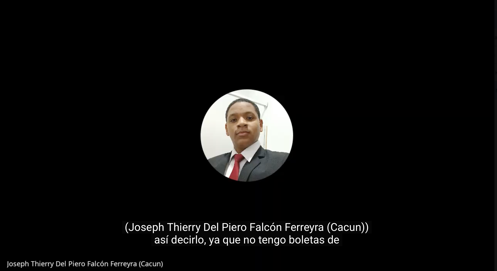

**Resumen**

Joseph financia sus gastos principalmente con ahorros propios y, cuando necesita un monto mayor, recurre a un préstamo bancario, aunque señala que el banco le otorga montos bajos y tasas altas por no contar con boletas de pago formales. Cuando el banco demora en aprobar una solicitud, recurre a préstamos familiares o a una junta con otros vendedores. Sus ingresos son variables según la temporada. Usa la app de su banco para pagar el préstamo y Yape para cobrar a sus clientes, pero tiene poca o ninguna familiaridad con criptomonedas o stablecoins. Le preocupa que una app sin banco de por medio no sea tan clara como su banco actual respecto a las condiciones del préstamo, y considera que podría demostrar ser "de fiar" mostrando que paga su préstamo bancario a tiempo o mediante referencias de su entorno de trabajo. Valoraría una solución más rápida que el banco y con montos ajustados a lo que realmente vende, pero la descartaría si la percibe menos segura o menos transparente que su banco.

**Transcripción completa**

| # | Pregunta | Respuesta |
|---|---|---|
| 1 | ¿Cómo financia hoy sus gastos o su actividad económica cuando necesita dinero que no tiene disponible? | "Si es poco, uso mis ahorros. Si necesito más, a veces saco un préstamo en mi banco, aunque no siempre me dan el monto que pido." |
| 2 | ¿Ha intentado alguna vez acceder a un préstamo formal (banco, financiera, caja)? ¿Qué pasó? | "Sí, tengo cuenta de ahorros en el banco y una vez pedí un préstamo, pero me lo dieron con un monto bajo y una tasa alta porque no tengo boletas de pago, solo mis ventas." |
| 3 | ¿A quién le pide dinero prestado hoy (familia, conocidos, prestamista informal, "junta")? ¿Bajo qué condiciones? | "Primero intento con el banco, pero si no me alcanza o me demoran, le pido a mi familia o entro a una junta con otras vendedoras." |
| 4 | ¿Qué tan predecibles son sus ingresos mes a mes? | "Varían harto, hay semanas buenas y otras flojas, depende de la temporada." |
| 5 | ¿Usa algún tipo de billetera digital o aplicación financiera hoy? ¿Cuál y para qué? | "Uso la app de mi banco para ver mis movimientos y pagar el préstamo, y Yape para cobrarles a mis clientes." |
| 6 | ¿Qué tan familiarizado está con el concepto de criptomonedas o stablecoins? | "Casi nada, he escuchado de bitcoin en las noticias pero no sé bien cómo funciona." |
| 7 | ¿Qué le preocuparía más de pedir un préstamo a través de una app sin un banco de por medio? | "Que las condiciones no sean tan claras como en el banco, donde ya sé cuánto pago cada mes y a quién reclamarle si hay un problema." |
| 8 | Si pudiera demostrar que "es de fiar" sin tener historial bancario, ¿cómo cree que podría demostrarlo? | "Mostrando que pago mi préstamo del banco a tiempo, o con referencias de la gente con la que trabajo en el mercado." |
| 9 | ¿Puede describir la última vez que tuvo un problema de dinero relacionado con esto? ¿Qué hizo? | "Una vez necesité dinero rápido y el banco se demoró en aprobarme el préstamo, así que mientras tanto le pedí prestado a una vecina." |
| 10 | ¿Qué tendría que pasar para que confiara en una aplicación nueva para este propósito? | "Que me expliquen bien cómo funciona sin palabras raras, y que sea tan clara como mi banco en mostrarme cuánto debo." |
| 11 | ¿Qué es lo que más valoraría de una solución así, y qué es lo que la haría descartarla de inmediato? | "Valoraría que sea más rápida que el banco y que me den un monto justo según lo que vendo. La descartaría si siento que es menos segura o menos clara que mi banco." |

---

##### Entrevista 2: Rafael Chui

**Ficha del entrevistado**

| Campo | Detalle |
|---|---|
| Nombre | Rafael Chui |
| Edad | 24 años |
| Distrito | San Borja |
| Ocupación | Repartidor independiente (delivery) |
| Nivel de bancarización | Cuenta de ahorros en caja municipal; acceso limitado a crédito formal (montos bajos por ingresos no fijos) |
| Familiaridad con billeteras digitales/cripto | Baja: usa Yape, Plin y la app de su caja; conoce las criptomonedas solo por redes sociales, sin experiencia de uso |
| Video | [Ver grabación](https://upcedupe-my.sharepoint.com/:v:/g/personal/u202213406_upc_edu_pe/IQAV70dTUnwjTb6dBn95hr5iAXZVc30kSbCMiMb09Yx5PSQ?nav=eyJyZWZlcnJhbEluZm8iOnsicmVmZXJyYWxBcHAiOiJPbmVEcml2ZUZvckJ1c2luZXNzIiwicmVmZXJyYWxBcHBQbGF0Zm9ybSI6IldlYiIsInJlZmVycmFsTW9kZSI6InZpZXciLCJyZWZlcnJhbFZpZXciOiJNeUZpbGVzTGlua0NvcHkifX0&e=I2NLfL) |

**Screenshot de la entrevista**


**Resumen**

Rafael financia sus gastos con lo que gana durante la semana y, ante un gasto grande como la reparación de su moto, recurre a su familia o a amigos, y ocasionalmente a una junta. Intentó acceder a un préstamo en la caja donde tiene su cuenta, pero por no tener ingresos fijos ni boletas solo le ofrecían un monto muy bajo, por lo que no lo tomó. Sus ingresos son medianamente predecibles: mejoran los fines de semana y a fin de mes, pero bajan con la lluvia o con fallas de las aplicaciones de reparto. Usa Yape y Plin para sus pagos diarios, y tiene muy poca familiaridad con las criptomonedas, que conoce solo por videos y comentarios de amigos. Le preocupa que una app sin banco de por medio le cobre condiciones no informadas al inicio o que no haya a quién reclamar si algo falla. Considera que podría demostrar ser "de fiar" mostrando su historial de pedidos, sus calificaciones en las apps de delivery y sus movimientos de Yape. Valoraría una solución rápida y fácil de usar desde el celular, pero la descartaría si le piden mucha información personal sin explicar el motivo o si las condiciones cambian después.

**Transcripción completa**

| # | Pregunta | Respuesta |
|---|---|---|
| 1 | ¿Cómo financia hoy sus gastos o su actividad económica cuando necesita dinero que no tiene disponible? | "Con lo que gano en la semana. Si se me presenta un gasto grande, como arreglar la moto, le pido a mis papás o a un amigo." |
| 2 | ¿Ha intentado alguna vez acceder a un préstamo formal (banco, financiera, caja)? ¿Qué pasó? | "Sí, fui a la caja donde tengo mi cuenta. Me dijeron que como mis ingresos no son fijos ni tengo boletas, solo me podían dar un monto muy chico. Al final no lo tomé porque no me servía para lo que necesitaba." |
| 3 | ¿A quién le pide dinero prestado hoy (familia, conocidos, prestamista informal, "junta")? ¿Bajo qué condiciones? | "A mi familia sobre todo, sin interés, pero siento que no puedo abusar. A veces entro a una junta con amigos, aunque con eso no puedo escoger cuándo me toca el dinero." |
| 4 | ¿Qué tan predecibles son sus ingresos mes a mes? | "Más o menos. Los fines de semana y a fin de mes hay más pedidos, pero si llueve o si falla la aplicación, la semana baja bastante." |
| 5 | ¿Usa algún tipo de billetera digital o aplicación financiera hoy? ¿Cuál y para qué? | "Uso Yape y Plin para recibir pagos y pagar mis cosas del día a día. También tengo la app de la caja, pero casi solo para ver mi saldo." |
| 6 | ¿Qué tan familiarizado está con el concepto de criptomonedas o stablecoins? | "Poquito. He visto videos en TikTok y mis amigos hablan de bitcoin, pero nunca he comprado nada y no sé cómo se usa para algo real como un préstamo." |
| 7 | ¿Qué le preocuparía más de pedir un préstamo a través de una app sin un banco de por medio? | "Que se pierda mi plata o que me cobren cosas que no me dijeron al inicio. Y que si hay un problema no haya nadie a quien llamar." |
| 8 | Si pudiera demostrar que "es de fiar" sin tener historial bancario, ¿cómo cree que podría demostrarlo? | "Mostrando mi historial de pedidos y mis calificaciones en las apps de delivery, que ahí se ve que trabajo constante. También con mis movimientos de Yape." |
| 9 | ¿Puede describir la última vez que tuvo un problema de dinero relacionado con esto? ¿Qué hizo? | "Hace poco se me malogró la moto y no podía trabajar mientras tanto. Le pedí prestado a mi tío y se lo fui devolviendo en cuotas pequeñas durante dos meses." |
| 10 | ¿Qué tendría que pasar para que confiara en una aplicación nueva para este propósito? | "Que la recomienden personas que conozco, que tenga buenas opiniones y que me muestre claramente cuánto voy a pagar en total antes de aceptar." |
| 11 | ¿Qué es lo que más valoraría de una solución así, y qué es lo que la haría descartarla de inmediato? | "Valoraría que sea rápida y que sea fácil de usar desde el celular, sin tantos trámites. La descartaría si me piden mucha información personal sin explicar para qué o si veo que las condiciones cambian después." |

---

##### Entrevista 3: Gonzalo Contreras

**Ficha del entrevistado**

| Campo | Detalle |
|---|---|
| Nombre | Gonzalo Contreras |
| Edad | 22 años |
| Distrito | Villa María del Triunfo |
| Ocupación | Comerciante de mercado (puesto propio) |
| Nivel de bancarización | Sin cuenta bancaria; sin acceso a crédito formal (le exigieron boletas, aval y documentos que no posee) |
| Familiaridad con billeteras digitales/cripto | Muy baja: solo usa Yape con el número de su celular; no conoce las criptomonedas |
| Video | [Ver grabación](https://upcedupe-my.sharepoint.com/:v:/g/personal/u202213406_upc_edu_pe/IQC0ybY5Ls4pQ6Qw5eC4GupXAWf9-JjDwupdcTAFsZYLOjQ?nav=eyJyZWZlcnJhbEluZm8iOnsicmVmZXJyYWxBcHAiOiJPbmVEcml2ZUZvckJ1c2luZXNzIiwicmVmZXJyYWxBcHBQbGF0Zm9ybSI6IldlYiIsInJlZmVycmFsTW9kZSI6InZpZXciLCJyZWZlcnJhbFZpZXciOiJNeUZpbGVzTGlua0NvcHkifX0&e=ptaozv) |

**Screenshot de la entrevista**


**Resumen**

Gonzalo financia su actividad con lo que va juntando de las ventas de su puesto y, cuando necesita más capital para comprar mercadería, recurre a conocidos o a una junta. Intentó acceder a un préstamo en una caja, pero le exigieron boletas, un aval y otros documentos que no posee, por lo que no continuó el trámite. Pide dinero prestado a su hermana o a una amiga del mercado y, solo cuando no tiene otra salida, a un prestamista del barrio que le cobra cerca de 10% semanal. Sus ingresos no son predecibles: mejoran en fechas como Navidad o el Día de la Madre y caen en otros meses. No tiene cuenta bancaria y su único medio digital es Yape, que usa para cobrar a sus clientes y pagar a sus proveedores. No está familiarizado con las criptomonedas y las percibe como algo complejo y poco seguro. Le preocupa ser estafado o no tener a quién reclamar si algo sale mal con una app. Considera que podría demostrar ser "de fiar" mediante el testimonio de sus clientes y proveedores, que lo conocen hace años. Valoraría un préstamo con menos trámites y menor interés que el del prestamista informal, pero lo descartaría si le piden dinero por adelantado o si no entiende bien las condiciones.

**Transcripción completa**

| # | Pregunta | Respuesta |
|---|---|---|
| 1 | ¿Cómo financia hoy sus gastos o su actividad económica cuando necesita dinero que no tiene disponible? | "Casi siempre con lo que voy juntando de las ventas. Si necesito más para comprar mercadería, le pido a algún conocido o entro a una junta." |
| 2 | ¿Ha intentado alguna vez acceder a un préstamo formal (banco, financiera, caja)? ¿Qué pasó? | "Fui una vez a una caja, pero me pidieron boletas, un aval y varios papeles que no tengo. Me dijeron que volviera cuando tuviera todo y ya no volví." |
| 3 | ¿A quién le pide dinero prestado hoy (familia, conocidos, prestamista informal, "junta")? ¿Bajo qué condiciones? | "A mi hermana o a una amiga del mercado. Con un prestamista del barrio también he sacado, pero cobra mucho interés, como 10% por semana, y solo lo hago si no hay otra salida." |
| 4 | ¿Qué tan predecibles son sus ingresos mes a mes? | "Nada predecibles. En fechas como Navidad o el Día de la Madre vendo bien, pero en otros meses cae bastante y a veces apenas me alcanza." |
| 5 | ¿Usa algún tipo de billetera digital o aplicación financiera hoy? ¿Cuál y para qué? | "Solo Yape, para cobrar a mis clientes y pagar a mis proveedores. No tengo cuenta en ningún banco, solo uso el número de mi celular." |
| 6 | ¿Qué tan familiarizado está con el concepto de criptomonedas o stablecoins? | "Nada. He escuchado que es dinero por internet, pero me suena a algo para gente que sabe de computadoras, no sé cómo funciona ni si es seguro." |
| 7 | ¿Qué le preocuparía más de pedir un préstamo a través de una app sin un banco de por medio? | "Que me estafen o que no tenga a quién reclamar. Con alguien del barrio al menos sé dónde encontrarlo, con una app no sé quién está detrás." |
| 8 | Si pudiera demostrar que "es de fiar" sin tener historial bancario, ¿cómo cree que podría demostrarlo? | "Con que mis clientes y mis proveedores digan que siempre pago. Llevo años en el mismo puesto y todos me conocen." |
| 9 | ¿Puede describir la última vez que tuvo un problema de dinero relacionado con esto? ¿Qué hizo? | "Hace unos meses se me malogró el refrigerador del puesto y necesitaba dinero urgente. No me alcanzó con lo que tenía, así que le pedí al prestamista del barrio y me salió caro." |
| 10 | ¿Qué tendría que pasar para que confiara en una aplicación nueva para este propósito? | "Que alguien de confianza ya la haya usado y me cuente que le funcionó. Y que me expliquen todo clarito, cuánto pago y cuándo, sin letras chiquitas." |
| 11 | ¿Qué es lo que más valoraría de una solución así, y qué es lo que la haría descartarla de inmediato? | "Valoraría que no me pidan tantos papeles y que me presten sin tanto interés como el prestamista. La descartaría si me piden dinero por adelantado o si no entiendo bien las condiciones." |

---

##### Tabla resumen de entrevistas: segmento Prestamista con capital ocioso

| # | Entrevistado | Edad | Ocupación | Bancarización | Fecha |
|---|---|---|---|---|---|
| 1 | Renso Julca | 21 | Ingeniero de Software | Intermedio-alto, usa stablecoins | 18/09/2026 |

---

##### Entrevista 1: Renso Julca

**Ficha del entrevistado**

| Campo | Detalle                                                                                                |
|---|--------------------------------------------------------------------------------------------------------|
| Nombre | Renso Julca                                                                                          |
| Edad | 21 años                                                                                                |
| Distrito | Carabayllo                                                                                |
| Ocupación | Ingeniero de Software                                                                                   |
| Nivel de bancarización | Intermedio-alto; maneja billeteras digitales cotidianas y posee nociones operativas en stablecoins (USDT) |
| Familiaridad con billeteras digitales/cripto | Alta: usa billeteras móviles a diario y aplicaciones cripto sin dificultad técnica |
| Práctica de préstamo actual | Coloca excedentes de liquidez en micropréstamos a conocidos o referidos, con una tasa base desde el 5% mensual por montos mínimos, para rotar su dinero con rapidez |

**Screenshot de la entrevista**

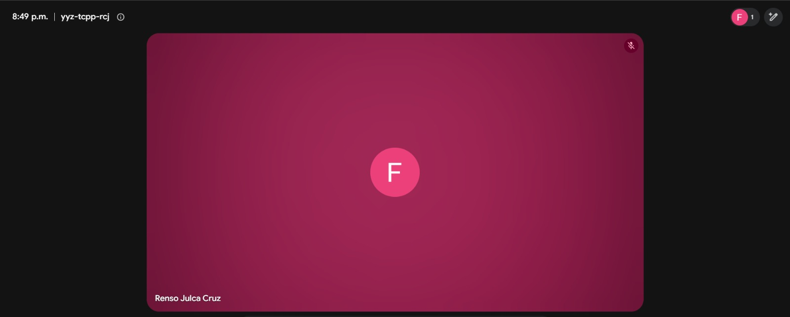

**Resumen**

Renso Julca, estudiante de 21 años e independiente en servicios digitales en Lima, rota activamente su excedente de capital prestando montos mínimos a conocidos con una tasa base del 5% mensual y ahorrando en stablecoins (USDT) para evitar la pérdida de valor adquisitivo frente a los bajos rendimientos bancarios. Aunque se siente cómodo con el uso de billeteras y herramientas cripto, sus principales fricciones son el desgaste de realizar cobros manuales, la falta de un historial confiable para medir el riesgo de impago sin garantías y la desconfianza hacia plataformas intermediarias centralizadas. Por ello, adoptaría una solución como LatiFi siempre que opere bajo una arquitectura no custodial, muestre un puntaje de reputación visible y transparente del prestatario, asegure la liquidación automática de capital e intereses mediante Smart Contracts y cuente con filtros de verificación mínimos que impidan la evasión mediante cuentas duplicadas.

**Transcripción completa**

| # | Pregunta | Respuesta |
|---|---|---|
| 1 | ¿Qué hace hoy con el dinero que no necesita usar de inmediato (ahorro, inversión, cripto, nada)? | Mantengo una parte pequeña como fondo de reserva en cuentas bancarias convencionales, pero la mayor parte de mi excedente la roto prestando montos chicos a personas que necesitan liquidez inmediata o compro stablecoins (USDT) en exchanges para evitar que pierda valor frente a la inflación. No lo dejo quieto en el banco porque las tasas que dan por ahorro no rinden nada. |
| 2 | ¿Alguna vez ha prestado dinero a alguien fuera de su círculo cercano a cambio de un interés? ¿Cómo le fue? | Sí, he prestado a amigos de conocidos o personas recomendadas cobrando un 5% de interés mensual sobre montos mínimos. En la mayoría de los casos me han pagado puntual porque sabían que si fallaban no les volvía a prestar, pero en un par de ocasiones tuve que estar insistiendo bastante para que completen la cuota. El cobro manual y estar escribiendo para recordar pagos es lo más desgastante. |
| 3 | ¿Qué tan cómodo se siente usando billeteras digitales o aplicaciones cripto? | Me siento bastante cómodo. Uso billeteras móviles a diario y también aplicaciones cripto sin problemas técnicos. Entiendo conceptos de transferencias directas y manejo de fondos, así que operar una app que se conecte con wallet no me resulta difícil. |
| 4 | ¿Qué información necesitaría ver de un desconocido antes de decidir prestarle dinero? | Si no lo conozco de nada, necesito ver mínimamente cuántos préstamos anteriores ha pedido, si los ha pagado a tiempo y un puntaje o indicador claro de cumplimiento. También saber a qué se dedica su negocio o en qué va a usar el dinero para saber si tendrá flujo de ingresos para devolverlo. |
| 5 | ¿Qué nivel de riesgo de no pago estaría dispuesto a aceptar a cambio de qué tasa de interés? | Por montos pequeños suelo manejar una tasa mínima del 5%. Estaría dispuesto a asumir un riesgo moderado con personas que recién empiezan a construir su reputación siempre que el monto inicial prestado sea bajo y la tasa compense ese margen. Si el riesgo percibido es muy alto o no hay ningún antecedente, no arriesgaría mi capital. |
| 6 | ¿Qué le generaría más desconfianza en una plataforma de préstamos entre desconocidos sin banco de por medio? | Me daría mucha desconfianza que la aplicación sea la que retenga o controle el dinero, o que el solicitante pueda crearse una cuenta falsa, pedir dinero, no pagar y desaparecer sin ninguna consecuencia. Necesito saber que el sistema asegura la devolución automática de lo cobrado sin intermediarios que demoren los retiros. |
| 7 | ¿Preferiría que existiera algún tipo de garantía o colateral, o le basta con una reputación verificable del prestatario? | En DeFi tradicional piden dejar el doble en garantía, pero entiendo que un pequeño emprendedor del día a día no tiene criptomonedas guardadas para dejar empeñadas. Para montos mínimos de microcrédito me basta con una reputación sólida y comprobable donde se vea que el usuario cuida su historial para no perder acceso a montos mayores. |
| 8 | ¿Puede describir la última vez que tuvo un problema de dinero relacionado con esto? ¿Qué hizo? | Le presté un monto pequeño a un conocido con la condición de devolverlo en 15 días con un extra. Pasó el mes y no me respondía los mensajes de WhatsApp; tuve que buscarlo directamente para acordar un pago fraccionado. Desde ahí decidí que no presto si no hay un compromiso muy claro o un historial que respalde a la persona. |
| 9 | ¿Qué tendría que pasar para que confiara en una aplicación nueva para este propósito? | Debe quedar clarísimo que la plataforma no se queda con mis llaves ni custodia mis fondos de forma opaca. Además, la ejecución del desembolso y el cobro debe ser automática e inmediata apenas el prestatario paga, sin cobros ocultos ni retrasos manuales. |
| 10 | ¿Qué es lo que más valoraría de una solución así, y qué es lo que la haría descartarla de inmediato? | Lo que más valoraría es ver un historial de pagos real y automatizado que me permita diversificar mi excedente en varios microcréditos de forma transparente. La descartaría de inmediato si me cobran comisiones abusivas por operar o si la plataforma permite cuentas fantasmas sin un filtro mínimo de verificación. |

---

#### 2.2.3. Análisis de entrevistas

El equipo analiza las cuatro entrevistas registradas en 2.2.2: tres del segmento prestatario (Joseph Falcón, Rafael Chui y Gonzalo Contreras) y una del segmento prestamista (Renso Julca). Cada hallazgo cita a quienes lo sustentan y se traduce en una decisión de producto trazable a una historia de usuario.

##### Hallazgos del segmento prestatario

| # | Hallazgo | Evidencia | Decisión de producto |
|---|---|---|---|
| H1 | El crédito formal les ofrece montos bajos o los excluye por no tener boletas ni ingresos fijos. | Joseph recibió un monto bajo con tasa alta; Rafael recibió un monto tan chico que no lo tomó; a Gonzalo le exigieron boletas, aval y documentos y abandonó el trámite. | Evaluar al solicitante por reputación y no por documentos formales (US-REP-01, US-REP-02). |
| H2 | Cuando necesitan dinero recurren a familiares, amigos, juntas o prestamistas informales, y el costo de este último es alto. | Los tres citan a su familia o a conocidos; Joseph y Rafael mencionan las juntas; Gonzalo cuenta que el prestamista del barrio le cobra cerca de 10% semanal. | Ofrecer una alternativa con tasa y plazo visibles desde la solicitud (US-LEND-01). |
| H3 | Sus ingresos varían según la temporada, el clima o el día de la semana. | Joseph describe semanas buenas y flojas, Rafael habla de lluvia y fallas de las aplicaciones de reparto, y Gonzalo menciona Navidad y el Día de la Madre. | Mostrar siempre la cuota y la fecha de vencimiento, y no exigir un monto fijo mensual (US-LEND-05). |
| H4 | Usan Yape o Plin a diario, pero casi no conocen las criptomonedas. | Los tres usan Yape; Rafael añade Plin; ninguno ha usado criptomonedas y Gonzalo dice que le suenan a algo "para gente que sabe de computadoras". | Onboarding en lenguaje simple y montos en soles junto al monto en stablecoin (US-AUTH-03, US-LEND-06). |
| H5 | Temen la falta de claridad en las condiciones y no tener a quién reclamar. | Joseph quiere saber cuánto paga cada mes; Rafael teme cobros no informados; Gonzalo teme una estafa porque no sabe quién está detrás de la aplicación. | Mostrar el costo total antes de aceptar y confirmar cada operación con un comprobante (US-AUTH-04, US-LEND-05). |
| H6 | Creen que pueden demostrar que son de fiar con señales ajenas al banco. | Joseph propone sus pagos puntuales y referencias del mercado; Rafael, su historial y calificaciones en las aplicaciones de reparto; Gonzalo, el testimonio de sus clientes y proveedores. | Combinar eventos on-chain con señales off-chain del perfil en la reputación (US-REP-02). |
| H7 | La confianza en una aplicación nueva depende de recomendaciones y de una explicación sin tecnicismos. | Rafael y Gonzalo piden que alguien conocido ya la haya usado; Joseph, Rafael y Gonzalo piden que les expliquen cuánto pagan y cuándo, sin palabras raras ni letras chiquitas. | Landing y onboarding con lenguaje sencillo y una sección de seguridad visible (US-LAND-01, US-AUTH-03). |

##### Hallazgos del segmento prestamista

| # | Hallazgo | Evidencia | Decisión de producto |
|---|---|---|---|
| H8 | Presta excedentes a conocidos con una tasa base desde 5% mensual y el cobro manual lo desgasta. | Renso rota su capital en préstamos pequeños y señala que recordar los pagos es lo más desgastante. | Automatizar el desembolso y el cobro con el Smart Contract (US-LEND-03, US-LEND-04). |
| H9 | Necesita ver el historial de pagos del solicitante antes de prestar a un desconocido. | Renso pide cuántos préstamos anteriores tiene, si los pagó a tiempo y un indicador claro de cumplimiento. | Feed con reputación visible y ordenable (US-LEND-02, US-REP-03). |
| H10 | Rechaza que la plataforma custodie los fondos y teme las cuentas falsas. | Renso descarta una aplicación que retenga el dinero y las cuentas fantasmas sin filtro mínimo de verificación. | Modelo no custodial y registro de perfil ligero (US-AUTH-02, US-IDEN-01). |
| H11 | Para montos pequeños le basta una reputación comprobable en lugar de un colateral. | Renso entiende que un pequeño emprendedor no tiene criptomonedas para dejar en garantía. | Descartar el colateral bloqueado en el alcance del producto. |

##### Limitaciones

Cuatro entrevistas no permiten generalizar y el segmento prestamista cuenta con una sola. El equipo agregará entrevistas de ese segmento y revisará estos hallazgos con cada nuevo registro.

### 2.3. Needfinding

El proceso de Needfinding de LatiFi se apoya en los hallazgos reales de las entrevistas de la sección 2.2. Cada artefacto indica la herramienta empleada y los datos de campo en los que se basa.

#### 2.3.1. User Personas

**Persona: Prestatario no bancarizado**

| Campo | Detalle |
|---|---|
| Herramienta | UXPressia |
| Basado en | Entrevista 1, sección 2.2.2 |
| Segmento | Prestatario no bancarizado/subatendido |

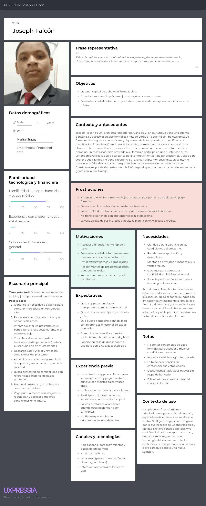

El Persona del prestatario fue construido en UXPressia a partir de los datos demográficos, objetivos, frustraciones y comportamientos recogidos en la entrevista 1 del segmento, representando a un prestatario con acceso limitado a crédito formal, ingresos variables y baja familiaridad con criptoactivos.

**Persona: Prestamista con capital ocioso**

| Campo | Detalle |
|---|---|
| Herramienta | UXPressia |
| Basado en | Entrevista 1, sección 2.2.2 |
| Segmento | Prestamista con capital ocioso |


El Persona del prestamista fue construido en UXPressia a partir de la entrevista 1 de su segmento, representando a un prestamista con excedente de liquidez, comodidad con billeteras digitales y stablecoins, y la necesidad de una señal clara de cumplimiento antes de prestar a desconocidos.

#### 2.3.2. User Task Matrix

La matriz cruza a los dos User Persona con las tareas que realizan hoy para cumplir sus objetivos financieros, con independencia de cualquier solución de software. Los segmentos considerados son el Prestatario no bancarizado, representado por Joseph Falcón, y el Prestamista con capital ocioso, representado por Renso Julca.

| Tarea | Prestatario: Frecuencia | Prestatario: Importancia | Prestamista: Frecuencia | Prestamista: Importancia |
|---|---|---|---|---|
| Financiar gastos o actividad con ahorros propios | Alta | Alta | No aplica | No aplica |
| Pedir un préstamo al banco cuando el ahorro no alcanza | Ocasional | Alta | No aplica | No aplica |
| Pedir dinero a conocidos cuando el banco demora | Ocasional | Media | No aplica | No aplica |
| Cobrar a sus clientes por Yape | Alta | Alta | No aplica | No aplica |
| Pagar las cuotas del préstamo y revisar movimientos en la app del banco | Mensual | Crítica | No aplica | No aplica |
| Demostrar que es de fiar sin historial bancario (pagos puntuales, referencias) | Ocasional | Alta | No aplica | No aplica |
| Mantener un fondo de reserva en cuenta bancaria | No aplica | No aplica | Baja | Media |
| Prestar excedentes a conocidos o referidos con interés | No aplica | No aplica | Alta | Alta |
| Comprar y guardar stablecoins (USDT) para conservar el valor del excedente | No aplica | No aplica | Alta | Alta |
| Evaluar si confiar en un solicitante desconocido (préstamos previos, cumplimiento, uso del dinero) | No aplica | No aplica | Antes de cada préstamo | Crítica |
| Fijar la tasa según el monto y el riesgo del solicitante | No aplica | No aplica | Por préstamo | Alta |
| Cobrar cuotas vencidas y acordar pagos fraccionados | No aplica | No aplica | Ocasional | Alta |

La frecuencia y la importancia se infieren de la entrevista 1 de cada segmento, por lo que se ajustarán al ampliar el registro de entrevistas.

Las tareas de mayor frecuencia e importancia del prestatario giran en torno a conseguir liquidez y pagarla a tiempo: financiarse con ahorros, recurrir al banco cuando no alcanza y cobrar a sus clientes. Para el prestamista, las tareas críticas son rotar su excedente prestando y decidir en quién confiar. La diferencia principal entre ambos es que el prestatario busca acceso y condiciones claras, mientras que el prestamista busca señales verificables de cumplimiento. Coinciden en la desconfianza hacia esquemas poco transparentes y en el valor de un historial de pagos: el prestatario lo necesita para demostrar que es de fiar y el prestamista para decidir a quién prestar.

#### 2.3.3. Empathy Mapping

**Empathy Map: Prestatario no bancarizado**

| Campo | Detalle |
|---|---|
| Herramienta | UXPressia |
| Basado en | Entrevista 1, sección 2.2.2 |
| Segmento | Prestatario no bancarizado/subatendido|

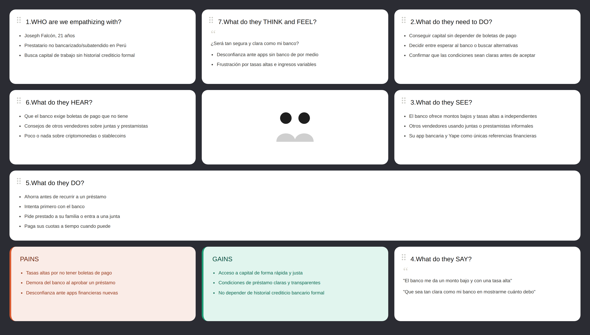

El Empathy Map fue construido en UXPressia a partir de los hallazgos de la entrevista 1 de la sección 2.2.2, documentando lo que el Prestatario dice, piensa, hace y siente frente al acceso al crédito.

**Empathy Map: Prestamista con capital ocioso**

| Campo | Detalle |
|---|---|
| Herramienta | UXPressia |
| Basado en | Entrevista 1, sección 2.2.2 |
| Segmento | Prestamista con capital ocioso |

**¿Qué piensa y siente?**

- **Pensamientos centrales:** "Dejar el dinero quieto en el banco hace que pierda valor frente a la inflación; prefiero rotarlo activamente prestando o comprando stablecoins". "No puedo prestar a desconocidos a ciegas si no tengo una señal clara de que la persona cuida su historial y pagará a tiempo".
- **Sentimientos:** frustración e incomodidad ante las cobranzas manuales y ante perseguir a quien se retrasa; seguridad y confianza si el retorno de su dinero queda programado de forma automática e inmutable en código.

**¿Qué ve?**

- En el entorno financiero: tasas bancarias tradicionales que no rinden y protocolos DeFi que exigen un sobrecolateral que los microemprendedores peruanos no tienen.
- En su entorno social y digital: contactos y conocidos que buscan liquidez inmediata y que pagan tasas sobre el 5% mensual para financiar compras o proyectos de corto plazo.
- En la plataforma LatiFi: un feed estructurado con solicitudes abiertas, tasas propuestas, plazos de pago y el indicador de reputación visible de cada solicitante.

**¿Qué oye?**

- A amigos y colegas hablar sobre billeteras móviles, adopción de stablecoins y plataformas Web3.
- Comentarios recurrentes sobre la falta de garantías en préstamos de confianza y el riesgo de que personas conocidas terminen incumpliendo sus pagos.
- Discusiones sobre la necesidad de plataformas transparentes donde intermediarios centralizados no bloqueen los retiros.

**¿Qué dice y hace?**

- **Dice:** "Presto con una tasa mínima del 5% mensual sobre montos pequeños para que mi dinero no pierda valor". "Para prestarle a alguien que no conozco, necesito ver cuántos préstamos ya pagó a tiempo y a qué se dedica".
- **Hace:** utiliza billeteras digitales cotidianas y mantiene ahorros en stablecoins (USDT); evalúa el perfil de riesgo antes de comprometer fondos y prioriza montos pequeños y de rápida rotación.

**Esfuerzos y frustraciones (Pains)**

- El desgaste de cobrar manualmente por mensajes cuando una cuota se vence.
- El riesgo de default total o de que usuarios malintencionados creen billeteras nuevas para huir de sus deudas (ataque Sybil).
- Plataformas que cobran comisiones abusivas o que retienen fondos sin permitir retiros directos.

**Deseos y necesidades (Gains)**

- Rentabilidad predecible y superior a la banca tradicional a través de micropréstamos en stablecoins.
- Desembolso y cobro 100% automatizado mediante Smart Contracts directamente a su wallet personal.

#### 2.3.4. As-is Scenario Mapping

Se documentará el escenario actual ("as-is") de cada segmento, es decir, cómo un prestatario no bancarizado consigue dinero hoy sin LatiFi y cómo un prestamista coloca su capital ocioso hoy sin LatiFi, como línea base para contrastar contra el escenario futuro ("to-be") que la plataforma habilitará. Este mapeo se trabajará en sesión de equipo sobre **Miro** o **LucidChart**, en paralelo al Big Picture EventStorming del dominio.

El presente diagrama modela el flujo operacional actual (*AS-IS*) de una solicitud de préstamo con garantía bajo esquemas tradicionales, caracterizado por una alta dependencia de la intervención humana, transferencia física de expedientes y baja trazabilidad en tiempo real.


##### Carriles de Responsabilidad (Swimlanes)
* **USER / BORROWER**: Prestatario que inicia la petición y aporta documentación de respaldo.
* **LOAN OFFICER / FRONT DESK**: Mesón de atención y primer filtro de recepción documental.
* **CREDIT RISK DEPARTMENT**: Área analítica encargada de evaluar la viabilidad de riesgo del crédito.
* **FINANCE / OPERATIONS**: Instancia final de emisión de vouchers, validación de firmas y desembolso de fondos.

##### Descripción Secuencial del Flujo
1. **Initiate Loan Application [Manual]**: El usuario completa y entrega la solicitud inicial del crédito.
2. **Submit Required Documents?**: Verificación de presencia de requisitos mínimos adjuntos.
   * *No*: El proceso se detiene o retorna para la recolección de faltantes.
   * *Yes*: Avanza a recepción formal.
3. **Receive & Review Application Package [Manual Verification]**: El Front Desk valida preliminarmente el paquete documental.
4. **Perform Initial Eligibility Check [Manual]**: Evaluación rápida de cumplimiento de políticas de entrada.
5. **Application Complete & Eligible?**: Validación de pase a siguiente fase.
   * *No* → **6. Notify Applicant of Rejection / Missing Info**.
   * *Yes* → **7. Assign Loan Officer & Create Physical File**.
8. **Forward File to Credit Dept**: Traslado físico o digital básico del expediente al departamento de riesgos.
9. **Conduct Credit Risk Assessment [Manual]**: Análisis manual del perfil de riesgo y capacidad de pago.
10. **Risk Acceptable?**:
    * *No* → Fin del proceso por rechazo de riesgo.
    * *Yes* → **12. Approve Loan Terms & Conditions**.
13. **Generate Loan Agreement [Manual]**: Confección e impresión física del contrato legal.
14. **Notify Loan Officer of Approval**: Aviso interno de viabilidad aprobada.
15. **Schedule Loan Closing Appointment**: Coordinación de cita presencial con el cliente.
16. **Prepare Disbursement Voucher [Manual]**: Elaboración del documento de orden de pago.
17. **Obtain Authorized Signatures [Manual]**: Firma física gerencial/financiera requerida.
18. **Disburse Funds [Check / Cash / Wire Transfer]**: Emisión efectiva del capital al usuario mediante medios tradicionales.

##### Puntos de Dolor Identificados (Pain Points)
* **Latencia elevada**: Tiempos muertos significativos en los traspasos de expedientes físicos/digitales entre el *Loan Officer*, *Credit Dept* y *Finance* (pasos 7, 8, 14, 15).
* **Fricción presencial**: Dependencia de citas presenciales obligatorias para firma de contratos y gestión de desembolsos (pasos 15-18).
* **Riesgo operativo**: Propensión a errores de transcripción manual en la evaluación de riesgos y pérdida o degradación de expedientes en físico.
* **Cero visibilidad en tiempo real**: El usuario no cuenta con un panel de autogestión para auditar en qué sub-paso de revisión se encuentra su expediente (bloque 9-13).
  
### 2.4. Ubiquitous Language

El siguiente glosario recoge los términos de negocio del dominio de microcrédito P2P descentralizado que el equipo usará de forma consistente en el resto del informe, en el modelo de dominio y en el código, siguiendo la práctica de Ubiquitous Language de Domain-Driven Design. Se excluyen términos puramente técnicos de ingeniería de software (framework, endpoint, repositorio, etc.) que no forman parte del lenguaje de negocio del dominio.

| Term | Definición |
|---|---|
| **Borrower** (Prestatario) | Persona no bancarizada que solicita un microcrédito en stablecoins a través de LatiFi Wallet, respaldado por su reputación y no por colateral bloqueado. |
| **Lender** (Prestamista) | Persona con capital ocioso que financia una o más solicitudes de préstamo publicadas por prestatarios, a cambio de un interés pactado. |
| **Loan Request** (Solicitud de préstamo) | Publicación de un prestatario que especifica el monto solicitado en stablecoin, la tasa de interés propuesta y el plazo de devolución, visible en el feed de prestamistas. |
| **Loan Agreement** (Contrato de préstamo) | Instancia del Smart Contract que representa un préstamo ya fondeado, con sus condiciones (monto, interés, plazo, estado) registradas de forma inmutable en blockchain. |
| **Collateral** (Colateral/Garantía) | Activo bloqueado por el prestatario como respaldo del préstamo. Explícitamente fuera del modelo de riesgo de LatiFi, que sustituye el colateral por reputación. |
| **Reputation Score** (Puntaje de reputación) | Medida cuantitativa de la confiabilidad de un prestatario, calculada de forma híbrida a partir de su historial de pagos on-chain y de señales de perfil off-chain gestionadas por la LatiFi API. |
| **Cold Start** (Arranque en frío) | Situación de un usuario nuevo sin ningún historial on-chain previo, para quien un modelo de reputación puramente on-chain no puede generar un puntaje confiable. |
| **KYC-lite** (Verificación de identidad liviana) | Captura mínima de datos de identidad (nombre, contacto, información autodeclarada) suficiente para disuadir ataques Sybil, sin llegar al nivel de un KYC documental regulatorio. |
| **Sybil Attack** (Ataque Sybil) | Estrategia en la que una misma persona crea múltiples billeteras para simular varias identidades y falsear artificialmente un historial de reputación limpio. |
| **Stablecoin** | Criptomoneda cuyo valor está anclado a una moneda fiduciaria (usualmente el dólar), usada para denominar los préstamos y evitar que la volatilidad de una criptomoneda nativa distorsione el monto adeudado. |
| **Wallet** (Billetera digital) | Aplicación o componente que custodia las claves criptográficas del usuario y le permite firmar transacciones; en LatiFi es no custodial, es decir, el usuario controla sus propias claves. |
| **Smart Contract** (Contrato inteligente) | Programa desplegado en blockchain que ejecuta de forma automática e inmutable las condiciones del préstamo: recepción de fondos, desembolso, liberación del pago y registro del vencimiento. |
| **Escrow** (Custodia temporal) | Función del Smart Contract mediante la cual los fondos del prestamista quedan retenidos por el contrato hasta que se cumplen las condiciones para desembolsarlos al prestatario. |
| **Default** (Incumplimiento) | Situación en la que el prestatario no devuelve el capital y/o el interés pactado dentro del plazo establecido, con impacto negativo en su puntaje de reputación. |
| **Repayment** (Devolución/Pago) | Acción del prestatario de devolver el capital más el interés pactado, liberando automáticamente los fondos correspondientes al prestamista a través del Smart Contract. |
| **On-chain / Off-chain** (En cadena / fuera de cadena) | Distinción entre los datos y la lógica que residen de forma inmutable en la blockchain (on-chain, ej. el estado del préstamo) y los que residen en un sistema tradicional fuera de ella (off-chain, ej. el perfil del usuario en la LatiFi API). |
| **Testnet** (Red de prueba) | Red blockchain paralela a la red principal (mainnet), usada para desplegar y probar el Smart Contract sin mover dinero real; LatiFi opera sobre la testnet Polygon Amoy. |
| **Exchange Rate** (Tipo de cambio) | Tasa de conversión entre el valor de la stablecoin del préstamo y la moneda local del usuario, consumida por la app para mostrar montos y cuotas en la moneda que el usuario entiende. |
| **Unbanked / Underbanked** (No bancarizado / subatendido) | Persona sin acceso a una cuenta bancaria formal o con acceso muy limitado a productos financieros formales, segmento objetivo primario de LatiFi. |

<div style="page-break-after: always;"></div>

## Capítulo III: Requirements Specification

### 3.1. To-Be Scenario Mapping

El modelo **TO-BE** rediseña el proceso de préstamo incorporando desintermediación mediante contratos inteligentes (*smart contracts*), autenticación non-custodial, valoración automatizada de garantías vía oráculos de precios y reputación on-chain, reduciendo drásticamente la latencia y eliminando el factor humano en la ejecución.


#### Carriles de Arquitectura / Capas (Swimlanes / Bounded Context Layers)
* **USER / BORROWER**: Prestatario autogestionado con wallet non-custodial.
* **IDENTITY / WALLET CONTEXT**: Autenticación criptográfica, firma de transacciones y validación de sesión.
* **EXCHANGE RATE CONTEXT**: Oráculo de precios en tiempo real para valoración de colateral (*Collateral Ratio*).
* **REPUTATION CONTEXT**: Historial de comportamiento on-chain, *trust tiers* y penalizaciones automáticas.
* **LENDING SMART CONTRACT CORE**: Lógica de depósito de colateral, emisión de deuda, liquidación y reembolso programado.

#### Descripción Secuencial del Flujo (TO-BE Steps)
1. **Connect Non-Custodial Wallet [Action]**: El usuario vincula su wallet a través de la interfaz. → *Event: `WalletConnected`*.
2. **Select Asset & Input Collateral/Loan Parameters [Data Input]**: El usuario define el monto del préstamo y colateral criptográfico aportado.
3. **Fetch Real-Time Asset Pricing (Oracles) [Logic]**: Consulta de precio de mercado y cálculo de *Collateralization Ratio (LTV)* vía *Exchange Rate Context*.
4. **Evaluate Credit Eligibility / Trust Tier [Logic]**: Consulta de score o tier de reputación del address del usuario vía *Reputation Context*.
5. **Initiate Loan Request [Trigger]**: Envío de transacción de solicitud al smart contract de lending.
6. **Lock Collateral in Escrow [Asset Transfer]**: Retención automática del colateral en el contrato inteligente.
7. **Mint & Disburse Loan [Funds Transfer]**: Transferencia atómica/on-chain de los fondos solicitados directamente a la wallet del usuario → *Event: `LoanDisbursed`*.
8. **Confirm Repayment & Update Health Factor [Logic]**: Monitoreo continuo de salud del colateral y recepción de cuotas.
   * **9a. Liquidate Collateral (Default) [Action]**: Ejecución algorítmica de liquidación parcial ante caída de LTV → *Events: `DefaultTriggered`, `ReputationPenaltyApplied`*.
   * **9b. Release Collateral (Paid) [Action]**: Liberación de garantía y actualización de score positivo → *Events: `LoanRepaid`, `ScoreUpdated`*.

#### Ventajas Clave / Mejora frente al AS-IS (Value Proposition)
* **Latencia cero/instantánea**: De días/semanas a segundos/minutos por ejecución determinista de smart contracts (pasos 5-7).
* **Desintermediación y Autogestión**: Eliminación de *Loan Officer*, mesones físicos, mesas de control de riesgos manuales y vouchers de papel.
* **Mitigación de riesgo de contraparte**: Lógica basada en código (*code is law*), con valoración objetiva por oráculos y liquidación algorítmica de garantías.
* **Trazabilidad total on-chain**: Auditoría pública y en tiempo real del estado de salud del préstamo (`Health Factor`), historial de pagos y reputación.

---

#### Tabla Comparativa Resumen: AS-IS vs. TO-BE
| Dimensión | Enfoque AS-IS (Tradicional) | Enfoque TO-BE (Web3 / Descentralizado) |
| :--- | :--- | :--- |
| **Tiempo de Procesamiento** | Varios días por los traspasos manuales entre áreas | Segundos a minutos (automático on-chain) |
| **Intermediarios** | Front Desk, Oficial de Crédito, Riesgos, Finanzas | Ninguno (Smart Contracts + Oráculos) |
| **Garantía / Colateral** | Físico / Documental / Legal tradicional | Criptoactivo bloqueado en Smart Contract Escrow |
| **Evaluación de Riesgo** | Subjetiva / Manual / Formularios impresos | Algorítmica (LTV por Oráculos + Trust Tiers On-chain) |
| **Disponibilidad / Canal** | Horario de oficina / Presencial en sucursal | 24/7 / Autogestión via Non-Custodial Wallet |

El propósito de esta sección es contrastar, mediante un To-Be Scenario Map, la secuencia de actividades que hoy ejecuta un prestatario o prestamista no bancarizado para acceder a crédito informal (fiado, prestamistas gota a gota, préstamos familiares) contra la secuencia propuesta una vez que LatiFi Wallet media el flujo mediante Smart Contracts y reputación descentralizada. Ese contraste se apoya en el As-Is construido a partir de entrevistas reales a los segmentos objetivo (prestatario no bancarizado y prestamista con capital ocioso), documentado en la sección de Needfinding del Capítulo II.

### 3.2. User Stories

Los 21 requisitos v1 definidos para el proyecto se traducen a continuación en User Stories agrupadas por Epic. Cada Epic corresponde a uno de los bounded contexts o frentes funcionales del proyecto (Auth, Identity, Lending, Reputation, API, Landing Page). Se agregan tres Technical Stories con rol "Developer" para cubrir aspectos de la RESTful API sin interacción directa de usuario final, principalmente el indexado de eventos on-chain, exigidos por la arquitectura pero invisibles para prestatario y prestamista.

| Epic/User Story ID | Título | Descripción | Criterios de Aceptación (Gherkin) | Relacionado con (Epic ID) |
|---|---|---|---|---|
| **EPIC-AUTH** | Autenticación con billetera | - | - | - |
| US-AUTH-01 | Conexión de billetera digital | Como prestatario o prestamista, deseo conectar mi billetera digital (WalletConnect/Metamask SDK) desde la app móvil, para autenticarme sin crear usuario y contraseña. | **Given** que soy un usuario nuevo o recurrente de LatiFi Wallet, **When** selecciono "Conectar billetera" y apruebo la solicitud de conexión desde mi wallet, **Then** la app reconoce mi dirección on-chain como mi identidad y me redirige a la pantalla principal según mi rol. | EPIC-AUTH |
| US-AUTH-02 | Firma no custodial de transacciones | Como usuario de LatiFi Wallet, deseo firmar mis transacciones desde mi propia billetera sin que LatiFi gestione mi llave privada, para conservar control total de mis fondos. | **Given** que inicio una acción que requiere una transacción on-chain (fondear, pagar), **When** la app construye la transacción y la envía a mi wallet para firma, **Then** la llave privada nunca sale de mi dispositivo ni es almacenada por LatiFi, y la transacción solo se envía a la red tras mi aprobación explícita. | EPIC-AUTH |
| US-AUTH-03 | Onboarding progresivo en lenguaje simple | Como usuario no familiarizado con criptomonedas, deseo completar un onboarding progresivo en lenguaje simple antes de conectar mi billetera por primera vez, para entender el flujo sin necesitar conocimiento técnico previo. | **Given** que abro LatiFi Wallet por primera vez, **When** avanzo por las pantallas de onboarding, **Then** cada paso explica el flujo de préstamo (solicitar, fondear, pagar, reputación) sin jerga cripto, y solo al final se me solicita conectar la billetera. | EPIC-AUTH |
| US-AUTH-04 | Retroalimentación de estado de transacción | Como usuario de LatiFi Wallet, deseo ver el estado de mi transacción (pendiente, confirmando, confirmada, fallida), para saber si mi acción se ejecutó sin necesidad de consultar un explorador de bloques. | **Given** que envié una transacción (fondeo o pago), **When** la transacción está en la mempool o siendo minada, **Then** la app muestra un estado "pendiente/confirmando" y actualiza a "confirmada" o "fallida" apenas la red Polygon Amoy confirma o rechaza el bloque correspondiente. | EPIC-AUTH |
| **EPIC-IDEN** | Identidad y perfil ligero | - | - | - |
| US-IDEN-01 | Registro de perfil ligero | Como usuario nuevo, deseo completar un registro de perfil ligero (nombre, contacto) antes de publicar o fondear una solicitud, para que el sistema tenga una base mínima de resistencia a Sybil. | **Given** que conecté mi billetera por primera vez, **When** intento publicar o fondear una solicitud de préstamo, **Then** el sistema me exige completar nombre y contacto antes de habilitar la acción, y vincula ese perfil a mi dirección on-chain. | EPIC-IDEN |
| US-IDEN-02 | Exposición de perfil vía API propia | Como usuario de LatiFi Wallet, deseo que mi perfil quede almacenado y accesible vía la LatiFi API, para que la app pueda mostrarlo de forma consistente en cualquier pantalla. | **Given** que completé mi registro de perfil, **When** la app solicita `GET /profiles/{address}` a LatiFi API, **Then** la API responde con los datos de perfil vinculados a mi dirección on-chain, sin exponer datos de otros usuarios. | EPIC-IDEN |
| **EPIC-LEND** | Ciclo de préstamo on-chain | - | - | - |
| US-LEND-01 | Publicación de solicitud de préstamo | Como prestatario, deseo publicar una solicitud de préstamo especificando monto, tasa de interés y plazo en una stablecoin de prueba, para que prestamistas interesados puedan evaluarla y fondearla. | **Given** que completé mi perfil, **When** ingreso monto, tasa y plazo y confirmo la publicación, **Then** la solicitud queda registrada (on-chain y/o reflejada en el feed off-chain) y visible para los prestamistas con estado "abierta". | EPIC-LEND |
| US-LEND-02 | Feed de solicitudes con reputación visible | Como prestamista, deseo ver un feed de solicitudes abiertas con la reputación de cada solicitante, para decidir a quién fondear con base en su historial de repago. | **Given** que existen solicitudes abiertas, **When** accedo a la pantalla de feed, **Then** cada tarjeta de solicitud muestra monto, tasa, plazo y el score de reputación del prestatario correspondiente. | EPIC-LEND, EPIC-REP |
| US-LEND-03 | Fondeo de solicitud vía Smart Contract | Como prestamista, deseo fondear una solicitud que dispare una transacción al Smart Contract, para que los fondos se transfieran al prestatario y las condiciones/vencimiento queden registrados de forma inmutable. | **Given** que selecciono una solicitud abierta y confirmo el fondeo, **When** firmo la transacción desde mi wallet, **Then** el Smart Contract transfiere los fondos al prestatario, registra monto/tasa/vencimiento de forma inmutable y emite el evento `LoanFunded`. | EPIC-LEND |
| US-LEND-04 | Pago de préstamo desde la app | Como prestatario, deseo pagar mi préstamo (capital + interés) desde la app, para liberar los fondos al prestamista automáticamente vía el Smart Contract. | **Given** que tengo un préstamo activo y fondos suficientes en mi wallet, **When** confirmo el pago de capital + interés, **Then** el Smart Contract transfiere los fondos al prestamista, marca el préstamo como pagado y emite el evento `LoanRepaid` con indicador de puntualidad. | EPIC-LEND |
| US-LEND-05 | Consulta de estado del préstamo | Como prestamista o prestatario, deseo ver el estado de mis préstamos (activo, pagado, vencido/default) en todo momento, para hacer seguimiento sin depender de que otra parte me informe. | **Given** que tengo al menos un préstamo activo o histórico, **When** accedo a "Mis préstamos", **Then** la app lista cada préstamo con su estado actual, derivado del Smart Contract o de su reflejo indexado en LatiFi API. | EPIC-LEND |
| US-LEND-06 | Visualización en moneda local | Como prestatario o prestamista, deseo ver el monto del préstamo y las cuotas en moneda local además de en stablecoin, para entender el compromiso económico real sin hacer la conversión manualmente. | **Given** que estoy viendo el detalle de una solicitud o préstamo, **When** la pantalla carga los montos, **Then** se muestra el valor en stablecoin y su equivalente en moneda local, calculado con la tasa de cambio expuesta por LatiFi API. | EPIC-LEND, EPIC-API |
| **EPIC-REP** | Sistema de reputación | - | - | - |
| US-REP-01 | Actualización automática de reputación | Como prestatario, deseo que mi reputación se actualice automáticamente tras cada resultado de préstamo (pagado a tiempo, tardío, incumplido), para que mi historial refleje mi comportamiento real sin intervención manual. | **Given** que un préstamo cambia de estado (repagado o default), **When** el evento correspondiente es indexado, **Then** el score de reputación del prestatario se recalcula y queda disponible vía API sin acción manual del usuario. | EPIC-REP |
| US-REP-02 | Reputación híbrida on-chain/off-chain | Como prestamista, deseo que la reputación combine eventos on-chain (repago vía Smart Contract) con señales off-chain (perfil en LatiFi API), para evaluar también a solicitantes sin historial on-chain previo. | **Given** que un prestatario tiene perfil off-chain pero aún ningún préstamo on-chain, **When** consulto su reputación, **Then** el sistema muestra un score inicial basado en señales off-chain disponibles, que se ajusta con cada evento on-chain posterior. | EPIC-REP, EPIC-IDEN |
| US-REP-03 | Feed ordenado/destacado por reputación | Como prestamista, deseo que el feed ordene o destaque las solicitudes según el nivel de reputación del solicitante, para priorizar mi revisión hacia los perfiles de menor riesgo. | **Given** que el feed contiene múltiples solicitudes abiertas, **When** aplico el orden por defecto o el filtro de reputación, **Then** las solicitudes de prestatarios con mayor score aparecen primero o con una insignia visual distintiva. | EPIC-REP, EPIC-LEND |
| US-REP-04 | Decaimiento/recuperación gradual de reputación | Como prestatario, deseo que mi reputación decaiga o se recupere de forma gradual ante pagos parciales o tardíos, para que un solo incidente no me clasifique de forma binaria como "incumplido". | **Given** que registro un pago tardío o parcial, **When** el sistema recalcula mi score, **Then** el ajuste es proporcional a la severidad del incidente (no un salto a cero), y se recupera gradualmente con pagos puntuales posteriores. | EPIC-REP |
| **EPIC-API** | RESTful API propia (LatiFi API) | - | - | - |
| US-API-01 | Endpoint de historial de reputación | Como prestamista, deseo consultar el historial de reputación de un prestatario desde la app, para revisar el detalle detrás de su score antes de fondear. | **Given** que estoy en el detalle de una solicitud, **When** solicito ver el historial de reputación del prestatario, **Then** la app consume `GET /reputation/{address}/history` de LatiFi API y muestra los eventos que compusieron el score actual. | EPIC-API, EPIC-REP |
| US-API-02 | Conversión a moneda local vía API propia | Como usuario de LatiFi Wallet, deseo que la app obtenga la conversión a moneda local desde un endpoint propio de LatiFi API, para ver montos coherentes sin que la app dependa directamente de una API externa de terceros. | **Given** que la app necesita mostrar un monto en moneda local, **When** invoca `GET /exchange-rate/convert`, **Then** LatiFi API responde con el valor convertido usando su caché de tasas oficiales, sin exponer la API externa directamente al cliente móvil. | EPIC-API |
| TS-API-03 (Technical Story) | Indexado de eventos on-chain del Smart Contract | Como Developer, deseo que un servicio indexador escuche los eventos `LoanFunded`, `LoanRepaid` y `LoanDefaulted` emitidos por el Smart Contract vía RPC, para que LatiFi API disponga de un espejo consultable del estado on-chain sin que la app consulte la blockchain en cada pantalla. | **Given** que el Smart Contract emite un evento de ciclo de vida de préstamo, **When** el indexador procesa el bloque correspondiente vía `eth_getLogs`/`ethLogFlowable`, **Then** el evento se traduce a un registro en la base de datos de LatiFi API dentro de una ventana de segundos, de forma idempotente (sin duplicar eventos ya procesados). | EPIC-API |
| TS-API-04 (Technical Story) | Checkpoint de último bloque procesado | Como Developer, deseo que el indexador mantenga un checkpoint del último bloque procesado, para reanudar la indexación tras una caída sin perder ni duplicar eventos. | **Given** que el proceso indexador se reinicia tras una falla, **When** vuelve a arrancar, **Then** retoma la lectura de eventos desde el último bloque confirmado como procesado, sin reprocesar el historial completo ni omitir bloques intermedios. | EPIC-API |
| TS-API-05 (Technical Story) | Autenticación de solicitudes REST por firma de wallet | Como Developer, deseo validar en LatiFi API que cada solicitud autenticada proviene de quien controla la dirección declarada, mediante verificación de firma sobre un desafío (nonce), para evitar suplantación de dirección en los endpoints REST. | **Given** que un cliente solicita un token de sesión, **When** firma el nonce entregado por la API con su wallet, **Then** la API verifica la firma contra la dirección declarada antes de emitir el JWT de sesión, rechazando cualquier firma inválida. | EPIC-API, EPIC-AUTH |
| **EPIC-LAND** | Landing Page institucional | - | - | - |
| US-LAND-01 | Landing page orientada a segmentos | Como visitante (prestatario o prestamista potencial), deseo entender el modelo de negocio de LatiFi desde la landing page, para decidir si quiero descargar o acceder a la app. | **Given** que un visitante llega a la landing page, **When** navega por las secciones de propuesta de valor, **Then** encuentra contenido diferenciado para el segmento prestatario y prestamista, con un llamado a la acción claro hacia la descarga/acceso de la app. | EPIC-LAND |
| US-LAND-02 | SEO, i18n y accesibilidad básica | Como visitante hispanohablante o angloparlante con o sin discapacidad, deseo navegar la landing page en mi idioma y con soporte de accesibilidad, para acceder al contenido sin barreras. | **Given** que un visitante accede a la landing page, **When** el navegador solicita el contenido, **Then** la página expone meta tags SEO básicos, soporta en_US/es_419 y cumple criterios ARIA verificables con un lector de pantalla. | EPIC-LAND |

### 3.3. Impact Mapping

El Impact Map traduce los Business Goals académicos del proyecto (no metas de negocio de producción real, dado el alcance de demo sobre testnet) en Actors, Impacts deseados y Deliverables, estos últimos trazables directamente a los User Stories de la sección 3.2.

**Business Goal (SMART):** Demostrar, ante el jurado del curso SI728, el ciclo completo de microcrédito P2P (solicitud → fondeo → ejecución en Smart Contract → repago → actualización de reputación) ejecutado end-to-end sobre Polygon Amoy, en una sesión de demo en vivo no mayor a 10 minutos, durante la entrega TF1 (semana 15).

**Business Goal secundario (SMART):** Evidenciar, para la semana 12 (TB2), un modelo de reputación híbrido on-chain/off-chain funcional que actualice el score de al menos un prestatario tras un ciclo de préstamo completo, sustentando la tesis diferenciadora del proyecto frente al modelo de colateral tradicional.

```
Business Goal: Demostrar el ciclo completo de préstamo end-to-end en Polygon Amoy (TF1, semana 15)
│
├── Actor: Prestatario (no bancarizado)
│   ├── Impact: Puede solicitar y recibir un microcrédito sin colateral ni historial bancario previo
│   │   └── Deliverable: US-AUTH-01, US-AUTH-03, US-IDEN-01, US-LEND-01, US-LEND-04, US-LEND-06
│   └── Impact: Confía en que el sistema refleja su comportamiento de pago de forma justa y gradual
│       └── Deliverable: US-REP-01, US-REP-02, US-REP-04
│
├── Actor: Prestamista (con capital ocioso)
│   ├── Impact: Puede evaluar el riesgo de un prestatario sin conocerlo, basado en reputación verificable
│   │   └── Deliverable: US-LEND-02, US-REP-03, US-API-01
│   └── Impact: Confía en que sus fondos se ejecutan de forma inmutable, sin depender de un intermediario centralizado
│       └── Deliverable: US-AUTH-02, US-AUTH-04, US-LEND-03, US-LEND-05
│
├── Actor: Jurado del curso SI728 (evaluador académico)
│   └── Impact: Verifica que el equipo aplicó correctamente DDD estratégico/táctico, Attribute-Driven Design y arquitectura Web3 híbrida
│       └── Deliverable: TS-API-03, TS-API-04, TS-API-05, Capítulo IV completo
│
└── Actor: Visitante web (prestatario/prestamista potencial, fuera de la demo técnica)
    └── Impact: Comprende la propuesta de valor y accede al canal de descarga de la app
        └── Deliverable: US-LAND-01, US-LAND-02
```

### 3.4. Product Backlog

El backlog prioriza primero el núcleo Auth + Identity + Lending que permite demostrar el préstamo end-to-end (condición de éxito explícita del proyecto), a continuación Reputation (que depende de al menos un ciclo de repago completo para tener datos que mostrar) y finalmente API/Landing Page en los aspectos que no bloquean el flujo core. La autenticación y el modelo no-custodial se ubican en las primeras posiciones, nunca al final, conforme lo exige el enunciado del curso. El Landing Page se incorpora desde el primer sprint como workstream paralelo, dado que no tiene dependencia técnica con el resto del sistema.

| # Orden | User Story ID | Título | Descripción | Story Points |
|---|---|---|---|---|
| 1 | US-AUTH-01 | Conexión de billetera digital | Autenticación no-custodial vía WalletConnect/Metamask SDK equivalente | 5 |
| 2 | US-AUTH-02 | Firma no custodial de transacciones | Firma de transacciones desde la wallet del usuario, sin custodia de llaves | 5 |
| 3 | TS-API-05 | Autenticación de solicitudes REST por firma de wallet | Verificación de firma sobre nonce para autenticar llamadas REST | 5 |
| 4 | US-IDEN-01 | Registro de perfil ligero | Captura de nombre/contacto como base de resistencia a Sybil | 2 |
| 5 | US-IDEN-02 | Exposición de perfil vía API propia | Endpoint REST de perfil vinculado a dirección on-chain | 3 |
| 6 | US-LAND-01 | Landing page orientada a segmentos | Estructura y contenido base de la landing (paralelo, sprint 1) | 3 |
| 7 | US-AUTH-03 | Onboarding progresivo en lenguaje simple | Flujo de onboarding sin jerga cripto previo a conectar wallet | 5 |
| 8 | US-LEND-01 | Publicación de solicitud de préstamo | Registro de monto, tasa e interés de una solicitud | 5 |
| 9 | US-LEND-03 | Fondeo de solicitud vía Smart Contract | Transacción de fondeo, escrow y transferencia al prestatario | 8 |
| 10 | US-AUTH-04 | Retroalimentación de estado de transacción | Estados pendiente/confirmando/confirmada/fallida en UI | 3 |
| 11 | TS-API-03 | Indexado de eventos on-chain del Smart Contract | Servicio indexador de `LoanFunded`/`LoanRepaid`/`LoanDefaulted` | 8 |
| 12 | TS-API-04 | Checkpoint de último bloque procesado | Reanudación idempotente del indexador tras una caída | 3 |
| 13 | US-LEND-02 | Feed de solicitudes con reputación visible | Listado de solicitudes abiertas con score del solicitante | 5 |
| 14 | US-LEND-04 | Pago de préstamo desde la app | Repago de capital + interés vía Smart Contract | 8 |
| 15 | US-LEND-05 | Consulta de estado del préstamo | Vista de estado activo/pagado/vencido para ambas partes | 3 |
| 16 | US-LAND-02 | SEO, i18n y accesibilidad básica | Meta tags, en_US/es_419 y cumplimiento ARIA de la landing | 3 |
| 17 | US-API-02 | Conversión a moneda local vía API propia | Endpoint propio de conversión, consumiendo una API externa de FX | 3 |
| 18 | US-LEND-06 | Visualización en moneda local | Presentación de montos en stablecoin y moneda local en la UI | 2 |
| 19 | US-REP-01 | Actualización automática de reputación | Recalculo de score tras cada resultado de préstamo indexado | 5 |
| 20 | US-REP-02 | Reputación híbrida on-chain/off-chain | Combinación de señales off-chain (perfil) y on-chain (repago) | 8 |
| 21 | US-API-01 | Endpoint de historial de reputación | Exposición del detalle de eventos detrás del score | 3 |
| 22 | US-REP-03 | Feed ordenado/destacado por reputación | Orden u badge de reputación sobre el feed existente | 3 |
| 23 | US-REP-04 | Decaimiento/recuperación gradual de reputación | Ajuste proporcional de score ante pagos parciales/tardíos | 5 |

<div style="page-break-after: always;"></div>

## Capítulo IV: Strategic-Level Software Design

### 4.1. Strategic-Level Attribute-Driven Design

#### Design Purpose

El propósito de este diseño estratégico es resolver, a nivel arquitectónico, la tensión central de LatiFi: ofrecer microcrédito a personas no bancarizadas sin colateral y sin un backend centralizado que decida sobre el dinero, sustituyendo ambos mecanismos por un Smart Contract inmutable como fuente de verdad del ciclo de préstamo y por un modelo de reputación híbrido on-chain/off-chain que resuelve el problema de "cold start" de usuarios sin historial crediticio previo (segmento Prestatario) ni historial on-chain previo (segmento Prestamista evaluando riesgo). El diseño debe, por tanto, garantizar simultáneamente que la lógica de fondeo/repago nunca se duplique fuera del contrato y que la experiencia de usuario sea viable para personas sin familiaridad cripto previa, dos atributos de calidad en tensión que el Attribute-Driven Design (ADD) hace explícitos antes de comprometerse con una estructura de componentes.

#### Attribute-Driven Design Inputs

**Primary Functionality**

Las siguientes User Stories de la sección 3.2 concentran el mayor impacto arquitectónico, por requerir coordinación entre Smart Contract, indexador y LatiFi API, y por sostener el Core Value del proyecto:

| Epic/User Story ID | Título | Descripción | Criterios de Aceptación (Gherkin) | Relacionado con (Epic ID) |
|---|---|---|---|---|
| US-LEND-03 | Fondeo de solicitud vía Smart Contract | Como prestamista, deseo fondear una solicitud que dispare una transacción al Smart Contract, para que los fondos se transfieran al prestatario y las condiciones/vencimiento queden registrados de forma inmutable. | **Given** que selecciono una solicitud abierta y confirmo el fondeo, **When** firmo la transacción desde mi wallet, **Then** el Smart Contract transfiere los fondos al prestatario, registra monto/tasa/vencimiento de forma inmutable y emite el evento `LoanFunded`. | EPIC-LEND |
| US-LEND-04 | Pago de préstamo desde la app | Como prestatario, deseo pagar mi préstamo (capital + interés) desde la app, para liberar los fondos al prestamista automáticamente vía el Smart Contract. | **Given** que tengo un préstamo activo y fondos suficientes, **When** confirmo el pago, **Then** el Smart Contract transfiere los fondos al prestamista, marca el préstamo como pagado y emite `LoanRepaid` con indicador de puntualidad. | EPIC-LEND |
| US-REP-02 | Reputación híbrida on-chain/off-chain | Como prestamista, deseo que la reputación combine eventos on-chain con señales off-chain, para evaluar también a solicitantes sin historial on-chain previo. | **Given** que un prestatario tiene perfil off-chain pero aún ningún préstamo on-chain, **When** consulto su reputación, **Then** el sistema muestra un score inicial off-chain que se ajusta con cada evento on-chain posterior. | EPIC-REP, EPIC-IDEN |

**Quality Attribute Scenarios**

| Atributo | Fuente | Estímulo | Artefacto | Entorno | Respuesta | Medida |
|---|---|---|---|---|---|---|
| Seguridad | Usuario malicioso (contrato atacante) | Intenta explotar una función de repago/fondeo mediante un patrón de reentrancy (callback recursivo antes de actualizar el estado) | Smart Contract `LoanAgreement` | Producción de demo en Polygon Amoy testnet | El contrato revierte la transacción de reentrada y preserva el estado consistente del préstamo | 0 fondos drenados en pruebas de reentrancy (Foundry); función protegida con `nonReentrant` de OpenZeppelin verificada en el 100% de las funciones que mueven fondos |
| Disponibilidad | Proveedor de RPC (Alchemy/Infura/público) | El endpoint RPC de Polygon Amoy utilizado por el indexador y la app deja de responder o excede el rate limit durante la demo | Event Indexer, LatiFi Wallet | Demo en vivo ante el jurado | El sistema reintenta con backoff y, si el indexador queda desactualizado, la app puede reconciliar el estado leyendo directamente del contrato ante una acción crítica (fondeo/pago) | Tiempo de recuperación del indexador menor a 60 segundos tras restablecerse el RPC; 0 pantallas de "loan feed" bloqueadas indefinidamente durante la demo |
| Usabilidad | Prestatario no bancarizado, no-cripto-nativo | Abre la app por primera vez sin haber usado nunca una wallet | LatiFi Wallet (flujo de onboarding) | Primer uso, dispositivo Android/iOS de gama media | El usuario completa el onboarding y conecta su wallet exitosamente sin abandonar el flujo por confusión con jerga cripto | Tasa de finalización del onboarding superior al 80% en pruebas de usabilidad con usuarios no técnicos (n≥5); cero términos técnicos sin explicación en pantalla (seed phrase, gas, nonce) |
| Rendimiento (tiempo de confirmación de transacción) | Prestamista o prestatario | Envía una transacción de fondeo o repago desde la app | Smart Contract + red Polygon Amoy | Testnet Polygon Amoy, condiciones normales de red | La app refleja el estado "confirmada" apenas el bloque que contiene la transacción alcanza el número de confirmaciones definido como seguro para la demo | Confirmación visible en la UI en menos de 15 segundos desde el envío, bajo condiciones normales de la testnet (chain ID 80002) |
| Integridad de datos (consistencia on-chain/off-chain) | Evento emitido por el Smart Contract | El contrato emite `LoanRepaid` tras un pago exitoso | Event Indexer, LatiFi API/DB | Operación normal, sin caída de RPC | El indexador procesa el evento de forma idempotente y actualiza el estado reflejado en LatiFi API sin duplicar ni perder el evento | Job de indexado con checkpoint de último bloque procesado; 0 eventos duplicados o perdidos en pruebas de reinicio forzado del indexador |

**Constraints**

| Technical Story | Restricción | Origen |
|---|---|---|
| TC-01 | El despliegue de los Smart Contracts se realiza exclusivamente sobre Polygon Amoy (testnet, chain ID 80002); no se contempla mainnet ni dinero real en ningún momento del proyecto. | Restricciones y alcance definidos para el proyecto |
| TC-02 | LatiFi no debe custodiar llaves privadas de los usuarios bajo ninguna circunstancia; el modelo de autenticación es estrictamente no-custodial (wallet-based). | Restricciones y alcance definidos para el proyecto |
| TC-03 | La aplicación móvil debe construirse en tecnología nativa (Kotlin para Android o Swift para iOS); están explícitamente prohibidos los frameworks híbridos (React Native, Flutter, Ionic). | Restricciones de stack tecnológico móvil definidas para el proyecto |
| TC-04 | El backend REST propio debe implementarse en Spring Boot, ASP.NET Core o NestJS (Java/C#/TypeScript), sin excepción a esas tres opciones. | Restricciones de stack tecnológico backend definidas para el proyecto |
| TC-05 | Toda la lógica de matching, fondeo, repago y determinación de default debe vivir en el Smart Contract; queda prohibido un backend centralizado que re-decida el estado del préstamo. | Alcance definido para el proyecto; identificado como anti-patrón durante el análisis de arquitectura |
| TC-06 | El control de versiones debe seguir GitFlow con Conventional Commits sobre GitHub, requisito de calificación del curso. | Restricciones definidas para el proyecto |
| TC-07 | La Landing Page y las aplicaciones Web/Frontend deben cumplir i18n (en_US, es_419) y accesibilidad (ARIA). | Restricciones definidas para el proyecto |

**Architectural Drivers Backlog**

| Driver ID | Título | Descripción | Importancia para Stakeholders | Impacto en Architecture Technical Complexity |
|---|---|---|---|---|
| DR-01 | Inmutabilidad y no-duplicación de la lógica de préstamo | El ciclo de vida del préstamo (fondeo, escrow, repago, default) debe residir únicamente en el Smart Contract, sin una copia de la lógica en el backend | Alta: es el Core Value del proyecto y una restricción explícita del curso | Alta: exige diseñar LatiFi API como consumidor puro de eventos, nunca como fuente de verdad alternativa |
| DR-02 | Seguridad del Smart Contract ante reentrancy | El contrato mueve fondos de terceros; una vulnerabilidad de reentrancy comprometería la integridad de todo el sistema | Alta: riesgo ético/profesional explícitamente evaluado por la rúbrica del curso | Alta: requiere patrón checks-effects-interactions, `ReentrancyGuard` y suite de pruebas de ataque dedicada |
| DR-03 | Reputación híbrida on-chain/off-chain | La reputación debe combinar señales on-chain y off-chain para resolver el cold-start de usuarios sin historial previo | Alta: es el diferenciador competitivo declarado frente a modelos puramente on-chain (RociFi) | Alta: exige un modelo de dominio en Reputation Context capaz de fusionar dos fuentes de eventos con distinta cadencia y confiabilidad |
| DR-04 | Usabilidad del onboarding para no-cripto-nativos | El segmento objetivo (no bancarizado) no tiene experiencia previa con wallets, gas o firmas | Alta: sin este atributo el sistema es inutilizable para el segmento objetivo, independientemente de su corrección técnica | Media: impacta principalmente el diseño de UI/UX y la secuencia de pantallas, con bajo acoplamiento a la arquitectura backend |
| DR-05 | Disponibilidad ante caída del RPC de Polygon Amoy | El indexador y la app dependen de un proveedor RPC externo fuera del control del equipo | Media-Alta: riesgo concreto de falla en vivo durante la demo ante el jurado | Media: exige estrategia de reintentos/backoff y reconciliación de lectura directa al contrato, sin rediseño estructural |
| DR-06 | Tiempo de confirmación de transacción perceptible por el usuario | Las transacciones blockchain no son instantáneas; el usuario necesita saber en qué estado está su acción | Media: afecta la percepción de confiabilidad del sistema durante la demo | Media: exige manejo de estados asíncronos en la UI y polling/subscripción al estado de la transacción |
| DR-07 | Restricción de stack (mobile nativo, backend acotado, solo testnet) | El curso fija de antemano tecnologías y entorno de despliegue permitidos | Alta: no negociable, condiciona toda decisión de stack | Baja-Media: no añade complejidad de diseño per se, pero elimina alternativas (p. ej. cross-platform) que simplificarían el desarrollo |
| DR-08 | No-custodia de llaves privadas | Ninguna llave privada de usuario puede residir ni transitar por servidores de LatiFi | Alta: es un requisito ético/regulatorio y arquitectónico explícito | Media: exige delegar completamente la firma a SDKs de wallet (Reown/WalletConnect) sin puntos intermedios de custodia |

#### Architectural Design Decisions

Las siguientes decisiones, ya adoptadas por el equipo durante el diseño técnico, se presentan como matrices de evaluación de patrones candidatos (Candidate Pattern Evaluation Matrix), documentando explícitamente el trade-off considerado.

**Decisión 1: Modelo de riesgo (reputación híbrida on/off-chain vs. sobrecolateralización vs. reputación puramente on-chain)**

| Patrón candidato | Pro | Con |
|---|---|---|
| Sobrecolateralización (estilo Aave/Compound) | Patrón de DeFi más probado y documentado; menor riesgo de diseño de dominio nuevo | Contradice la premisa de servir a no bancarizados, que por definición no tienen activos cripto que bloquear; duplica complejidad de Smart Contract sin beneficio para la rúbrica del curso |
| Reputación puramente on-chain (estilo RociFi) | Modelo simple de implementar; toda la fuente de verdad vive en un solo lugar (el contrato) | Falla exactamente para el segmento objetivo: un usuario nuevo sin wallet con historial previo no tiene señal on-chain que evaluar (cold-start), lo que deja a la mayoría de prestatarios reales sin score útil |
| **Reputación híbrida on-chain/off-chain (seleccionada)** | Resuelve el cold-start combinando perfil off-chain (LatiFi API) con historial de repago on-chain (Smart Contract vía indexador); es el diferenciador competitivo explícito del proyecto frente a Goldfinch/RociFi/Aave | Introduce una fuente adicional de complejidad de dominio (fusionar dos tipos de señal con distinta confiabilidad) y depende de que el indexador mantenga sincronía razonable entre ambas fuentes |

**Decisión 2: Traducción de eventos on-chain (indexer custom vs. subgraph de The Graph)**

| Patrón candidato | Pro | Con |
|---|---|---|
| Subgraph (The Graph) | Solución estándar de la industria DeFi para indexado de eventos; infraestructura de queries GraphQL ya resuelta y probada en producción | Curva de aprendizaje y setup adicional (definición de manifest, despliegue en un nodo de indexado) desproporcionados para una demo académica de 15 semanas sobre testnet; agrega una dependencia de infraestructura externa no exigida por el curso |
| **Indexer custom embebido en LatiFi API (seleccionado)** | Control total sobre el formato del evento consumido por Reputation/Profile; reutiliza el mismo proceso/stack que el resto del backend (Spring Boot/NestJS/ASP.NET Core), sin infraestructura adicional; suficiente para el volumen de eventos de una demo | Requiere implementar manualmente el manejo de checkpoint de bloque, reintentos y (en teoría) reorgs, responsabilidad que un servicio como The Graph resolvería de fábrica |
| Polling directo desde la app móvil (sin indexador) | Cero infraestructura adicional | Explícitamente descartado como anti-patrón durante el análisis de arquitectura (Anti-Pattern 2 y 3): lento, costoso en batería/datos y no escala más allá de un puñado de préstamos; bloquea la construcción del feed de solicitudes |

**Decisión 3: Toolchain de contratos (Foundry vs. Hardhat como framework primario)**

| Patrón candidato | Pro | Con |
|---|---|---|
| Hardhat como framework primario | Ecosistema JavaScript/TypeScript más amplio; facilita compartir tooling con un eventual landing page en JS | Ciclo de compilación/test más lento que Foundry (hasta 20x); indirección de un test runner externo sobre Solidity |
| **Foundry como framework primario (seleccionado)** | Tests nativos en Solidity sin indirección de un runner JS; ciclos de compilación/test 2-20x más rápidos, crítico para 15 semanas de curso; es el toolchain que usan flujos de estilo auditoría de seguridad, alineado con el Driver DR-02 (reentrancy) | Menor integración nativa con un stack TypeScript compartido; el equipo debe mantener Hardhat como secundario solo para scripts de despliegue/verificación si necesita tooling JS puntual |

#### Quality Attribute Scenario Refinements

**Refinamiento 1: Seguridad del Smart Contract ante reentrancy**

- **Scenario:** Un actor malicioso despliega un contrato receptor que, al recibir la transferencia de fondos de una llamada a `repayLoan()` o `fundLoan()`, invoca recursivamente la misma función antes de que el `LoanAgreement` actualice su estado interno, con el objetivo de drenar fondos del contrato.
- **Business Goals:** Preservar la integridad de los fondos de los prestamistas dentro del Smart Contract, condición sin la cual el flujo completo de préstamo no puede demostrarse ni evaluarse éticamente frente al jurado.
- **Relevant Quality Attributes:** Seguridad; en menor medida, Fiabilidad (el estado del préstamo debe permanecer consistente tras el intento de ataque).
- **Stimulus Source:** Un usuario o contrato malicioso que interactúa con `LoanAgreement` desde una dirección arbitraria en Polygon Amoy.
- **Environment:** Entorno de testnet Polygon Amoy, en cualquier momento de operación del contrato (no solo durante la demo).
- **Artifact:** Las funciones del Smart Contract `LoanAgreement` que mueven fondos (`fundLoan`, `repayLoan`, cualquier función de liberación de escrow).
- **Response:** La función revierte la transacción de reentrada mediante el modificador `nonReentrant` de OpenZeppelin y el patrón checks-effects-interactions (el estado se actualiza antes de la transferencia externa), de modo que ningún fondo adicional se transfiere en la llamada recursiva.
- **Response Measure:** 0 fondos drenados en la suite de pruebas de reentrancy (Foundry, con un contrato atacante de prueba); 100% de las funciones que mueven fondos cubiertas por `nonReentrant` y por al menos un test que simula un receptor malicioso.
- **Questions:** ¿El equipo dispone de tiempo en el cronograma (semanas 4-7, fase de contratos) para escribir contratos atacantes de prueba, no solo tests de camino feliz? ¿OpenZeppelin 5.x cubre todas las funciones críticas o se requiere un guard adicional en alguna ruta no estándar (p. ej. default/timeout)?
- **Issues:** El nivel de rigor de testing de seguridad exigido por la rúbrica del curso no está cuantificado en la documentación del proyecto; se recomienda validar con el profesor si se espera una auditoría formal o basta con la suite de tests de reentrancy/overflow ya planificada.

**Refinamiento 2: Usabilidad del onboarding para no-cripto-nativos**

- **Scenario:** Un prestatario potencial, adulto no bancarizado sin experiencia previa con billeteras digitales, instala LatiFi Wallet por primera vez y debe completar el onboarding y conectar su wallet antes de poder solicitar un préstamo.
- **Business Goals:** Validar, dentro del alcance académico, que el modelo "reputación en vez de colateral" es utilizable por el segmento objetivo real y no solo por usuarios cripto-nativos del propio equipo, sustentando la sección de Lean UX/UX Research de la rúbrica.
- **Relevant Quality Attributes:** Usabilidad; secundariamente, Accesibilidad (i18n es_419/en_US aplicado también dentro de la app, no solo en la landing page).
- **Stimulus Source:** Un usuario final representativo del segmento Prestatario (no bancarizado, primer contacto con cripto), en una sesión de prueba de usabilidad o en la demo en vivo.
- **Environment:** Primer uso de la app, en un dispositivo Android de gama media, sin conocimiento previo de conceptos como seed phrase, gas o dirección on-chain.
- **Artifact:** El flujo de onboarding de LatiFi Wallet (pantallas previas a "Conectar billetera") y el propio flujo de conexión de wallet vía Reown WalletKit/AppKit.
- **Response:** El usuario completa cada paso del onboarding en lenguaje simple (sin jerga cripto), entiende qué implica conectar su wallet antes de hacerlo, y logra conectar exitosamente su billetera sin abandonar el flujo por confusión.
- **Response Measure:** Tasa de finalización del onboarding superior al 80% en una prueba de usabilidad con al menos 5 usuarios no técnicos representativos del segmento; cero abandonos atribuibles a terminología no explicada, verificado en la sesión de validación.
- **Questions:** ¿Las entrevistas de validación del Capítulo II incluirán participantes genuinamente no bancarizados, o solo compañeros de clase con perfil técnico? ¿Qué tan realista es medir "abandono por confusión" sin una sesión moderada de usabilidad grabada?
- **Issues:** Esta métrica depende de datos de validación que hoy no existen; el equipo debe programar al menos una ronda de prueba de usabilidad con usuarios no técnicos antes de TB2, no dejarla para después de construida la app completa.

### 4.2. Strategic-Level Domain-Driven Design

#### Bounded Contexts

Se adoptan los cinco bounded contexts identificados durante la investigación de arquitectura como propuesta de partida para el diseño estratégico de LatiFi:

- **Lending Context.** Dueño del ciclo de vida completo del préstamo: solicitud de términos, fondeo, escrow, repago y determinación de default. Vive enteramente on-chain, en el Smart Contract `LoanAgreement`/`LoanFactory`. Es la fuente de verdad del sistema y no depende de ningún otro contexto para operar.
- **Identity/Wallet Context.** Responsable de la conexión de wallet, la vinculación de una dirección on-chain a un perfil de usuario y la verificación de firmas que autentican llamadas a la LatiFi API. Vive parcialmente en el cliente móvil (SDK de wallet) y parcialmente como una porción delgada de verificación dentro de LatiFi API.
- **Reputation Context.** Responsable de calcular y exponer el score de reputación híbrido, a partir de eventos on-chain indexados (repago, default) y señales off-chain (perfil). Vive en LatiFi API + base de datos, alimentado por el Event Indexer.
- **Exchange Rate Context.** Responsable de obtener, cachear y exponer tasas de cambio de stablecoin a moneda local. Vive en LatiFi API + base de datos, sin dependencia de ningún otro contexto salvo el proveedor externo de FX.
- **Marketing/Landing Context.** Responsable del sitio institucional público: propuesta de valor, SEO, i18n y accesibilidad. Vive como sitio estático completamente desacoplado del resto del sistema.

#### EventStorming

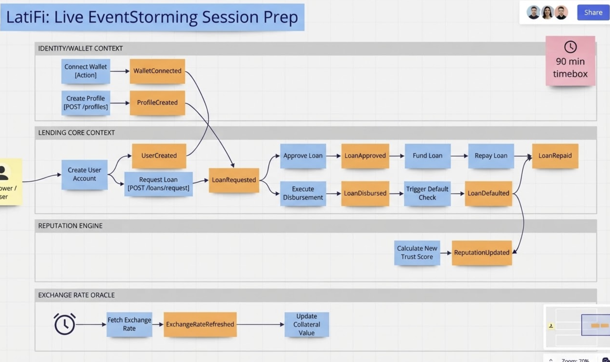

Los Domain Events identificados a partir del flujo de dominio son los siguientes:

- `ProfileCreated`: se registra un perfil ligero vinculado a una dirección on-chain (Identity/Wallet Context).
- `LoanRequested`: un prestatario publica una solicitud de préstamo con monto, tasa y plazo (Lending Context; decisión pendiente sobre si se emite como evento on-chain o se origina off-chain, ver Domain Message Flows más abajo).
- `LoanFunded`: un prestamista fondea una solicitud y el Smart Contract transfiere los fondos al prestatario (Lending Context).
- `LoanRepaid`: el prestatario repaga capital + interés y el contrato libera los fondos al prestamista (Lending Context).
- `LoanDefaulted`: el préstamo supera su plazo de vencimiento sin ser repagado (Lending Context).
- `ReputationUpdated`: el Reputation Context recalcula el score de un prestatario tras un evento de repago o default indexado (Reputation Context).
- `ExchangeRateRefreshed`: el Exchange Rate Context actualiza su caché de tasas desde el proveedor externo (Exchange Rate Context).

  

#### Candidate Context Discovery

Aplicando el razonamiento start-with-value a la problemática de LatiFi, los cinco bounded contexts anteriores se justifican de la siguiente manera:

El **Lending Context** se aísla primero porque concentra el valor central del negocio (el Core Value del proyecto depende exclusivamente de que este ciclo funcione) y porque, al vivir on-chain, tiene un ciclo de vida de desarrollo y despliegue completamente distinto (Solidity/Foundry, deploy a Polygon Amoy) del resto del sistema (REST/Kotlin/Swift). Separarlo temprano evita que su lógica se filtre o duplique hacia otros contextos, riesgo que la investigación de arquitectura señala explícitamente como anti-patrón.

El **Identity/Wallet Context** se separa porque resuelve un problema de negocio distinto (quién es el usuario) del que resuelve Lending (qué puede hacer ese usuario con dinero). Aunque físicamente es delgado (una porción vive en el cliente, otra en la API), su valor de negocio es autónomo: sin identidad verificable no hay resistencia a Sybil, precondición de todo el modelo de reputación.

El **Reputation Context** se separa de Identity porque, aunque ambos giran en torno al mismo usuario, cada uno entrega un valor de negocio distinto y con una tasa de cambio distinta: Identity cambia poco (una vez creado el perfil, rara vez se actualiza), mientras que Reputation cambia con cada evento de préstamo. Fusionarlos generaría un modelo que mezcla datos de baja y alta cadencia de cambio, dificultando su evolución independiente. Este es precisamente el diferenciador competitivo del proyecto (reputación híbrida), por lo que merece su propio contexto con reglas de negocio propias.

El **Exchange Rate Context** se separa por tener una razón de cambio y una fuente de datos completamente ajena al resto del dominio (un proveedor externo de FX, sin relación con préstamos ni reputación); acoplarlo a Reputation o Lending introduciría una dependencia espuria y, peor aún, el riesgo de que una tasa de cambio termine influyendo (aunque sea indirectamente) en la lógica de negocio del contrato, riesgo que la investigación de arquitectura señala como pitfall de "oracle manipulation".

El **Marketing/Landing Context** se separa porque no comparte modelo de dominio, usuarios autenticados ni ciclo de despliegue con ningún otro contexto; es, en términos de DDD estratégico, un "Generic Subdomain" que aporta valor de adquisición pero no valor transaccional, y su total independencia técnica permite que un sub-equipo lo desarrolle en paralelo desde la semana 1 sin coordinarse con el resto.


#### Domain Message Flows Modeling

El flujo de mensajes del happy path entre bounded contexts es el siguiente. El **Prestatario**, tras haber sido dado de alta por el **Identity/Wallet Context** (evento `ProfileCreated`), publica una solicitud de préstamo; esta acción origina un mensaje que el **Lending Context** registra como los términos de una solicitud abierta (evento `LoanRequested`, con la decisión pendiente sobre si nace on-chain o como estado off-chain reflejado luego on-chain). El **Prestamista**, al navegar el feed servido por LatiFi API, consulta al **Reputation Context** el score del solicitante antes de decidir fondear; si decide fondear, envía un comando que el **Lending Context** ejecuta on-chain, transfiriendo fondos al prestatario y emitiendo el evento `LoanFunded`. Este evento cruza la frontera on-chain/off-chain a través del Event Indexer, que actúa como traductor (anti-corruption layer) hacia el **Reputation Context**, el cual aún no actualiza el score en este punto (el fondeo no es, por sí mismo, una señal de comportamiento de pago). Cuando el prestatario repaga el préstamo, el **Lending Context** emite `LoanRepaid`; nuevamente el indexador traduce este evento y esta vez sí dispara en el **Reputation Context** el recálculo del score (evento `ReputationUpdated`), combinando esta señal on-chain con las señales off-chain ya existentes en el perfil del **Identity/Wallet Context**. En paralelo, y sin relación causal con el ciclo de préstamo, el **Exchange Rate Context** refresca periódicamente su caché de tasas para que tanto el feed del Lending Context como las pantallas de detalle del prestatario puedan mostrar montos en moneda local en cualquier punto del flujo.


#### Bounded Context Canvases

**Especificación Táctica de Fronteras:** La acotación formal de contratos internos, invariantes y subyacentes se consolida mediante canvases tácticos individuales.


#### Context Mapping

**Topología de Interacción y Contratos:** Las relaciones entre los cinco bounded contexts, en términos de los patrones estratégicos de DDD, se formalizan de la siguiente manera:

- **Lending Context → Identity/Wallet Context y Reputation Context: Upstream/Downstream con Anti-Corruption Layer.** Lending es upstream puro: no depende de ningún otro contexto para funcionar (el contrato no consulta perfiles ni scores para ejecutar fondeo o repago). Reputation e Identity/Wallet son downstream, y consumen los eventos de Lending exclusivamente a través del Event Indexer, que actúa como Anti-Corruption Layer: traduce logs crudos de blockchain (topics, valores hex-encoded, números de bloque) en eventos de dominio legibles (`BorrowerRepaidOnTime`, por ejemplo) antes de que lleguen a Reputation. Esto protege a Reputation de cualquier cambio en la forma del ABI o del esquema de eventos del contrato.
- **Reputation Context respecto de Lending Context: Conformist.** Reputation no negocia ni influye en qué eventos emite el contrato; se adapta enteramente a lo que Lending decide emitir. Esta relación es deliberada: es la única forma de preservar la garantía de que la lógica de préstamo vive exclusivamente on-chain (Driver DR-01).
- **Reputation Context ↔ Identity/Wallet Context: Customer/Supplier.** Reputation es cliente de Identity/Wallet en el sentido de que necesita el perfil (señales off-chain) como insumo para calcular el score híbrido; Identity/Wallet, como proveedor, expone ese perfil vía un contrato de datos estable (el perfil vinculado a una dirección), sin conocer ni depender de cómo Reputation lo usa internamente.
- **Exchange Rate Context: Separate Ways respecto de todos los demás.** No comparte modelo de dominio con ningún otro contexto ni depende de ellos; su única relación externa es con el proveedor de FX de terceros. Esta independencia es intencional: evita que una fluctuación o falla de la tasa de cambio contamine la lógica de negocio de Lending o Reputation.
- **Marketing/Landing Context: Separate Ways respecto de todos los demás.** Al igual que Exchange Rate, no comparte modelo ni tiene dependencias técnicas con el resto del sistema; en términos de Context Mapping es un contexto aislado por diseño, lo que le permite desarrollarse y desplegarse de forma completamente independiente.
- **LatiFi API como Shared Kernel interno (a nivel de infraestructura, no de dominio).** Aunque Identity/Wallet, Reputation y Exchange Rate son bounded contexts distintos a nivel de dominio, para el alcance del curso se co-despliegan dentro del mismo proceso de LatiFi API (Spring Boot/NestJS/ASP.NET Core), compartiendo infraestructura transversal (autenticación, configuración, acceso a base de datos) mediante un módulo `shared`. Este acoplamiento es explícitamente de infraestructura, no de modelo de dominio: cada contexto mantiene sus propios agregados y lenguaje ubicuo dentro de su paquete, de modo que la separación lógica exigida por la rúbrica de DDD se preserva aun cuando el despliegue físico esté unificado por restricciones de alcance académico.

#### Software Architecture

**System Landscape Diagram (C4)**

El panorama de sistemas reúne todo lo que el equipo construye y todo lo que LatiFi usa sin construirlo. Cuatro sistemas propios sirven a tres tipos de persona: la aplicación LatiFi Wallet para el prestatario y el prestamista, la LatiFi API que guarda perfiles y reputación, los Smart Contracts que ejecutan el préstamo y la Landing Page que atiende al visitante. Dos sistemas externos completan el panorama: la red Polygon Amoy, donde viven los contratos, y la API de tasas de cambio que alimenta la conversión a moneda local.

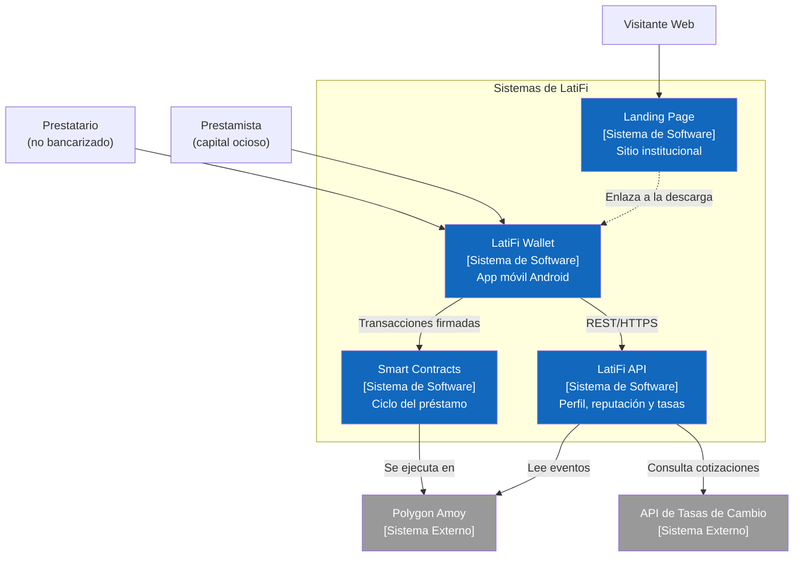
```mermaid
graph TD
    Prestatario["Prestatario<br/>(no bancarizado)"]
    Prestamista["Prestamista<br/>(capital ocioso)"]
    Visitante["Visitante Web"]

    subgraph "Sistemas de LatiFi"
        Wallet["LatiFi Wallet<br/>[Sistema de Software]<br/>App móvil Android"]
        API["LatiFi API<br/>[Sistema de Software]<br/>Perfil, reputación y tasas"]
        SC["Smart Contracts<br/>[Sistema de Software]<br/>Ciclo del préstamo"]
        Landing["Landing Page<br/>[Sistema de Software]<br/>Sitio institucional"]
    end

    Polygon["Polygon Amoy<br/>[Sistema Externo]"]
    FXApi["API de Tasas de Cambio<br/>[Sistema Externo]"]

    Prestatario --> Wallet
    Prestamista --> Wallet
    Visitante --> Landing
    Wallet -->|"REST/HTTPS"| API
    Wallet -->|"Transacciones firmadas"| SC
    SC -->|"Se ejecuta en"| Polygon
    API -->|"Lee eventos"| Polygon
    API -->|"Consulta cotizaciones"| FXApi
    Landing -.->|"Enlaza a la descarga"| Wallet

    style Wallet fill:#1168bd,color:#fff
    style API fill:#1168bd,color:#fff
    style SC fill:#1168bd,color:#fff
    style Landing fill:#1168bd,color:#fff
    style Polygon fill:#999,color:#fff
    style FXApi fill:#999,color:#fff
```

**Context Level Diagram (C4, Nivel 1)**

El sistema LatiFi se representa como una única caja negra ("LatiFi Platform") rodeada de cuatro actores externos. El **Prestatario** y el **Prestamista** interactúan con el sistema a través de la app móvil LatiFi Wallet para solicitar, fondear, pagar y consultar préstamos. La **red blockchain Polygon Amoy** es un sistema externo con el que LatiFi Platform intercambia transacciones firmadas y eventos on-chain, actuando como el libro mayor inmutable del ciclo de préstamo. La **API externa de tasas de cambio** es otro sistema externo, consumido unidireccionalmente por LatiFi Platform para obtener cotizaciones de stablecoin a moneda local, sin que LatiFi le exponga nada a cambio. Un quinto actor, el **Visitante web**, interactúa únicamente con la porción pública de LatiFi Platform (la Landing Page) sin necesidad de wallet ni cuenta.

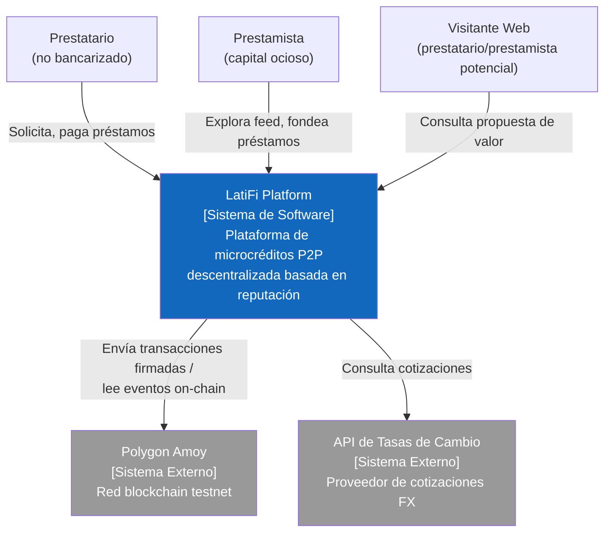
```mermaid
graph TD
    Prestatario["Prestatario<br/>(no bancarizado)"]
    Prestamista["Prestamista<br/>(capital ocioso)"]
    Visitante["Visitante Web<br/>(prestatario/prestamista potencial)"]
    LatiFi["LatiFi Platform<br/>[Sistema de Software]<br/>Plataforma de microcréditos P2P<br/>descentralizada basada en reputación"]
    Polygon["Polygon Amoy<br/>[Sistema Externo]<br/>Red blockchain testnet"]
    FXApi["API de Tasas de Cambio<br/>[Sistema Externo]<br/>Proveedor de cotizaciones FX"]

    Prestatario -->|"Solicita, paga préstamos"| LatiFi
    Prestamista -->|"Explora feed, fondea préstamos"| LatiFi
    Visitante -->|"Consulta propuesta de valor"| LatiFi
    LatiFi -->|"Envía transacciones firmadas /<br/>lee eventos on-chain"| Polygon
    LatiFi -->|"Consulta cotizaciones"| FXApi

    style LatiFi fill:#1168bd,color:#fff
    style Polygon fill:#999,color:#fff
    style FXApi fill:#999,color:#fff
```

**Container Level Diagram (C4, Nivel 2)**

Al abrir la caja negra "LatiFi Platform", se distinguen seis contenedores. **LatiFi Wallet (mobile)**, app nativa Kotlin para Android, es el punto de entrada de Prestatario y Prestamista; se comunica directamente con los **Smart Contracts** vía JSON-RPC (para acciones que el usuario inicia: conectar, fondear, pagar) y con la **LatiFi API** vía REST/HTTPS (para perfil, reputación, feed y conversión de moneda). Los **Smart Contracts**, desplegados en Polygon Amoy, son la fuente de verdad del ciclo de préstamo y emiten eventos que el **Event Indexer** consume vía RPC. El Event Indexer traduce esos eventos y escribe en la **LatiFi DB** (PostgreSQL) a través de la propia LatiFi API, de la cual puede considerarse un proceso embebido para el alcance del curso. La **LatiFi API** (Spring Boot/NestJS/ASP.NET Core) expone los endpoints REST de perfil, reputación e historial, y de conversión de moneda (consumiendo a su vez la API externa de FX), persistiendo todo en la LatiFi DB. La **Landing Page**, contenedor estático independiente, no se comunica con ningún otro contenedor salvo, opcionalmente, un enlace de descarga hacia las tiendas de aplicaciones.

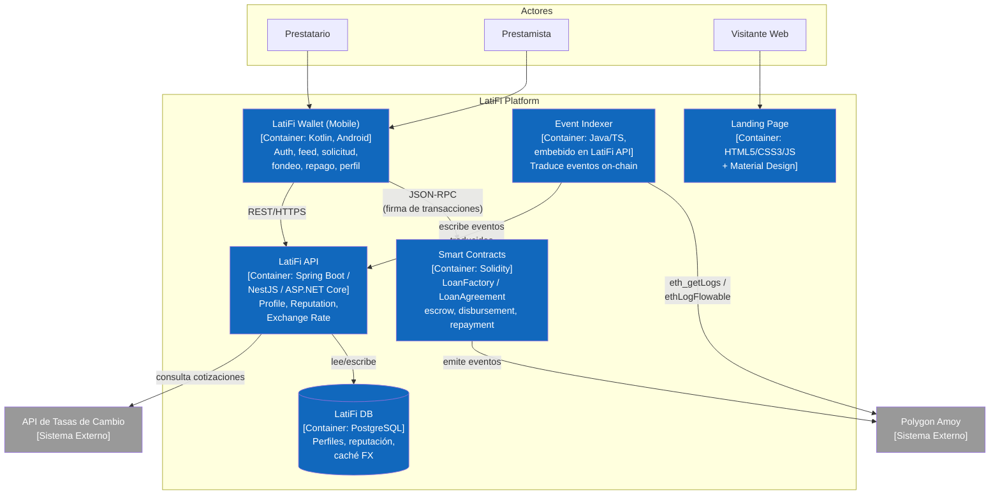
```mermaid
graph TD
    subgraph Actores
        Prestatario["Prestatario"]
        Prestamista["Prestamista"]
        Visitante["Visitante Web"]
    end

    subgraph "LatiFi Platform"
        Mobile["LatiFi Wallet (Mobile)<br/>[Container: Kotlin, Android]<br/>Auth, feed, solicitud,<br/>fondeo, repago, perfil"]
        SC["Smart Contracts<br/>[Container: Solidity]<br/>LoanFactory / LoanAgreement<br/>escrow, disbursement, repayment"]
        Indexer["Event Indexer<br/>[Container: Java/TS,<br/>embebido en LatiFi API]<br/>Traduce eventos on-chain"]
        API["LatiFi API<br/>[Container: Spring Boot /<br/>NestJS / ASP.NET Core]<br/>Profile, Reputation,<br/>Exchange Rate"]
        DB[("LatiFi DB<br/>[Container: PostgreSQL]<br/>Perfiles, reputación,<br/>caché FX")]
        Landing["Landing Page<br/>[Container: HTML5/CSS3/JS<br/>+ Material Design]"]
    end

    Polygon["Polygon Amoy<br/>[Sistema Externo]"]
    FXApi["API de Tasas de Cambio<br/>[Sistema Externo]"]

    Prestatario --> Mobile
    Prestamista --> Mobile
    Visitante --> Landing

    Mobile -->|"JSON-RPC<br/>(firma de transacciones)"| SC
    Mobile -->|"REST/HTTPS"| API
    SC -->|"emite eventos"| Polygon
    Indexer -->|"eth_getLogs /<br/>ethLogFlowable"| Polygon
    Indexer -->|"escribe eventos<br/>traducidos"| API
    API -->|"lee/escribe"| DB
    API -->|"consulta cotizaciones"| FXApi

    style Mobile fill:#1168bd,color:#fff
    style SC fill:#1168bd,color:#fff
    style Indexer fill:#1168bd,color:#fff
    style API fill:#1168bd,color:#fff
    style DB fill:#1168bd,color:#fff
    style Landing fill:#1168bd,color:#fff
    style Polygon fill:#999,color:#fff
    style FXApi fill:#999,color:#fff
```
**Deployment Diagram (C4)**

El despliegue distribuye el sistema en cuatro nodos. La aplicación se instala en el teléfono Android del usuario, donde la clave de su billetera queda protegida en el Android Keystore y nunca sale del dispositivo. Los Smart Contracts viven en la red de pruebas Polygon Amoy. LatiFi API, el indexador de eventos, la base de datos PostgreSQL y la landing page corren en un servidor privado virtual (VPS) de Hetzner administrado con Dokploy, que construye y publica cada servicio desde su repositorio de GitHub. El visitante accede a la landing desde su navegador.

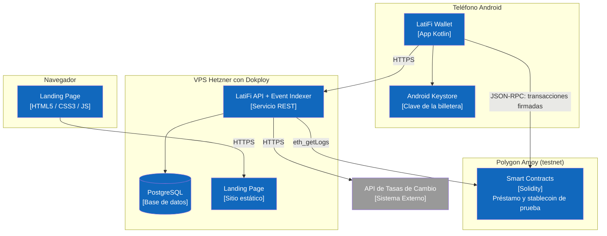
```mermaid
graph TD
    subgraph "Teléfono Android"
        App["LatiFi Wallet<br/>[App Kotlin]"]
        KS["Android Keystore<br/>[Clave de la billetera]"]
    end

    subgraph "Navegador"
        Browser["Landing Page<br/>[HTML5 / CSS3 / JS]"]
    end

    subgraph "VPS Hetzner con Dokploy"
        APIsrv["LatiFi API + Event Indexer<br/>[Servicio REST]"]
        PG[("PostgreSQL<br/>[Base de datos]")]
        Static["Landing Page<br/>[Sitio estático]"]
    end

    subgraph "Polygon Amoy (testnet)"
        Contracts["Smart Contracts<br/>[Solidity]<br/>Préstamo y stablecoin de prueba"]
    end

    FX["API de Tasas de Cambio<br/>[Sistema Externo]"]

    App --> KS
    App -->|"HTTPS"| APIsrv
    App -->|"JSON-RPC: transacciones firmadas"| Contracts
    Browser -->|"HTTPS"| Static
    APIsrv --> PG
    APIsrv -->|"eth_getLogs"| Contracts
    APIsrv -->|"HTTPS"| FX

    style App fill:#1168bd,color:#fff
    style KS fill:#1168bd,color:#fff
    style APIsrv fill:#1168bd,color:#fff
    style PG fill:#1168bd,color:#fff
    style Static fill:#1168bd,color:#fff
    style Browser fill:#1168bd,color:#fff
    style Contracts fill:#1168bd,color:#fff
    style FX fill:#999,color:#fff
```

## Capítulo V: Tactical-Level Software Design

El Capítulo IV delimitó los cinco bounded contexts de LatiFi y fijó cómo se relacionan entre sí. Este capítulo baja un nivel y define, para cada contexto, las clases que lo implementan, la capa a la que pertenece cada una, los componentes de cada container y las estructuras donde persiste su información. El diseño sigue los patrones tácticos de Domain-Driven Design: Entities, Value Objects, Aggregates, Domain Services, Repositories, Command Handlers y Event Handlers.

Cada contexto se organiza en cuatro capas, con una dependencia que siempre apunta hacia el dominio:

| Capa | Responsabilidad | Ejemplos en LatiFi |
|---|---|---|
| Domain Layer | Reglas de negocio, invariantes y lenguaje ubicuo del contexto. No conoce frameworks ni bases de datos. | `Loan`, `Profile`, `ReputationProfile`, `ExchangeRate`, repositorios como interfaces |
| Application Layer | Orquesta los casos de uso y los flujos de proceso. Recibe comandos y consultas, y reacciona a eventos. | `LoanAgreement` (comandos on-chain), `ProfileService`, `RecordLoanOutcomeHandler` |
| Interface Layer | Puerta de entrada al contexto: controladores REST, funciones externas del contrato, pantallas móviles. | `ProfileController`, ABI de `LoanAgreement`, `LoanFeedController` |
| Infrastructure Layer | Acceso a servicios externos: base de datos, red blockchain, proveedor de tasas, Android Keystore. | `JpaProfileRepository`, `Web3jChainEventSource`, `HttpExchangeRateProvider` |

Los contextos se reparten entre los containers que definió el Capítulo IV y usan las tecnologías ya decididas:

| Bounded context | Containers que lo implementan | Tecnología | Persistencia | Historias de usuario |
|---|---|---|---|---|
| Lending | Smart Contracts | Solidity 0.8.35, OpenZeppelin 5.x, Foundry | Almacenamiento del contrato en Polygon Amoy | US-LEND-01, US-LEND-03, US-LEND-04, US-LEND-05 |
| Identity/Wallet | LatiFi Wallet, LatiFi API | Kotlin y web3j para Android; Spring Boot 3.5 con Java 21 | Android Keystore; PostgreSQL | US-AUTH-01 a US-AUTH-04, US-IDEN-01, US-IDEN-02 |
| Reputation | LatiFi API, Event Indexer | Spring Boot 3.5, web3j, Spring Data JPA | PostgreSQL | US-REP-01 a US-REP-04, US-API-01, US-LEND-02, US-LEND-05 |
| Exchange Rate | LatiFi API | Spring Boot 3.5, cliente HTTP, caché en base de datos | PostgreSQL | US-LEND-06, US-API-02 |
| Marketing/Landing | Landing Page | HTML5, CSS3, JavaScript y Material Design | Archivos JSON versionados | US-LAND-01, US-LAND-02 |

Los diagramas de componentes usan la notación del C4 Model (Container Boundary, Component, Component DB y System Ext). Los diagramas de clases usan UML con visibilidad (`+` público, `-` privado, `#` protegido), relaciones con nombre y multiplicidad. Los diagramas de base de datos muestran tablas, columnas, claves primarias (PK), claves foráneas (FK) y restricciones únicas (UK).

### 5.1. Bounded Context: Lending

El Lending Context es el único dueño del ciclo de vida del préstamo y vive completo en la cadena. Su diseño parte de cuatro decisiones, todas coherentes con el Capítulo IV:

- **Un único contrato registro.** `LoanAgreement` guarda todos los préstamos en un mapa indexado por identificador. Se descartó una fábrica que despliegue un contrato por préstamo, porque obligaría al Event Indexer a descubrir direcciones nuevas de forma dinámica y encarece el gas de cada solicitud.
- **La solicitud nace on-chain.** `LoanRequested` se emite desde el contrato, de modo que el feed de solicitudes se deriva solo de eventos y ningún estado del préstamo existe fuera de la cadena.
- **Cuotas iguales con un vencimiento cada una.** El plazo total se divide en entre una y seis cuotas del mismo monto, espaciadas de forma uniforme. La última cuota absorbe el residuo del redondeo.
- **Ningún dato de precio entra al contrato.** El contrato opera solo con la unidad de la stablecoin. La conversión a moneda local es presentacional y pertenece al Exchange Rate Context.

#### 5.1.1. Domain Layer

El dominio del contrato se compone de tipos de datos, una librería de cálculo y las interfaces que expresan el contrato público. No depende de ninguna librería externa salvo la interfaz estándar `IERC20`.

| Clase | Tipo | Propósito | Atributos y métodos |
|---|---|---|---|
| `Loan` | Aggregate Root (struct) | Representa un préstamo desde la solicitud hasta su liquidación. Es la única copia del estado del préstamo. | `id`, `borrower`, `lender`, `principal`, `interestRateBps`, `termDays`, `installments`, `totalDue`, `amountRepaid`, `installmentsPaid`, `requestedAt`, `fundedAt`, `status` |
| `LoanStatus` | Enumeración | Estados válidos de un préstamo, que alimentan la consulta de estado de US-LEND-05. | `Open`, `Active`, `Repaid`, `Defaulted` |
| `BorrowerStats` | Value Object (struct) | Contadores de resultados de un prestatario que el contrato incrementa y nadie más puede modificar. | `onTimePayments`, `latePayments`, `defaults` |
| `InterestMath` | Domain Service (librería) | Calcula el monto total a pagar, el monto y la fecha de cada cuota. Es pura: no lee ni escribe estado. | `totalDue(principal, rateBps)`, `installmentAmount(totalDue, count, index)`, `dueDate(fundedAt, termDays, count, index)` |
| `ILoanAgreement` | Interfaz | Declara las operaciones, los eventos y los errores del contexto. Es el contrato público que consumen la app y el indexador. | `requestLoan`, `fundLoan`, `repay`, `markDefaulted`, `getLoan`, `getBorrowerStats`, `nextDueDate` |

Las reglas de negocio que el dominio hace cumplir son estas:

1. El monto, el plazo y el número de cuotas deben ser mayores que cero, y la tasa debe estar dentro del rango configurado.
2. Un préstamo solo se fondea una vez, y nunca lo fondea su propio prestatario.
3. Una vez fondeado, ni el monto, ni la tasa, ni el plazo, ni el vencimiento cambian.
4. El prestatario no puede pagar más de lo que adeuda.
5. Después del vencimiento final, cualquier cuenta puede marcar el préstamo como incumplido.

Los eventos de dominio y sus parámetros son:

| Evento | Parámetros | Cuándo se emite |
|---|---|---|
| `LoanRequested` | `loanId`, `borrower`, `principal`, `interestRateBps`, `termDays`, `installments` | El prestatario publica una solicitud válida. |
| `LoanFunded` | `loanId`, `lender`, `borrower`, `principal`, `fundedAt`, `finalDueDate` | Un prestamista fondea y la stablecoin pasa al prestatario. |
| `LoanRepaid` | `loanId`, `amountPaid`, `onTime` | En cada pago del prestatario, aunque el préstamo no se liquide. |
| `LoanDefaulted` | `loanId` | Se marca como incumplido un préstamo vencido. |

#### 5.1.2. Interface Layer

La capa de interfaz del contrato es su ABI. Las funciones externas reciben las intenciones de los usuarios y delegan la regla de negocio en las capas inferiores.

| Elemento | Tipo | Propósito | Firma |
|---|---|---|---|
| `requestLoan` | Función de escritura | Publica una solicitud de préstamo (US-LEND-01). | `requestLoan(uint256 principal, uint16 interestRateBps, uint16 termDays, uint8 installments) returns (uint256 loanId)` |
| `fundLoan` | Función de escritura | Fondea una solicitud abierta (US-LEND-03). | `fundLoan(uint256 loanId)` |
| `repay` | Función de escritura | Registra un pago del prestatario (US-LEND-04). | `repay(uint256 loanId, uint256 amount)` |
| `markDefaulted` | Función de escritura | Marca un préstamo vencido como incumplido. | `markDefaulted(uint256 loanId)` |
| `getLoan` | Función de lectura | Devuelve el préstamo completo (US-LEND-05). | `getLoan(uint256 loanId) returns (Loan)` |
| `getBorrowerStats` | Función de lectura | Devuelve los contadores de un prestatario. | `getBorrowerStats(address borrower) returns (BorrowerStats)` |
| `nextDueDate` | Función de lectura | Devuelve la fecha de la próxima cuota pendiente. | `nextDueDate(uint256 loanId) returns (uint64)` |

Los errores personalizados reemplazan a los mensajes de texto para reducir el gas y facilitar las pruebas: `InvalidAmount`, `InvalidTerm`, `RateOutOfRange`, `LoanNotOpen`, `SelfFunding`, `LoanNotActive`, `Overpayment` y `NotYetDefaultable`.

#### 5.1.3. Application Layer

La capa de aplicación del contrato la forman los manejadores de comandos, que son las funciones de `LoanAgreement`. Cada uno valida la entrada, aplica la regla del dominio, actualiza el estado y emite el evento. En un contrato no existen manejadores de eventos entrantes: el contexto solo publica eventos, nunca los consume.

| Manejador | Comando que atiende | Flujo |
|---|---|---|
| `requestLoan` | Publicar solicitud | Valida monto, plazo, cuotas y tasa; calcula `totalDue`; guarda el préstamo en estado `Open`; emite `LoanRequested`. |
| `fundLoan` | Fondear solicitud | Verifica que esté `Open` y que el prestamista no sea el prestatario; cambia a `Active`; fija `fundedAt`; transfiere la stablecoin del prestamista al prestatario; emite `LoanFunded`. |
| `repay` | Pagar | Verifica que esté `Active` y que el pago no exceda lo adeudado; determina si el pago es puntual; transfiere la stablecoin del prestatario al prestamista; actualiza contadores; emite `LoanRepaid`; si el saldo llega a cero, cambia a `Repaid`. |
| `markDefaulted` | Marcar incumplimiento | Verifica que esté `Active` y que haya pasado el vencimiento final; cambia a `Defaulted`; incrementa `defaults`; emite `LoanDefaulted`. |

Todas las funciones que mueven fondos llevan el modificador `nonReentrant` y siguen el patrón checks-effects-interactions: el estado se actualiza antes de transferir la stablecoin.

#### 5.1.4. Infrastructure Layer

La infraestructura del contrato la forman las dependencias externas que sostienen la ejecución. Se reutilizan componentes auditados de OpenZeppelin en lugar de escribirlos de nuevo.

| Componente | Origen | Propósito |
|---|---|---|
| `SafeERC20` | OpenZeppelin 5.x | Transfiere la stablecoin con verificación del resultado de cada llamada. |
| `ReentrancyGuard` | OpenZeppelin 5.x | Provee el modificador `nonReentrant`. |
| `Pausable` y `AccessControl` | OpenZeppelin 5.x | Permiten que un rol administrador detenga las operaciones ante un incidente. |
| `MockStablecoin` | Propio | ERC-20 de prueba con 6 decimales y emisión pública acotada, que evita depender de faucets externos durante las demostraciones. |
| `IERC20` | Estándar ERC-20 | Puerto por el que `LoanAgreement` conoce la stablecoin sin acoplarse a una implementación. |

#### 5.1.5. Bounded Context Software Architecture Component Level Diagrams

El container Smart Contracts se descompone en cuatro componentes propios y tres de OpenZeppelin. La app firma las transacciones y el Event Indexer lee los eventos desde la red.

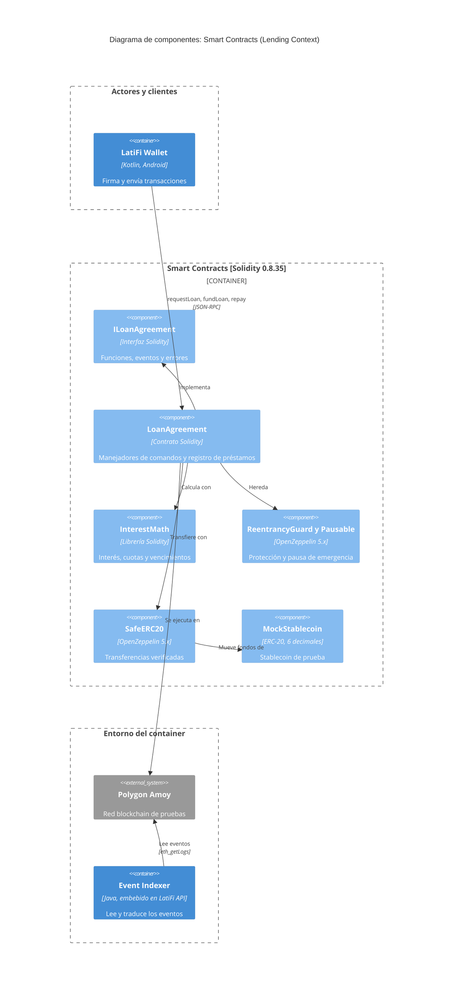
```mermaid
C4Component
    title Diagrama de componentes: Smart Contracts (Lending Context)

    Boundary(up, "Actores y clientes", "") {
        Container(wallet, "LatiFi Wallet", "Kotlin, Android", "Firma y envía transacciones")
    }

    Container_Boundary(sc, "Smart Contracts [Solidity 0.8.35]") {
        Component(abi, "ILoanAgreement", "Interfaz Solidity", "Funciones, eventos y errores")
        Component(agreement, "LoanAgreement", "Contrato Solidity", "Manejadores de comandos y registro de préstamos")
        Component(math, "InterestMath", "Librería Solidity", "Interés, cuotas y vencimientos")
        Component(guard, "ReentrancyGuard y Pausable", "OpenZeppelin 5.x", "Protección y pausa de emergencia")
        Component(safe, "SafeERC20", "OpenZeppelin 5.x", "Transferencias verificadas")
        Component(token, "MockStablecoin", "ERC-20, 6 decimales", "Stablecoin de prueba")
    }

    Boundary(down, "Entorno del container", "") {
        System_Ext(amoy, "Polygon Amoy", "Red blockchain de pruebas")
        Container(indexer, "Event Indexer", "Java, embebido en LatiFi API", "Lee y traduce los eventos")
    }

    Rel(wallet, agreement, "requestLoan, fundLoan, repay", "JSON-RPC")
    Rel(agreement, abi, "Implementa")
    Rel(agreement, math, "Calcula con")
    Rel(agreement, guard, "Hereda")
    Rel(agreement, safe, "Transfiere con")
    Rel(safe, token, "Mueve fondos de")
    Rel(agreement, amoy, "Se ejecuta en")
    Rel(indexer, amoy, "Lee eventos", "eth_getLogs")

    UpdateLayoutConfig($c4ShapeInRow="3", $c4BoundaryInRow="1")
```

#### 5.1.6. Bounded Context Software Architecture Code Level Diagrams

##### 5.1.6.1. Bounded Context Domain Layer Class Diagrams

El diagrama muestra las clases del Domain Layer y la interfaz que las expone. `LoanAgreement` conserva todos los préstamos y todos los contadores; `InterestMath` es una librería sin estado.

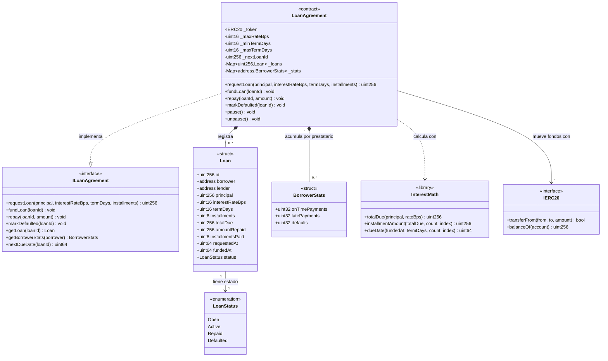
```mermaid
classDiagram
    class ILoanAgreement {
        <<interface>>
        +requestLoan(principal, interestRateBps, termDays, installments) uint256
        +fundLoan(loanId) void
        +repay(loanId, amount) void
        +markDefaulted(loanId) void
        +getLoan(loanId) Loan
        +getBorrowerStats(borrower) BorrowerStats
        +nextDueDate(loanId) uint64
    }
    class LoanAgreement {
        <<contract>>
        -IERC20 _token
        -uint16 _maxRateBps
        -uint16 _minTermDays
        -uint16 _maxTermDays
        -uint256 _nextLoanId
        -Map~uint256,Loan~ _loans
        -Map~address,BorrowerStats~ _stats
        +requestLoan(principal, interestRateBps, termDays, installments) uint256
        +fundLoan(loanId) void
        +repay(loanId, amount) void
        +markDefaulted(loanId) void
        +pause() void
        +unpause() void
    }
    class Loan {
        <<struct>>
        +uint256 id
        +address borrower
        +address lender
        +uint256 principal
        +uint16 interestRateBps
        +uint16 termDays
        +uint8 installments
        +uint256 totalDue
        +uint256 amountRepaid
        +uint8 installmentsPaid
        +uint64 requestedAt
        +uint64 fundedAt
        +LoanStatus status
    }
    class LoanStatus {
        <<enumeration>>
        Open
        Active
        Repaid
        Defaulted
    }
    class BorrowerStats {
        <<struct>>
        +uint32 onTimePayments
        +uint32 latePayments
        +uint32 defaults
    }
    class InterestMath {
        <<library>>
        +totalDue(principal, rateBps) uint256
        +installmentAmount(totalDue, count, index) uint256
        +dueDate(fundedAt, termDays, count, index) uint64
    }
    class IERC20 {
        <<interface>>
        +transferFrom(from, to, amount) bool
        +balanceOf(account) uint256
    }

    LoanAgreement ..|> ILoanAgreement : implementa
    LoanAgreement "1" *-- "0..*" Loan : registra
    LoanAgreement "1" *-- "0..*" BorrowerStats : acumula por prestatario
    Loan "1" --> "1" LoanStatus : tiene estado
    LoanAgreement ..> InterestMath : calcula con
    LoanAgreement --> "1" IERC20 : mueve fondos con
```

##### 5.1.6.2. Bounded Context Database Diagram

El Lending Context no usa tablas. Su persistencia es el almacenamiento del contrato y el registro de eventos de la cadena. El diagrama presenta ambos con la misma notación relacional para facilitar la lectura: el préstamo se identifica por su `id`, los contadores se identifican por la dirección del prestatario y cada evento referencia al préstamo que lo originó.

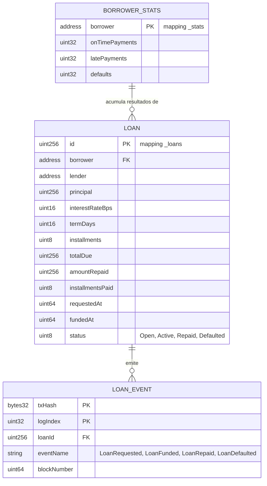
```mermaid
erDiagram
    BORROWER_STATS {
        address borrower PK "mapping _stats"
        uint32 onTimePayments
        uint32 latePayments
        uint32 defaults
    }
    LOAN {
        uint256 id PK "mapping _loans"
        address borrower FK
        address lender
        uint256 principal
        uint16 interestRateBps
        uint16 termDays
        uint8 installments
        uint256 totalDue
        uint256 amountRepaid
        uint8 installmentsPaid
        uint64 requestedAt
        uint64 fundedAt
        uint8 status "Open, Active, Repaid, Defaulted"
    }
    LOAN_EVENT {
        bytes32 txHash PK
        uint32 logIndex PK
        uint256 loanId FK
        string eventName "LoanRequested, LoanFunded, LoanRepaid, LoanDefaulted"
        uint64 blockNumber
    }

    BORROWER_STATS ||--o{ LOAN : "acumula resultados de"
    LOAN ||--o{ LOAN_EVENT : "emite"
```

Restricciones del esquema:

- `LOAN.id` es un contador ascendente (`_nextLoanId`) que nunca se reutiliza.
- `LOAN.borrower` y `LOAN.lender` son distintos cuando el estado es `Active` o posterior.
- `LOAN.amountRepaid` nunca supera `LOAN.totalDue`.
- `LOAN.principal`, `LOAN.interestRateBps`, `LOAN.termDays`, `LOAN.installments` y `LOAN.totalDue` son inmutables desde que el estado pasa a `Active`.
- `LOAN_EVENT` no se escribe desde el contrato: la red lo produce como registro inmutable de cada transacción, y el par `txHash` y `logIndex` lo identifica de forma única.

### 5.2. Bounded Context: Identity/Wallet

El Identity/Wallet Context responde a la pregunta de quién es el usuario. Se reparte en dos containers: LatiFi Wallet, que crea y custodia en el dispositivo la clave del usuario y firma, y LatiFi API, que verifica las firmas y guarda el perfil ligero. La dirección on-chain es la identidad; no existen usuario ni contraseña.

Las decisiones de diseño del contexto son:

- **Billetera propia y no custodial.** La app genera el par de claves en el primer arranque y lo protege con Android Keystore. Ninguna clave ni frase de recuperación sale del dispositivo (DR-08). La conexión con una billetera externa a través de Reown queda como vía opcional de importación, no como flujo principal.
- **Autenticación por desafío y firma.** La API entrega un nonce de un solo uso; la app lo firma con el esquema de mensaje personal de Ethereum (EIP-191); la API recupera la dirección del firmante y, solo si coincide con la declarada, emite un token de sesión.
- **Perfil ligero como barrera mínima contra Sybil.** El perfil guarda nombre y un dato de contacto. La API nunca devuelve el contacto a un usuario distinto de su dueño.

#### 5.2.1. Domain Layer

Dominio del container LatiFi Wallet (Android):

| Clase | Tipo | Propósito | Atributos y métodos |
|---|---|---|---|
| `Wallet` | Entity | Billetera del usuario en el dispositivo. | `address: WalletAddress`, `createdAt: Instant`, `recoveryConfirmed: Boolean`; `confirmRecovery()` |
| `WalletAddress` | Value Object | Dirección de 20 bytes en formato hexadecimal con suma de verificación. | `value: String`; `toChecksum(): String`; valida el prefijo `0x` y 40 caracteres hexadecimales |
| `RecoveryPhrase` | Value Object | Frase de 12 palabras que permite restaurar la billetera. Nunca se persiste en texto plano. | `words: List<String>`; `toSeed(): ByteArray` |
| `SignedMessage` | Value Object | Resultado de firmar un mensaje. | `message: String`, `signature: String`, `signer: WalletAddress` |
| `TransactionStatus` | Enumeración | Estados que ve el usuario durante una operación on-chain (US-AUTH-04). | `Pending`, `Confirming`, `Confirmed`, `Failed` |
| `WalletRepository` | Repositorio (interfaz) | Puerto de persistencia de la billetera. | `current(): Wallet?`, `save(wallet)`, `clear()` |
| `MessageSigner` | Domain Service (interfaz) | Puerto de firma de mensajes y transacciones con la clave del usuario. | `sign(message): SignedMessage`, `signTransaction(raw): ByteArray` |

Dominio del container LatiFi API:

| Clase | Tipo | Propósito | Atributos y métodos |
|---|---|---|---|
| `Profile` | Aggregate Root | Perfil ligero vinculado a una dirección. | `address: WalletAddress`, `displayName: String`, `contact: ContactInfo`, `createdAt`, `updatedAt`; `update(displayName, contact)`, `isComplete(): Boolean` |
| `ContactInfo` | Value Object | Dato de contacto validado. | `type: ContactType`, `value: String` |
| `ContactType` | Enumeración | Tipo de contacto aceptado. | `EMAIL`, `PHONE` |
| `AuthChallenge` | Entity | Desafío de un solo uso que el usuario debe firmar. | `id: UUID`, `address: WalletAddress`, `nonce: String`, `issuedAt`, `expiresAt`, `consumedAt`; `isExpired(now)`, `consume(now)` |
| `SignatureVerifier` | Domain Service (interfaz) | Puerto que recupera la dirección de quien firmó un mensaje. | `recoverSigner(message, signature): WalletAddress` |
| `ProfileRepository` | Repositorio (interfaz) | Puerto de persistencia de perfiles. | `findByAddress(address)`, `save(profile)` |
| `AuthChallengeRepository` | Repositorio (interfaz) | Puerto de persistencia de desafíos. | `findById(id)`, `save(challenge)` |
| `ProfileCreated` | Domain Event | Se emite al registrarse un perfil nuevo. | `address`, `occurredAt` |
| `ProfileUpdated` | Domain Event | Se emite al cambiar un perfil existente. | `address`, `occurredAt` |

Invariantes: un desafío solo se consume una vez y solo antes de su expiración; un perfil siempre pertenece a exactamente una dirección; el contacto solo es legible por su dueño.

#### 5.2.2. Interface Layer

Interfaz del container LatiFi API (REST, con prefijo `/api/v1`):

| Controlador | Operación | Propósito | Acceso |
|---|---|---|---|
| `AuthController` | `POST /auth/challenge` | Solicita un nonce para una dirección. | Público |
| `AuthController` | `POST /auth/verify` | Entrega dirección y firma; devuelve el token de sesión si el firmante coincide. | Público |
| `ProfileController` | `GET /profiles/{address}` | Lee un perfil. El contacto solo se incluye cuando la dirección consultada es la del usuario autenticado. | Autenticado |
| `ProfileController` | `PUT /profiles/{address}` | Crea o actualiza el perfil. Solo el dueño de la dirección puede escribir. | Autenticado |

Los objetos de transferencia son `ChallengeRequest`, `ChallengeResponse`, `VerifyRequest`, `TokenResponse`, `ProfileResponse` y `ProfileUpdateRequest`. Los errores se devuelven con código 401 para firmas inválidas, repetidas o vencidas, y con código 403 cuando el usuario intenta escribir un perfil ajeno.

Interfaz del container LatiFi Wallet (pantallas y modelos de vista):

| Clase | Propósito | Historia |
|---|---|---|
| `OnboardingScreen` y `OnboardingViewModel` | Explica en lenguaje simple cómo se solicita, fondea y paga un préstamo antes de crear la billetera. | US-AUTH-03 |
| `WalletSetupScreen` y `WalletSetupViewModel` | Crea la billetera, muestra la frase de recuperación y exige su confirmación. | US-AUTH-01, US-AUTH-02 |
| `ProfileScreen` y `ProfileViewModel` | Captura y edita nombre y contacto. Bloquea publicar o fondear mientras el perfil esté incompleto. | US-IDEN-01 |
| `TransactionStatusSheet` y `TransactionStatusViewModel` | Muestra el estado de una transacción y ofrece reintentar o reconectar si la firma nunca llega. | US-AUTH-04 |

#### 5.2.3. Application Layer

Aplicación del container LatiFi API:

| Clase | Operaciones | Flujo |
|---|---|---|
| `AuthService` | `issueChallenge(address)` | Genera un nonce aleatorio, fija su vencimiento en cinco minutos y lo persiste. |
| `AuthService` | `verify(challengeId, signature)` | Recupera el firmante, comprueba que coincida con la dirección del desafío, consume el desafío y emite el token. |
| `ProfileService` | `getProfile(address, requester)` | Devuelve el perfil y omite el contacto si el solicitante no es el dueño. |
| `ProfileService` | `upsertProfile(address, request, requester)` | Verifica la propiedad, valida el contacto, guarda y publica `ProfileCreated` o `ProfileUpdated`. |

Aplicación del container LatiFi Wallet (casos de uso):

| Caso de uso | Flujo |
|---|---|
| `CreateWalletUseCase` | Genera el par de claves, lo guarda a través de `WalletRepository` y devuelve la frase de recuperación para mostrarla una vez. |
| `RestoreWalletUseCase` | Reconstruye la billetera desde una frase de recuperación y la guarda. |
| `SignInUseCase` | Pide el desafío a la API, lo firma con `MessageSigner`, lo verifica y almacena el token de sesión. |
| `SaveProfileUseCase` | Envía nombre y contacto a la API y actualiza el estado local del perfil. |
| `TrackTransactionUseCase` | Consulta el recibo de la transacción hasta confirmarla y emite cada cambio de `TransactionStatus`. |

#### 5.2.4. Infrastructure Layer

Infraestructura del container LatiFi API:

| Clase | Implementa | Tecnología |
|---|---|---|
| `JpaProfileRepository` | `ProfileRepository` | Spring Data JPA sobre PostgreSQL |
| `JpaAuthChallengeRepository` | `AuthChallengeRepository` | Spring Data JPA sobre PostgreSQL |
| `Web3jSignatureVerifier` | `SignatureVerifier` | web3j, recuperación de firma ECDSA según EIP-191 |
| `JwtTokenProvider` | Emisión y lectura del token de sesión | Spring Security con JWT |
| `JwtAuthenticationFilter` | Autenticación de cada petición | Filtro de Spring Security |
| `SpringDomainEventPublisher` | Publicación de `ProfileCreated` y `ProfileUpdated` | Eventos de aplicación de Spring |

Infraestructura del container LatiFi Wallet:

| Clase | Implementa | Tecnología |
|---|---|---|
| `KeystoreWalletRepository` | `WalletRepository` | Android Keystore protege la clave que cifra el material de la billetera con AES-GCM |
| `Web3jMessageSigner` | `MessageSigner` | web3j para Android, firma EIP-191 y de transacciones |
| `LatiFiAuthApi` y `LatiFiProfileApi` | Clientes REST | Retrofit y OkHttp |
| `SessionStore` | Almacén del token de sesión | Preferencias cifradas |
| `ReceiptPoller` | Consulta de recibos | web3j sobre JSON-RPC |
| `ReownImportAdapter` | Importación opcional de una billetera externa | SDK de Reown |

#### 5.2.5. Bounded Context Software Architecture Component Level Diagrams

Container LatiFi API, módulo de identidad:

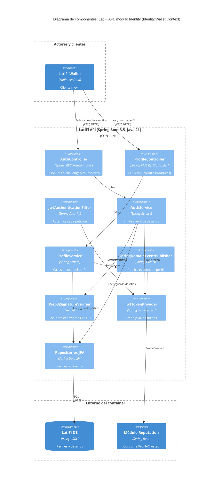
```mermaid
C4Component
    title Diagrama de componentes: LatiFi API, módulo Identity (Identity/Wallet Context)

    Boundary(up, "Actores y clientes", "") {
        Container(wallet, "LatiFi Wallet", "Kotlin, Android", "Cliente móvil")
    }

    Container_Boundary(api, "LatiFi API [Spring Boot 3.5, Java 21]") {
        Component(authc, "AuthController", "Spring MVC RestController", "POST /auth/challenge y /auth/verify")
        Component(profc, "ProfileController", "Spring MVC RestController", "GET y PUT /profiles/{address}")
        Component(filter, "JwtAuthenticationFilter", "Spring Security", "Autentica cada petición")
        Component(authsvc, "AuthService", "Spring Service", "Emite y verifica desafíos")
        Component(profsvc, "ProfileService", "Spring Service", "Casos de uso del perfil")
        Component(pub, "SpringDomainEventPublisher", "Spring Events", "Publica eventos de perfil")
        Component(verifier, "Web3jSignatureVerifier", "web3j", "Recupera el firmante EIP-191")
        Component(jwt, "JwtTokenProvider", "Spring Security JWT", "Emite y valida tokens")
        Component(repos, "Repositorios JPA", "Spring Data JPA", "Perfiles y desafíos")
    }

    Boundary(down, "Entorno del container", "") {
        ContainerDb(db, "LatiFi DB", "PostgreSQL", "Perfiles y desafíos")
        Container(rep, "Módulo Reputation", "Spring Boot", "Consume ProfileCreated")
    }

    Rel(wallet, authc, "Solicita desafío y verifica", "REST, HTTPS")
    Rel(wallet, profc, "Lee y guarda perfil", "REST, HTTPS")
    Rel(filter, jwt, "Valida token")
    Rel(authc, authsvc, "Usa")
    Rel(profc, profsvc, "Usa")
    Rel(authsvc, verifier, "Verifica firma")
    Rel(authsvc, jwt, "Emite token")
    Rel(authsvc, repos, "Lee y guarda desafíos")
    Rel(profsvc, repos, "Lee y guarda perfiles")
    Rel(profsvc, pub, "Publica eventos")
    Rel(repos, db, "SQL", "JDBC")
    Rel(pub, rep, "ProfileCreated")

    UpdateLayoutConfig($c4ShapeInRow="3", $c4BoundaryInRow="1")
```

Container LatiFi Wallet, módulo de identidad y billetera:

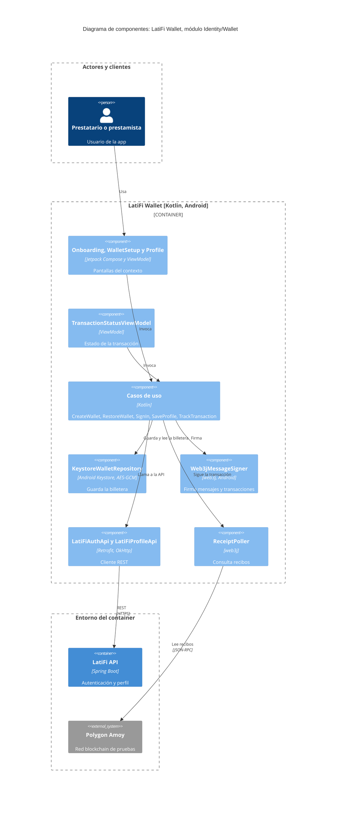
```mermaid
C4Component
    title Diagrama de componentes: LatiFi Wallet, módulo Identity/Wallet

    Boundary(up, "Actores y clientes", "") {
        Person(user, "Prestatario o prestamista", "Usuario de la app")
    }

    Container_Boundary(app, "LatiFi Wallet [Kotlin, Android]") {
        Component(ui, "Onboarding, WalletSetup y Profile", "Jetpack Compose y ViewModel", "Pantallas del contexto")
        Component(tx, "TransactionStatusViewModel", "ViewModel", "Estado de la transacción")
        Component(uc, "Casos de uso", "Kotlin", "CreateWallet, RestoreWallet, SignIn, SaveProfile, TrackTransaction")
        Component(walletrepo, "KeystoreWalletRepository", "Android Keystore, AES-GCM", "Guarda la billetera")
        Component(signer, "Web3jMessageSigner", "web3j, Android", "Firma mensajes y transacciones")
        Component(client, "LatiFiAuthApi y LatiFiProfileApi", "Retrofit, OkHttp", "Cliente REST")
        Component(poller, "ReceiptPoller", "web3j", "Consulta recibos")
    }

    Boundary(down, "Entorno del container", "") {
        Container(api, "LatiFi API", "Spring Boot", "Autenticación y perfil")
        System_Ext(amoy, "Polygon Amoy", "Red blockchain de pruebas")
    }

    Rel(user, ui, "Usa")
    Rel(ui, uc, "Invoca")
    Rel(tx, uc, "Invoca")
    Rel(uc, walletrepo, "Guarda y lee la billetera")
    Rel(uc, signer, "Firma")
    Rel(uc, client, "Llama a la API")
    Rel(uc, poller, "Sigue la transacción")
    Rel(client, api, "REST", "HTTPS")
    Rel(poller, amoy, "Lee recibos", "JSON-RPC")

    UpdateLayoutConfig($c4ShapeInRow="3", $c4BoundaryInRow="1")
```

#### 5.2.6. Bounded Context Software Architecture Code Level Diagrams

##### 5.2.6.1. Bounded Context Domain Layer Class Diagrams

Dominio del container LatiFi API:

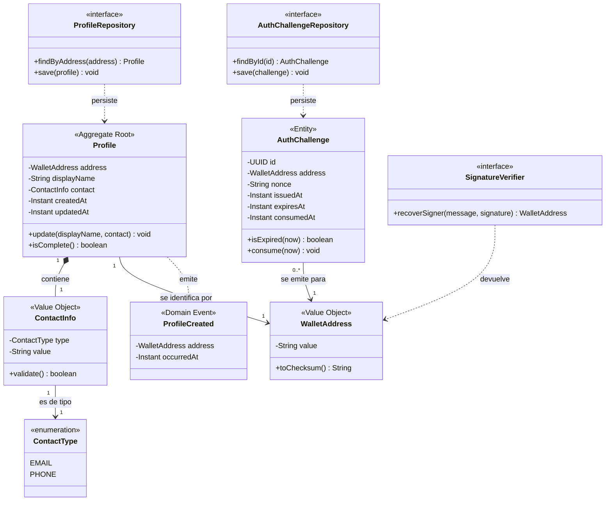
```mermaid
classDiagram
    class Profile {
        <<Aggregate Root>>
        -WalletAddress address
        -String displayName
        -ContactInfo contact
        -Instant createdAt
        -Instant updatedAt
        +update(displayName, contact) void
        +isComplete() boolean
    }
    class ContactInfo {
        <<Value Object>>
        -ContactType type
        -String value
        +validate() boolean
    }
    class ContactType {
        <<enumeration>>
        EMAIL
        PHONE
    }
    class WalletAddress {
        <<Value Object>>
        -String value
        +toChecksum() String
    }
    class AuthChallenge {
        <<Entity>>
        -UUID id
        -WalletAddress address
        -String nonce
        -Instant issuedAt
        -Instant expiresAt
        -Instant consumedAt
        +isExpired(now) boolean
        +consume(now) void
    }
    class SignatureVerifier {
        <<interface>>
        +recoverSigner(message, signature) WalletAddress
    }
    class ProfileRepository {
        <<interface>>
        +findByAddress(address) Profile
        +save(profile) void
    }
    class AuthChallengeRepository {
        <<interface>>
        +findById(id) AuthChallenge
        +save(challenge) void
    }
    class ProfileCreated {
        <<Domain Event>>
        -WalletAddress address
        -Instant occurredAt
    }

    Profile "1" *-- "1" ContactInfo : contiene
    Profile "1" --> "1" WalletAddress : se identifica por
    ContactInfo "1" --> "1" ContactType : es de tipo
    AuthChallenge "0..*" --> "1" WalletAddress : se emite para
    Profile ..> ProfileCreated : emite
    ProfileRepository ..> Profile : persiste
    AuthChallengeRepository ..> AuthChallenge : persiste
    SignatureVerifier ..> WalletAddress : devuelve
```

Dominio del container LatiFi Wallet:

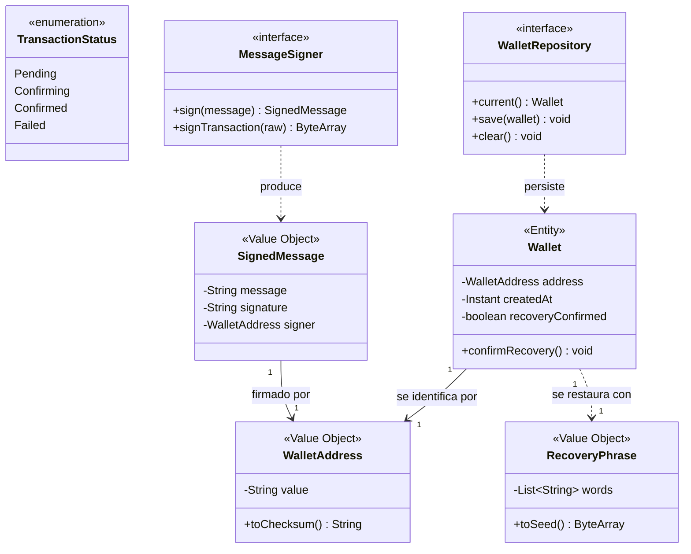
```mermaid
classDiagram
    class Wallet {
        <<Entity>>
        -WalletAddress address
        -Instant createdAt
        -boolean recoveryConfirmed
        +confirmRecovery() void
    }
    class WalletAddress {
        <<Value Object>>
        -String value
        +toChecksum() String
    }
    class RecoveryPhrase {
        <<Value Object>>
        -List~String~ words
        +toSeed() ByteArray
    }
    class SignedMessage {
        <<Value Object>>
        -String message
        -String signature
        -WalletAddress signer
    }
    class TransactionStatus {
        <<enumeration>>
        Pending
        Confirming
        Confirmed
        Failed
    }
    class WalletRepository {
        <<interface>>
        +current() Wallet
        +save(wallet) void
        +clear() void
    }
    class MessageSigner {
        <<interface>>
        +sign(message) SignedMessage
        +signTransaction(raw) ByteArray
    }

    Wallet "1" --> "1" WalletAddress : se identifica por
    Wallet "1" ..> "1" RecoveryPhrase : se restaura con
    MessageSigner ..> SignedMessage : produce
    SignedMessage "1" --> "1" WalletAddress : firmado por
    WalletRepository ..> Wallet : persiste
```

##### 5.2.6.2. Bounded Context Database Diagram

Las tablas del contexto viven en PostgreSQL y las crea una migración versionada. El desafío no declara clave foránea hacia `profile`, porque se emite antes de que el perfil exista. En el dispositivo, la billetera no se modela como tabla: el material cifrado se guarda en almacenamiento privado de la app, protegido por una clave que nunca abandona Android Keystore.

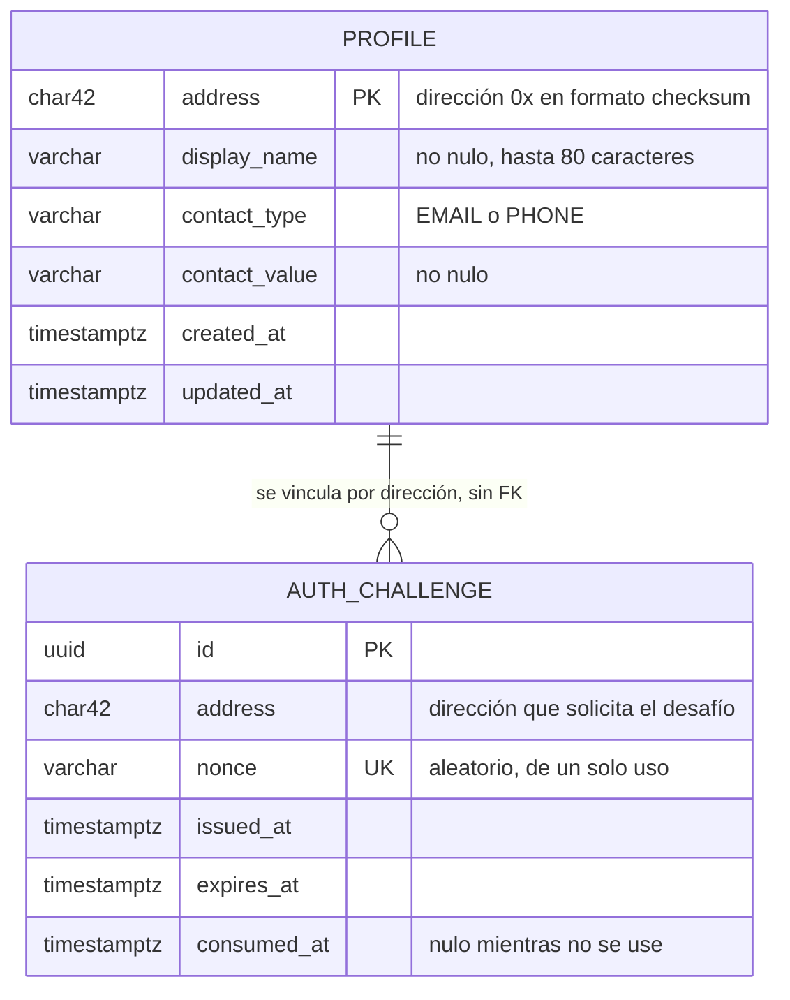
```mermaid
erDiagram
    PROFILE {
        char42 address PK "dirección 0x en formato checksum"
        varchar display_name "no nulo, hasta 80 caracteres"
        varchar contact_type "EMAIL o PHONE"
        varchar contact_value "no nulo"
        timestamptz created_at
        timestamptz updated_at
    }
    AUTH_CHALLENGE {
        uuid id PK
        char42 address "dirección que solicita el desafío"
        varchar nonce UK "aleatorio, de un solo uso"
        timestamptz issued_at
        timestamptz expires_at
        timestamptz consumed_at "nulo mientras no se use"
    }

    PROFILE ||--o{ AUTH_CHALLENGE : "se vincula por dirección, sin FK"
```

Restricciones del esquema:

- `PROFILE.address` es la clave primaria natural y se guarda siempre en formato checksum.
- `AUTH_CHALLENGE.nonce` es único; un desafío con `consumed_at` distinto de nulo se rechaza, lo que impide reutilizar una firma.
- `AUTH_CHALLENGE.expires_at` es siempre posterior a `issued_at`, y la verificación rechaza los desafíos vencidos.
- `PROFILE.contact_value` se valida contra el formato de `contact_type` antes de guardarse.

### 5.3. Bounded Context: Reputation

El Reputation Context calcula y expone la confianza que merece cada prestatario. Es el diferenciador de LatiFi: sustituye al colateral por un score híbrido que combina resultados on-chain con señales off-chain. Vive en LatiFi API y se alimenta del Event Indexer, que actúa como Anti-Corruption Layer entre la cadena y el dominio.

El contexto también aloja la proyección de lectura de los préstamos. Como el contrato es la única fuente de verdad, la API mantiene una copia derivada de sus eventos para servir el feed y las listas sin consultar la cadena en cada pantalla. Esa copia nunca decide el estado de un préstamo: solo lo refleja.

Las decisiones de diseño del contexto son:

- **Score de 0 a 100 con niveles.** El número alimenta el orden del feed y el nivel (`NEW`, `BUILDING`, `TRUSTED`, `EXCELLENT`) alimenta la etiqueta que ve el prestamista.
- **Cambios graduales y explicables.** Cada variación queda registrada como un `ReputationEvent` con su motivo y la transacción que la originó, de modo que la historia del score siempre puede auditarse.
- **Idempotencia por transacción y posición del log.** Procesar dos veces el mismo evento on-chain no cambia el score, porque el par `txHash` y `logIndex` es único.
- **Política configurable.** Los parámetros del cálculo viven en una clase de política y no en el código de los casos de uso, para ajustarlos sin tocar el flujo.

La política inicial del cálculo es la siguiente:

| Situación | Efecto sobre el score |
|---|---|
| Prestatario sin perfil completo | Score inicial de 30 |
| Perfil con nombre y contacto | Suma 10 puntos una sola vez (score inicial de 40) |
| Pago puntual | Suma 5 puntos; suma 7 mientras el score esté por debajo del máximo que alcanzó el prestatario (recuperación gradual) |
| Pago tardío | Resta 2 puntos por día de atraso, con un tope de 15 |
| Incumplimiento | Resta 30 puntos |

El score siempre se mantiene entre 0 y 100. Los niveles son `NEW` de 0 a 39, `BUILDING` de 40 a 59, `TRUSTED` de 60 a 79 y `EXCELLENT` de 80 a 100.

#### 5.3.1. Domain Layer

| Clase | Tipo | Propósito | Atributos y métodos |
|---|---|---|---|
| `ReputationProfile` | Aggregate Root | Reputación vigente de un prestatario. | `address: WalletAddress`, `score: ReputationScore`, `level: ReputationLevel`, `onTimeCount`, `lateCount`, `defaultCount`, `peakScore`, `profileComplete`, `updatedAt`; `applyOutcome(outcome, policy): ReputationEvent`, `applyProfileSignal(complete, policy): ReputationEvent` |
| `ReputationScore` | Value Object | Puntaje acotado entre 0 y 100. | `value: Int`; `plus(delta): ReputationScore`, `minus(delta): ReputationScore`, `level(): ReputationLevel` |
| `ReputationLevel` | Enumeración | Nivel que se muestra al prestamista. | `NEW`, `BUILDING`, `TRUSTED`, `EXCELLENT` |
| `ReputationEvent` | Entity | Registro de una variación del score y de su causa. | `id`, `address`, `loanId`, `type: ReputationEventType`, `delta`, `scoreAfter`, `daysLate`, `chainEventId`, `occurredAt` |
| `ReputationEventType` | Enumeración | Causa de la variación. | `PROFILE_COMPLETED`, `REPAID_ON_TIME`, `REPAID_LATE`, `DEFAULTED` |
| `LoanOutcome` | Value Object | Resultado de un préstamo ya traducido a lenguaje de dominio por el Anti-Corruption Layer. | `loanId`, `borrower`, `kind: OutcomeKind`, `amountPaid`, `daysLate`, `txHash`, `logIndex`, `occurredAt` |
| `OutcomeKind` | Enumeración | Tipo de resultado. | `BORROWER_REPAID_ON_TIME`, `BORROWER_REPAID_LATE`, `BORROWER_DEFAULTED` |
| `ReputationPolicy` | Domain Service | Contiene los parámetros y calcula la variación de cada situación. | `initialScore`, `profileBonus`, `onTimeGain`, `recoveryGain`, `latePenaltyPerDay`, `latePenaltyCap`, `defaultPenalty`; `deltaFor(profile, outcome): Int` |
| `LoanSummary` | Entity (proyección) | Copia de lectura de un préstamo, derivada de eventos. | `loanId`, `borrower`, `lender`, `principal`, `interestRateBps`, `termDays`, `installments`, `status`, `amountRepaid`, `requestedAt`, `fundedAt`, `finalDueDate`; `apply(chainEvent)` |
| `ChainEvent` | Entity | Evento on-chain recibido, con su posición exacta. | `txHash`, `logIndex`, `blockNumber`, `eventName`, `loanId`, `payload`, `processedAt` |
| `IndexerCheckpoint` | Entity | Último bloque procesado del contrato. | `contractAddress`, `lastProcessedBlock`, `updatedAt` |
| `ReputationRepository`, `ReputationEventRepository`, `LoanSummaryRepository`, `ChainEventRepository`, `IndexerCheckpointRepository` | Repositorios (interfaces) | Puertos de persistencia del contexto. | `findByAddress`, `save`, `existsByTxHashAndLogIndex`, `findFeed(filter, sort)` |
| `ChainEventSource` | Domain Service (interfaz) | Puerto por el que el dominio obtiene eventos de la cadena. | `fetch(fromBlock, toBlock): List<RawLog>`, `latestBlock(): Long` |

Invariantes: el score nunca sale del rango de 0 a 100; un `ChainEvent` se procesa una sola vez; cada cambio de score genera exactamente un `ReputationEvent`; la proyección `LoanSummary` solo avanza hacia estados posteriores del préstamo.

#### 5.3.2. Interface Layer

Interfaz REST de LatiFi API:

| Controlador | Operación | Propósito | Historia |
|---|---|---|---|
| `ReputationController` | `GET /reputation/{address}` | Devuelve score, nivel y contadores de un prestatario. | US-REP-02, US-API-01 |
| `ReputationController` | `GET /reputation/{address}/history` | Lista paginada de los `ReputationEvent` con la referencia de transacción de cada uno. | US-API-01 |
| `LoanFeedController` | `GET /loans` | Lista préstamos con filtros `status`, `minAmount`, `maxAmount`, `maxTermDays`, `minLevel`, `borrower` y `lender`, y orden `sort` por `reputation`, `amount`, `term` o `rate`. Por defecto ordena por reputación. | US-LEND-02, US-REP-03, US-LEND-05 |
| `LoanFeedController` | `GET /loans/{loanId}` | Devuelve un préstamo con su estado y su reputación. | US-LEND-05 |

Consumidores internos del contexto:

| Clase | Tipo | Propósito |
|---|---|---|
| `ChainEventPoller` | Consumer programado | Dispara un ciclo de indexación a intervalo fijo. |
| `ProfileEventListener` | Event listener | Recibe `ProfileCreated` y `ProfileUpdated` del Identity/Wallet Context. |

#### 5.3.3. Application Layer

| Clase | Tipo | Flujo |
|---|---|---|
| `EventIndexingService` | Servicio de aplicación | Lee desde el checkpoint hasta el último bloque, traduce cada log, entrega el resultado a los manejadores y avanza el checkpoint en la misma transacción. |
| `RecordLoanOutcomeHandler` | Event Handler | Recibe un `LoanOutcome`, descarta duplicados por `txHash` y `logIndex`, aplica la política, guarda el `ReputationEvent` y actualiza el `ReputationProfile`. |
| `ApplyProfileSignalHandler` | Event Handler | Al recibir un perfil completo, suma la bonificación una sola vez y registra `PROFILE_COMPLETED`. |
| `LoanMirrorProjector` | Event Handler | Aplica `LoanRequested`, `LoanFunded`, `LoanRepaid` y `LoanDefaulted` sobre la proyección de préstamos. |
| `GetReputationQuery` y `GetReputationHistoryQuery` | Query Handlers | Devuelven la reputación y su historia. |
| `ListLoansQuery` | Query Handler | Combina la proyección de préstamos con la reputación para el feed y las listas. |

El flujo de un resultado de préstamo es este: el contrato emite el evento, el indexador lo lee y lo traduce, `RecordLoanOutcomeHandler` recalcula el score y la app lo muestra la próxima vez que consulta la API. El Reputation Context nunca decide si un préstamo está pagado o vencido; solo reacciona al resultado que la cadena ya fijó.

#### 5.3.4. Infrastructure Layer

| Clase | Implementa | Tecnología |
|---|---|---|
| `Web3jChainEventSource` | `ChainEventSource` | web3j sobre JSON-RPC, consulta `eth_getLogs` por rangos de bloques con reintentos y espera creciente |
| `LoanAgreementEventDecoder` | Decodificación de logs | Wrapper de web3j generado desde el ABI de `LoanAgreement` |
| `ChainEventTranslator` | Anti-Corruption Layer | Convierte logs crudos en `LoanOutcome` y en eventos de proyección |
| `JpaReputationRepository` | `ReputationRepository` | Spring Data JPA sobre PostgreSQL |
| `JpaReputationEventRepository` | `ReputationEventRepository` | Spring Data JPA sobre PostgreSQL |
| `JpaLoanSummaryRepository` | `LoanSummaryRepository` | Spring Data JPA con consultas dinámicas de filtro y orden |
| `JpaChainEventRepository` | `ChainEventRepository` | Spring Data JPA con restricción única sobre `tx_hash` y `log_index` |
| `JpaIndexerCheckpointRepository` | `IndexerCheckpointRepository` | Spring Data JPA |

#### 5.3.5. Bounded Context Software Architecture Component Level Diagrams

Container LatiFi API, módulo Reputation y Loan Feed:

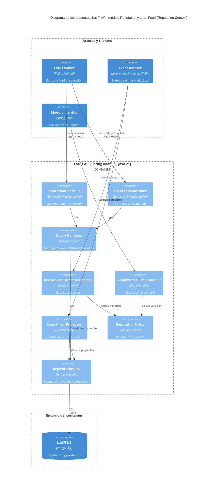
```mermaid
C4Component
    title Diagrama de componentes: LatiFi API, módulo Reputation y Loan Feed (Reputation Context)

    Boundary(up, "Actores y clientes", "") {
        Container(wallet, "LatiFi Wallet", "Kotlin, Android", "Consulta feed y reputación")
        Container(indexer, "Event Indexer", "Java, embebido en LatiFi API", "Entrega eventos traducidos")
        Container(identity, "Módulo Identity", "Spring Boot", "Publica ProfileCreated")
    }

    Container_Boundary(api, "LatiFi API [Spring Boot 3.5, Java 21]") {
        Component(repc, "ReputationController", "Spring MVC RestController", "GET /reputation y /history")
        Component(feedc, "LoanFeedController", "Spring MVC RestController", "GET /loans y /loans/{id}")
        Component(queries, "Query Handlers", "Spring Service", "GetReputation, GetHistory, ListLoans")
        Component(outcome, "RecordLoanOutcomeHandler", "Event Handler", "Recalcula el score")
        Component(signal, "ApplyProfileSignalHandler", "Event Handler", "Aplica la señal de perfil")
        Component(projector, "LoanMirrorProjector", "Event Handler", "Actualiza la proyección")
        Component(policy, "ReputationPolicy", "Domain Service", "Parámetros y cálculo")
        Component(repos, "Repositorios JPA", "Spring Data JPA", "Reputación, eventos y préstamos")
    }

    Boundary(down, "Entorno del container", "") {
        ContainerDb(db, "LatiFi DB", "PostgreSQL", "Reputación y préstamos")
    }

    Rel(wallet, repc, "Lee reputación", "REST, HTTPS")
    Rel(wallet, feedc, "Lee feed y préstamos", "REST, HTTPS")
    Rel(indexer, outcome, "LoanOutcome")
    Rel(indexer, projector, "Evento de préstamo")
    Rel(identity, signal, "ProfileCreated")
    Rel(repc, queries, "Usa")
    Rel(feedc, queries, "Usa")
    Rel(outcome, policy, "Calcula variación")
    Rel(signal, policy, "Calcula variación")
    Rel(queries, repos, "Lee")
    Rel(outcome, repos, "Guarda score y evento")
    Rel(projector, repos, "Guarda proyección")
    Rel(repos, db, "SQL", "JDBC")

    UpdateLayoutConfig($c4ShapeInRow="3", $c4BoundaryInRow="1")
```

Container Event Indexer:

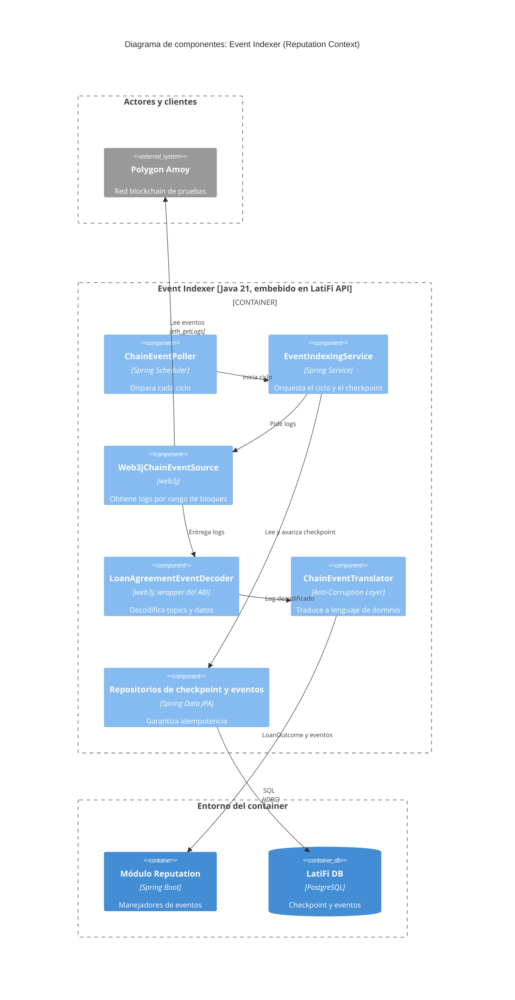
```mermaid
C4Component
    title Diagrama de componentes: Event Indexer (Reputation Context)

    Boundary(up, "Actores y clientes", "") {
        System_Ext(amoy, "Polygon Amoy", "Red blockchain de pruebas")
    }

    Container_Boundary(idx, "Event Indexer [Java 21, embebido en LatiFi API]") {
        Component(poller, "ChainEventPoller", "Spring Scheduler", "Dispara cada ciclo")
        Component(service, "EventIndexingService", "Spring Service", "Orquesta el ciclo y el checkpoint")
        Component(source, "Web3jChainEventSource", "web3j", "Obtiene logs por rango de bloques")
        Component(decoder, "LoanAgreementEventDecoder", "web3j, wrapper del ABI", "Decodifica topics y datos")
        Component(acl, "ChainEventTranslator", "Anti-Corruption Layer", "Traduce a lenguaje de dominio")
        Component(store, "Repositorios de checkpoint y eventos", "Spring Data JPA", "Garantiza idempotencia")
    }

    Boundary(down, "Entorno del container", "") {
        Container(rep, "Módulo Reputation", "Spring Boot", "Manejadores de eventos")
        ContainerDb(db, "LatiFi DB", "PostgreSQL", "Checkpoint y eventos")
    }

    Rel(poller, service, "Inicia ciclo")
    Rel(service, source, "Pide logs")
    Rel(source, amoy, "Lee eventos", "eth_getLogs")
    Rel(source, decoder, "Entrega logs")
    Rel(decoder, acl, "Log decodificado")
    Rel(service, store, "Lee y avanza checkpoint")
    Rel(acl, rep, "LoanOutcome y eventos")
    Rel(store, db, "SQL", "JDBC")

    UpdateLayoutConfig($c4ShapeInRow="3", $c4BoundaryInRow="1")
```

#### 5.3.6. Bounded Context Software Architecture Code Level Diagrams

##### 5.3.6.1. Bounded Context Domain Layer Class Diagrams

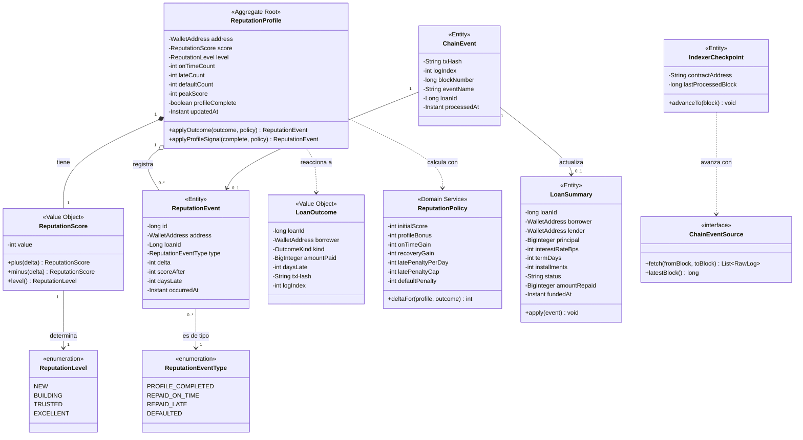
```mermaid
classDiagram
    class ReputationProfile {
        <<Aggregate Root>>
        -WalletAddress address
        -ReputationScore score
        -ReputationLevel level
        -int onTimeCount
        -int lateCount
        -int defaultCount
        -int peakScore
        -boolean profileComplete
        -Instant updatedAt
        +applyOutcome(outcome, policy) ReputationEvent
        +applyProfileSignal(complete, policy) ReputationEvent
    }
    class ReputationScore {
        <<Value Object>>
        -int value
        +plus(delta) ReputationScore
        +minus(delta) ReputationScore
        +level() ReputationLevel
    }
    class ReputationLevel {
        <<enumeration>>
        NEW
        BUILDING
        TRUSTED
        EXCELLENT
    }
    class ReputationEvent {
        <<Entity>>
        -long id
        -WalletAddress address
        -Long loanId
        -ReputationEventType type
        -int delta
        -int scoreAfter
        -int daysLate
        -Instant occurredAt
    }
    class ReputationEventType {
        <<enumeration>>
        PROFILE_COMPLETED
        REPAID_ON_TIME
        REPAID_LATE
        DEFAULTED
    }
    class LoanOutcome {
        <<Value Object>>
        -long loanId
        -WalletAddress borrower
        -OutcomeKind kind
        -BigInteger amountPaid
        -int daysLate
        -String txHash
        -int logIndex
    }
    class ReputationPolicy {
        <<Domain Service>>
        -int initialScore
        -int profileBonus
        -int onTimeGain
        -int recoveryGain
        -int latePenaltyPerDay
        -int latePenaltyCap
        -int defaultPenalty
        +deltaFor(profile, outcome) int
    }
    class LoanSummary {
        <<Entity>>
        -long loanId
        -WalletAddress borrower
        -WalletAddress lender
        -BigInteger principal
        -int interestRateBps
        -int termDays
        -int installments
        -String status
        -BigInteger amountRepaid
        -Instant fundedAt
        +apply(event) void
    }
    class ChainEvent {
        <<Entity>>
        -String txHash
        -int logIndex
        -long blockNumber
        -String eventName
        -Long loanId
        -Instant processedAt
    }
    class IndexerCheckpoint {
        <<Entity>>
        -String contractAddress
        -long lastProcessedBlock
        +advanceTo(block) void
    }
    class ChainEventSource {
        <<interface>>
        +fetch(fromBlock, toBlock) List~RawLog~
        +latestBlock() long
    }

    ReputationProfile "1" *-- "1" ReputationScore : tiene
    ReputationProfile "1" o-- "0..*" ReputationEvent : registra
    ReputationScore "1" --> "1" ReputationLevel : determina
    ReputationEvent "0..*" --> "1" ReputationEventType : es de tipo
    ReputationProfile ..> ReputationPolicy : calcula con
    ReputationProfile ..> LoanOutcome : reacciona a
    ChainEvent "1" --> "0..1" ReputationEvent : origina
    ChainEvent "1" --> "0..1" LoanSummary : actualiza
    IndexerCheckpoint ..> ChainEventSource : avanza con
```

##### 5.3.6.2. Bounded Context Database Diagram

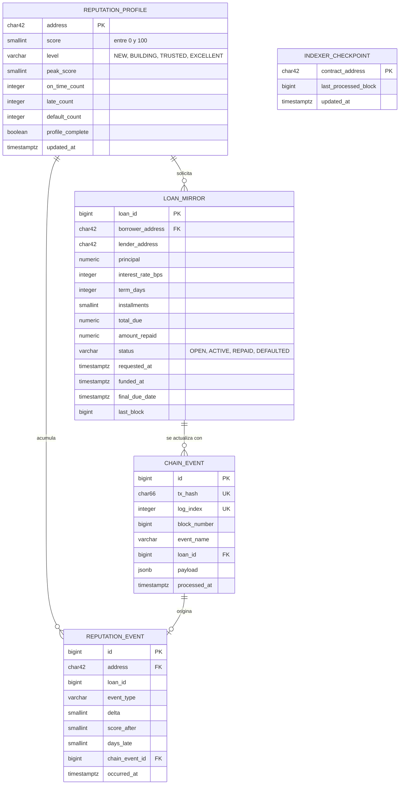
```mermaid
erDiagram
    REPUTATION_PROFILE {
        char42 address PK
        smallint score "entre 0 y 100"
        varchar level "NEW, BUILDING, TRUSTED, EXCELLENT"
        smallint peak_score
        integer on_time_count
        integer late_count
        integer default_count
        boolean profile_complete
        timestamptz updated_at
    }
    CHAIN_EVENT {
        bigint id PK
        char66 tx_hash UK
        integer log_index UK
        bigint block_number
        varchar event_name
        bigint loan_id FK
        jsonb payload
        timestamptz processed_at
    }
    REPUTATION_EVENT {
        bigint id PK
        char42 address FK
        bigint loan_id
        varchar event_type
        smallint delta
        smallint score_after
        smallint days_late
        bigint chain_event_id FK
        timestamptz occurred_at
    }
    LOAN_MIRROR {
        bigint loan_id PK
        char42 borrower_address FK
        char42 lender_address
        numeric principal
        integer interest_rate_bps
        integer term_days
        smallint installments
        numeric total_due
        numeric amount_repaid
        varchar status "OPEN, ACTIVE, REPAID, DEFAULTED"
        timestamptz requested_at
        timestamptz funded_at
        timestamptz final_due_date
        bigint last_block
    }
    INDEXER_CHECKPOINT {
        char42 contract_address PK
        bigint last_processed_block
        timestamptz updated_at
    }

    REPUTATION_PROFILE ||--o{ REPUTATION_EVENT : "acumula"
    REPUTATION_PROFILE ||--o{ LOAN_MIRROR : "solicita"
    LOAN_MIRROR ||--o{ CHAIN_EVENT : "se actualiza con"
    CHAIN_EVENT ||--o| REPUTATION_EVENT : "origina"
```

Restricciones del esquema:

- `CHAIN_EVENT` tiene una restricción única sobre `tx_hash` y `log_index`, que vuelve idempotente el procesamiento de eventos.
- `REPUTATION_PROFILE.score` y `peak_score` están acotados entre 0 y 100 mediante una restricción `CHECK`.
- `REPUTATION_EVENT.chain_event_id` es nulo para los eventos que no provienen de la cadena, como `PROFILE_COMPLETED`.
- `LOAN_MIRROR.borrower_address` referencia a `REPUTATION_PROFILE`, que se crea con el score inicial la primera vez que aparece un prestatario.
- `LOAN_MIRROR.status` solo admite valores del conjunto `OPEN`, `ACTIVE`, `REPAID` y `DEFAULTED`.
- Los índices cubren `LOAN_MIRROR(status, requested_at)` y `REPUTATION_EVENT(address, occurred_at)` para el feed y para el historial paginado.

### 5.4. Bounded Context: Exchange Rate

El Exchange Rate Context convierte montos de stablecoin a la moneda local del usuario para que un prestatario sin experiencia entienda cuánto debe o cuánto recibe (US-LEND-06). Es un contexto de presentación: ningún dato de precio entra al contrato ni modifica el estado de un préstamo, lo que elimina el riesgo de manipulación de oráculo que identificó el Capítulo IV.

Las decisiones de diseño del contexto son:

- **La app nunca llama al proveedor externo.** Solo LatiFi API consulta las tasas, las cachea y las expone con un endpoint propio (US-API-02).
- **Refresco programado, no por petición.** Un trabajo periódico actualiza las tasas; las conversiones siempre leen de la caché, de modo que un proveedor lento o caído no afecta la respuesta al usuario.
- **Valor vencido pero disponible.** Si el proveedor falla, la API devuelve la última tasa guardada con la marca `stale`, y la app puede avisar que el valor es aproximado.
- **Paridad supuesta de la stablecoin.** La conversión toma la stablecoin como equivalente a un dólar estadounidense y aplica la tasa del dólar a la moneda local.

#### 5.4.1. Domain Layer

| Clase | Tipo | Propósito | Atributos y métodos |
|---|---|---|---|
| `ExchangeRate` | Aggregate Root | Tasa vigente de un par de monedas. | `pair: CurrencyPair`, `rate: BigDecimal`, `source: String`, `fetchedAt: Instant`; `isStale(now, ttl): Boolean`, `convert(amount: StablecoinAmount): LocalAmount`, `refresh(newRate, fetchedAt)` |
| `CurrencyPair` | Value Object | Par de moneda base y moneda local. | `base: CurrencyCode`, `quote: CurrencyCode` |
| `CurrencyCode` | Value Object | Código de moneda ISO 4217. | `value: String`; valida tres letras mayúsculas |
| `StablecoinAmount` | Value Object | Monto de stablecoin en unidades mínimas. | `units: BigInteger`, `decimals: Int`; `toDecimal(): BigDecimal` |
| `LocalAmount` | Value Object | Resultado de una conversión. | `value: BigDecimal`, `currency: CurrencyCode`, `rate: BigDecimal`, `asOf: Instant`, `stale: Boolean` |
| `ExchangeRateRefreshed` | Domain Event | Se emite cuando se actualiza la caché de tasas. | `pair`, `rate`, `fetchedAt` |
| `ExchangeRateProvider` | Domain Service (interfaz) | Puerto hacia el proveedor externo de tasas. | `fetchRates(base, quotes): List<RateQuote>` |
| `ExchangeRateRepository` | Repositorio (interfaz) | Puerto de persistencia de tasas e historial. | `findByPair(pair)`, `findAll()`, `save(rate)` |

Invariantes: la tasa es siempre mayor que cero; el par se identifica por base y moneda local, sin repeticiones; una conversión indica siempre desde qué instante proviene la tasa que usó.

#### 5.4.2. Interface Layer

| Controlador | Operación | Propósito | Historia |
|---|---|---|---|
| `ExchangeRateController` | `GET /exchange-rate/convert?amount={units}&currency={code}` | Convierte un monto de stablecoin a la moneda local. Devuelve valor, tasa, instante de la tasa y la marca `stale`. | US-API-02, US-LEND-06 |
| `ExchangeRateController` | `GET /exchange-rate/rates` | Lista las tasas disponibles y su antigüedad. | US-API-02 |

Una moneda no soportada devuelve el código 400 con un mensaje localizado según `Accept-Language`.

#### 5.4.3. Application Layer

| Clase | Tipo | Flujo |
|---|---|---|
| `ConvertAmountQuery` | Query Handler | Busca la tasa del par, construye el `StablecoinAmount`, convierte y marca el resultado como `stale` si superó el tiempo de vida configurado. |
| `ListRatesQuery` | Query Handler | Devuelve todas las tasas guardadas con su antigüedad. |
| `RefreshRatesHandler` | Command Handler | Pide al proveedor las tasas de las monedas configuradas, actualiza cada `ExchangeRate`, guarda el historial y publica `ExchangeRateRefreshed`. Si el proveedor falla, conserva la tasa anterior. |
| `RateRefreshJob` | Disparador programado | Invoca a `RefreshRatesHandler` cada hora. |

#### 5.4.4. Infrastructure Layer

| Clase | Implementa | Tecnología |
|---|---|---|
| `HttpExchangeRateProvider` | `ExchangeRateProvider` | Cliente HTTP de Spring con tiempo de espera de tres segundos y dos reintentos |
| `JpaExchangeRateRepository` | `ExchangeRateRepository` | Spring Data JPA sobre PostgreSQL |
| `RateRefreshJob` | Planificador | `@Scheduled` de Spring |
| `ExchangeRateProperties` | Configuración | Monedas soportadas, tiempo de vida de la caché y dirección del proveedor |

#### 5.4.5. Bounded Context Software Architecture Component Level Diagrams

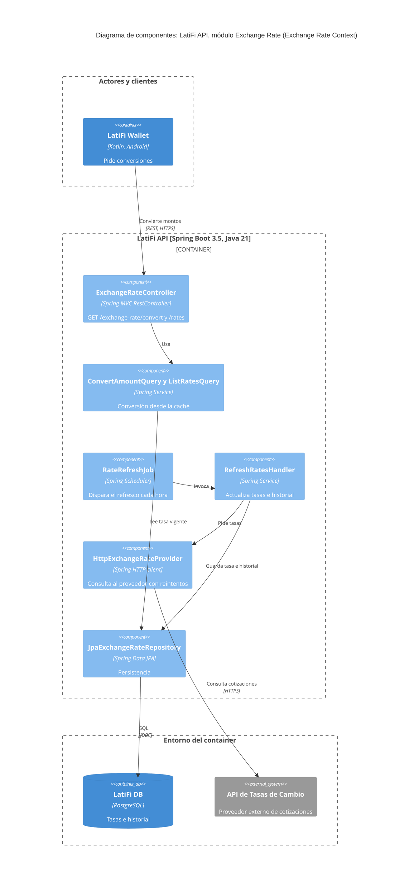
```mermaid
C4Component
    title Diagrama de componentes: LatiFi API, módulo Exchange Rate (Exchange Rate Context)

    Boundary(up, "Actores y clientes", "") {
        Container(wallet, "LatiFi Wallet", "Kotlin, Android", "Pide conversiones")
    }

    Container_Boundary(api, "LatiFi API [Spring Boot 3.5, Java 21]") {
        Component(ctrl, "ExchangeRateController", "Spring MVC RestController", "GET /exchange-rate/convert y /rates")
        Component(query, "ConvertAmountQuery y ListRatesQuery", "Spring Service", "Conversión desde la caché")
        Component(job, "RateRefreshJob", "Spring Scheduler", "Dispara el refresco cada hora")
        Component(refresh, "RefreshRatesHandler", "Spring Service", "Actualiza tasas e historial")
        Component(provider, "HttpExchangeRateProvider", "Spring HTTP client", "Consulta al proveedor con reintentos")
        Component(repo, "JpaExchangeRateRepository", "Spring Data JPA", "Persistencia")
    }

    Boundary(down, "Entorno del container", "") {
        ContainerDb(db, "LatiFi DB", "PostgreSQL", "Tasas e historial")
        System_Ext(fx, "API de Tasas de Cambio", "Proveedor externo de cotizaciones")
    }

    Rel(wallet, ctrl, "Convierte montos", "REST, HTTPS")
    Rel(ctrl, query, "Usa")
    Rel(query, repo, "Lee tasa vigente")
    Rel(job, refresh, "Invoca")
    Rel(refresh, provider, "Pide tasas")
    Rel(refresh, repo, "Guarda tasa e historial")
    Rel(provider, fx, "Consulta cotizaciones", "HTTPS")
    Rel(repo, db, "SQL", "JDBC")

    UpdateLayoutConfig($c4ShapeInRow="3", $c4BoundaryInRow="1")
```

#### 5.4.6. Bounded Context Software Architecture Code Level Diagrams

##### 5.4.6.1. Bounded Context Domain Layer Class Diagrams

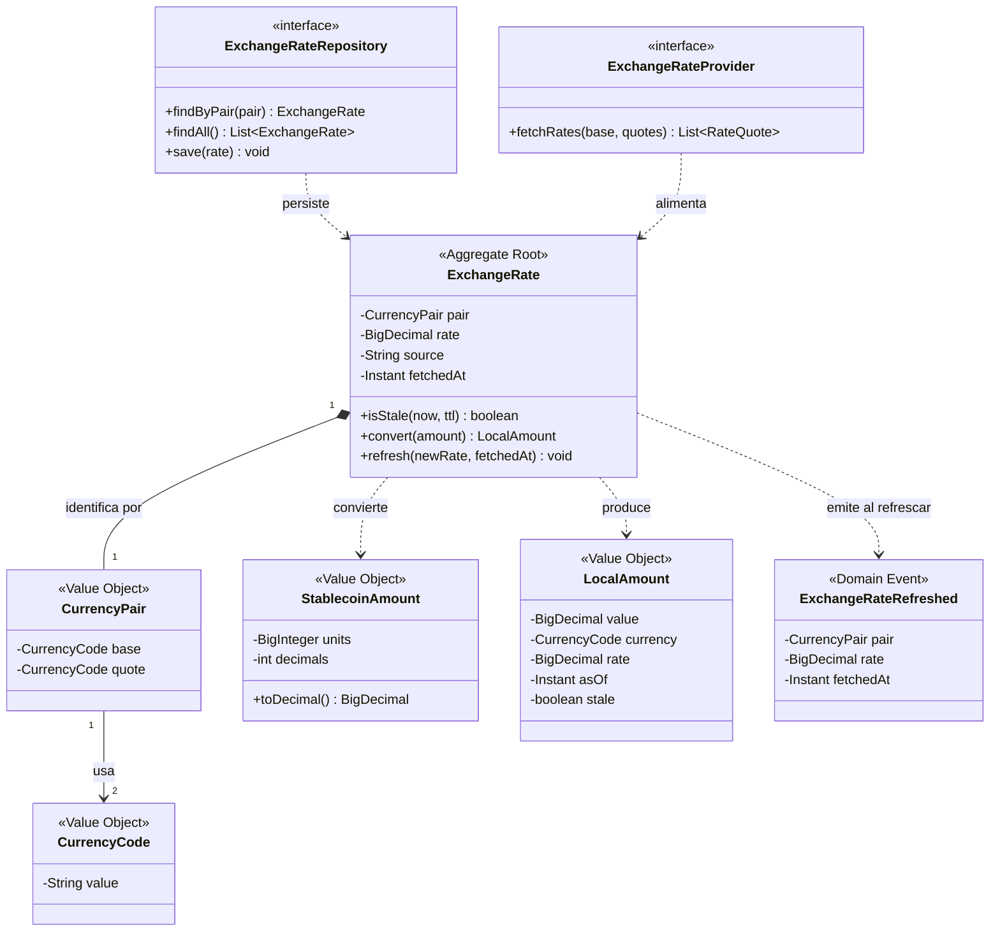
```mermaid
classDiagram
    class ExchangeRate {
        <<Aggregate Root>>
        -CurrencyPair pair
        -BigDecimal rate
        -String source
        -Instant fetchedAt
        +isStale(now, ttl) boolean
        +convert(amount) LocalAmount
        +refresh(newRate, fetchedAt) void
    }
    class CurrencyPair {
        <<Value Object>>
        -CurrencyCode base
        -CurrencyCode quote
    }
    class CurrencyCode {
        <<Value Object>>
        -String value
    }
    class StablecoinAmount {
        <<Value Object>>
        -BigInteger units
        -int decimals
        +toDecimal() BigDecimal
    }
    class LocalAmount {
        <<Value Object>>
        -BigDecimal value
        -CurrencyCode currency
        -BigDecimal rate
        -Instant asOf
        -boolean stale
    }
    class ExchangeRateProvider {
        <<interface>>
        +fetchRates(base, quotes) List~RateQuote~
    }
    class ExchangeRateRepository {
        <<interface>>
        +findByPair(pair) ExchangeRate
        +findAll() List~ExchangeRate~
        +save(rate) void
    }
    class ExchangeRateRefreshed {
        <<Domain Event>>
        -CurrencyPair pair
        -BigDecimal rate
        -Instant fetchedAt
    }

    ExchangeRate "1" *-- "1" CurrencyPair : identifica por
    CurrencyPair "1" --> "2" CurrencyCode : usa
    ExchangeRate ..> StablecoinAmount : convierte
    ExchangeRate ..> LocalAmount : produce
    ExchangeRate ..> ExchangeRateRefreshed : emite al refrescar
    ExchangeRateRepository ..> ExchangeRate : persiste
    ExchangeRateProvider ..> ExchangeRate : alimenta
```

##### 5.4.6.2. Bounded Context Database Diagram

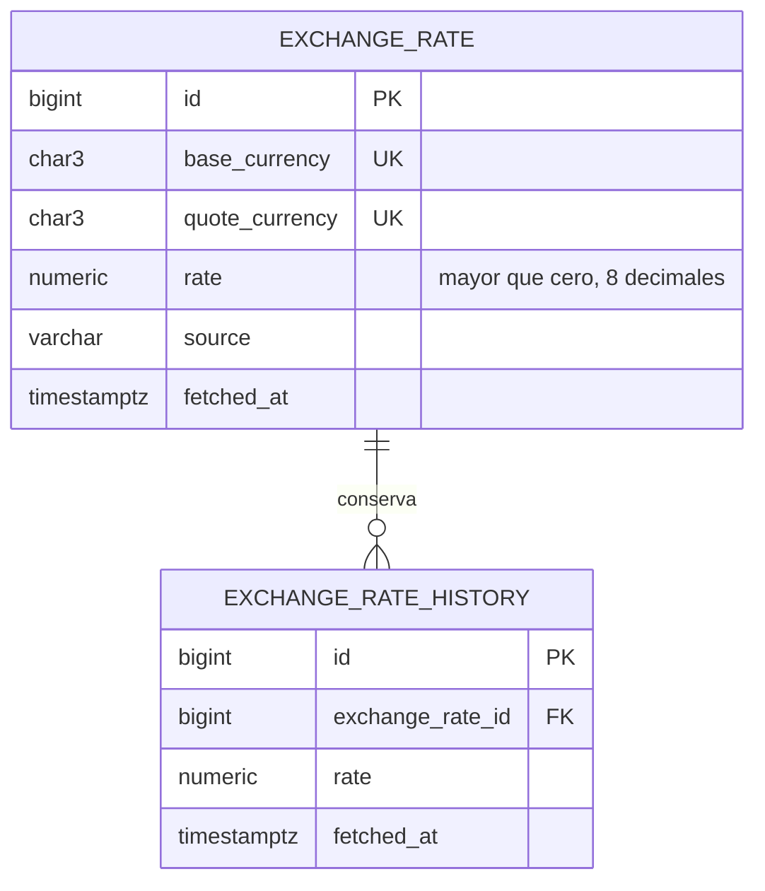
```mermaid
erDiagram
    EXCHANGE_RATE {
        bigint id PK
        char3 base_currency UK
        char3 quote_currency UK
        numeric rate "mayor que cero, 8 decimales"
        varchar source
        timestamptz fetched_at
    }
    EXCHANGE_RATE_HISTORY {
        bigint id PK
        bigint exchange_rate_id FK
        numeric rate
        timestamptz fetched_at
    }

    EXCHANGE_RATE ||--o{ EXCHANGE_RATE_HISTORY : "conserva"
```

Restricciones del esquema:

- `EXCHANGE_RATE` tiene una restricción única sobre `base_currency` y `quote_currency`, de modo que cada par tiene una sola tasa vigente.
- `rate` lleva una restricción `CHECK` que exige un valor mayor que cero.
- `EXCHANGE_RATE_HISTORY` solo se agrega: no se actualiza ni se borra, y permite reconstruir qué tasa vio un usuario en un momento dado.
- El índice sobre `EXCHANGE_RATE_HISTORY(exchange_rate_id, fetched_at)` acelera la consulta del historial reciente.

### 5.5. Bounded Context: Marketing/Landing

El Marketing/Landing Context sirve el sitio institucional. No comparte modelo, usuarios autenticados ni ciclo de despliegue con el resto del sistema, así que su diseño táctico es el más breve: no tiene agregados de negocio ni base de datos, y sus reglas son de presentación. Aun así conserva las cuatro capas para que el código de la landing mantenga la misma separación de responsabilidades que el resto de los contextos.

Las decisiones de diseño del contexto son:

- **Contenido separado de la estructura.** Los textos viven en diccionarios JSON por idioma, de modo que añadir un idioma no exige tocar el HTML.
- **Idioma según el navegador, con selector manual.** La página arranca en el idioma del navegador cuando está soportado, usa `en_US` como alternativa y recuerda la elección del visitante (US-LAND-02).
- **Sin dependencia técnica de otros contextos.** El único vínculo es un enlace de descarga hacia la app.

#### 5.5.1. Domain Layer

| Clase | Tipo | Propósito | Atributos y métodos |
|---|---|---|---|
| `Locale` | Value Object | Idioma soportado por el sitio. | `code: String` con valores `en_US` y `es_419`; `fromBrowser(languages): Locale` |
| `TranslationDictionary` | Value Object | Conjunto de textos de un idioma, indexado por clave. | `locale: Locale`, `entries: Map<String, String>`; `get(key): String` |
| `PageSection` | Entity | Sección anclada de la página. | `id`, `anchor`, `titleKey`, `audience` (prestatario, prestamista o ambos) |
| `SeoMetadata` | Value Object | Etiquetas de cabecera de una página en un idioma. | `title` (hasta 60 caracteres), `description` (hasta 155), `keywords`, `canonical`, `openGraph`, `robots` |
| `DownloadTarget` | Value Object | Destino del botón de descarga. | `url`, `label` |

#### 5.5.2. Interface Layer

| Elemento | Propósito | Historia |
|---|---|---|
| `index.html` | Página única con las secciones How it works, Benefits, Security, FAQ y Download. | US-LAND-01 |
| `terms.html` y `privacy.html` | Términos y condiciones y política de privacidad, accesibles desde el pie de página. | US-LAND-02 |
| `LanguageSelector` | Control visible que cambia el idioma. | US-LAND-02 |
| `FaqAccordion` | Acordeón de preguntas frecuentes operable por teclado. | US-LAND-02 |
| `SkipLink` y `MobileMenu` | Salto al contenido y menú compacto para teléfonos, con foco visible. | US-LAND-02 |

#### 5.5.3. Application Layer

| Clase | Flujo |
|---|---|
| `LanguageSwitcher` | Detecta el idioma, carga el diccionario, reemplaza los textos, fija el atributo `lang` y guarda la preferencia. |
| `SeoMetadataUpdater` | Actualiza título, descripción, `hreflang` y etiquetas sociales al cambiar de idioma. |
| `SectionNavigator` | Desplaza suavemente hacia cada ancla y marca la sección activa en el menú. |
| `DownloadLinkResolver` | Entrega el destino de descarga vigente a cada botón de acción. |

#### 5.5.4. Infrastructure Layer

| Clase o recurso | Propósito | Tecnología |
|---|---|---|
| `i18n/en_US.json` y `i18n/es_419.json` | Diccionarios de texto versionados en el repositorio. | JSON |
| `LocalePreferenceStore` | Guarda la elección del visitante, con respaldo si el almacenamiento no está disponible. | `localStorage` |
| Hosting estático | Publica el sitio por HTTPS desde la rama `main`. | Servidor estático en el VPS administrado con Dokploy |
| Hojas de estilo | Aplican la guía de estilo y el diseño responsive. | CSS3 con Material Design |

#### 5.5.5. Bounded Context Software Architecture Component Level Diagrams

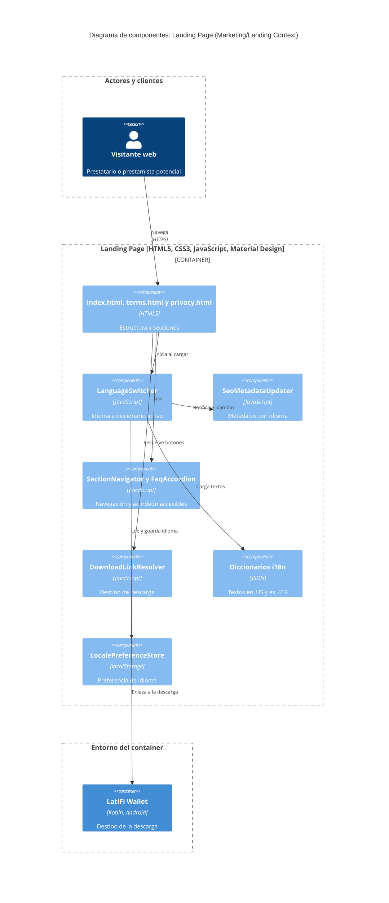
```mermaid
C4Component
    title Diagrama de componentes: Landing Page (Marketing/Landing Context)

    Boundary(up, "Actores y clientes", "") {
        Person(visitor, "Visitante web", "Prestatario o prestamista potencial")
    }

    Container_Boundary(landing, "Landing Page [HTML5, CSS3, JavaScript, Material Design]") {
        Component(page, "index.html, terms.html y privacy.html", "HTML5", "Estructura y secciones")
        Component(lang, "LanguageSwitcher", "JavaScript", "Idioma y diccionario activo")
        Component(seo, "SeoMetadataUpdater", "JavaScript", "Metadatos por idioma")
        Component(nav, "SectionNavigator y FaqAccordion", "JavaScript", "Navegación y acordeón accesibles")
        Component(dl, "DownloadLinkResolver", "JavaScript", "Destino de descarga")
        Component(dict, "Diccionarios i18n", "JSON", "Textos en_US y es_419")
        Component(store, "LocalePreferenceStore", "localStorage", "Preferencia de idioma")
    }

    Boundary(down, "Entorno del container", "") {
        Container(wallet, "LatiFi Wallet", "Kotlin, Android", "Destino de la descarga")
    }

    Rel(visitor, page, "Navega", "HTTPS")
    Rel(page, lang, "Inicia al cargar")
    Rel(page, nav, "Usa")
    Rel(page, dl, "Resuelve botones")
    Rel(lang, seo, "Notifica el cambio")
    Rel(lang, dict, "Carga textos")
    Rel(lang, store, "Lee y guarda idioma")
    Rel(dl, wallet, "Enlaza a la descarga")

    UpdateLayoutConfig($c4ShapeInRow="3", $c4BoundaryInRow="1")
```

#### 5.5.6. Bounded Context Software Architecture Code Level Diagrams

##### 5.5.6.1. Bounded Context Domain Layer Class Diagrams

```mermaid
classDiagram
    class Locale {
        <<Value Object>>
        -String code
        +fromBrowser(languages) Locale
    }
    class TranslationDictionary {
        <<Value Object>>
        -Locale locale
        -Map~String,String~ entries
        +get(key) String
    }
    class PageSection {
        <<Entity>>
        -String id
        -String anchor
        -String titleKey
        -String audience
    }
    class SeoMetadata {
        <<Value Object>>
        -String title
        -String description
        -String keywords
        -String canonical
        -String robots
    }
    class DownloadTarget {
        <<Value Object>>
        -String url
        -String label
    }
    class LanguageSwitcher {
        <<Application Service>>
        +apply(locale) void
        +detect() Locale
    }

    TranslationDictionary "1" --> "1" Locale : pertenece a
    SeoMetadata "1" --> "1" Locale : se publica en
    PageSection "1" --> "1" TranslationDictionary : se titula con
    LanguageSwitcher ..> TranslationDictionary : carga
    LanguageSwitcher ..> SeoMetadata : actualiza
    PageSection ..> DownloadTarget : puede enlazar a
```

##### 5.5.6.2. Bounded Context Database Diagram

El contexto no persiste datos de usuarios: no hay base de datos ni formularios que almacenen información. Lo único que persiste es el contenido, que vive como archivos JSON versionados junto al código. El diagrama muestra su estructura lógica, que es la que valida la integración continua para garantizar que ningún idioma quede con textos sin traducir.

```mermaid
erDiagram
    LOCALE {
        string code PK "en_US o es_419"
        string language_tag "valor del atributo lang"
    }
    TRANSLATION_ENTRY {
        string locale_code PK, FK
        string key PK
        string text "no vacío"
    }
    PAGE_SEO {
        string page PK "index, terms o privacy"
        string locale_code PK, FK
        string title "hasta 60 caracteres"
        string description "hasta 155 caracteres"
        string canonical
    }

    LOCALE ||--o{ TRANSLATION_ENTRY : "contiene"
    LOCALE ||--o{ PAGE_SEO : "define"
```

Restricciones de contenido:

- Cada clave de `TRANSLATION_ENTRY` existe en ambos idiomas; la integración continua falla si falta alguna.
- `PAGE_SEO.title` no supera los 60 caracteres y `PAGE_SEO.description` no supera los 155.
- `LOCALE.code` solo admite `en_US` y `es_419`; añadir un idioma consiste en agregar un archivo JSON, sin cambios de estructura.

## Capítulo VI: Solution UX Design

### 6.1. Style Guidelines

Las guías de estilo de LatiFi Wallet establecen las reglas visuales y de interacción que dan coherencia a la aplicación móvil nativa (Kotlin / Swift) y a la landing page (HTML5, CSS3 y JavaScript). Se basan en Material Design 3 y en las Human Interface Guidelines de Apple, y se orientan a un público que desconfía de las plataformas financieras: la interfaz debe transmitir claridad, seguridad y transparencia, como lo expresó la persona entrevistada al comparar la experiencia con la de su banco.

Los principios que guían las decisiones de diseño son:

| Principio | Descripción |
|---|---|
| Claridad | Un objetivo por pantalla, montos y plazos siempre visibles, lenguaje sencillo. |
| Confianza | Estados y confirmaciones explícitas, colores sobrios y trazabilidad de cada operación. |
| Inclusión | Contraste mínimo WCAG 2.1 AA, texto escalable y estados que no dependen solo del color. |
| Consistencia | Los mismos componentes, colores y reglas en app y web. |

### 6.1.1. General Style Guidelines

#### Identidad visual

El logotipo representa a dos personas (los nodos del prestatario y del prestamista) unidas por una línea de pulso: “Lati” de latido y “Fi” de finanzas. Se definen versiones sobre fondo claro, oscuro y azul de marca, un ícono de aplicación (Android adaptive / iOS), un isotipo sin contenedor para favicon, tamaños mínimos (48, 32 y 20 px), un margen libre igual a la mitad de la altura del isotipo y usos incorrectos que deben evitarse (cambiar colores, deformar o usarlo con bajo contraste).

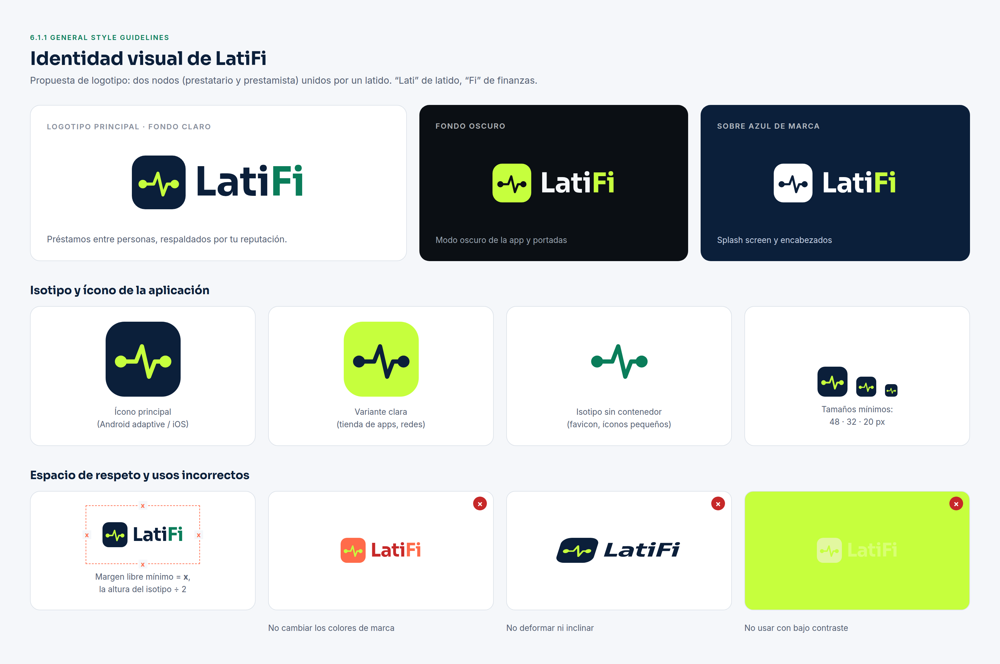

#### Paleta de colores

| Color | HEX | RGB | Uso |
|---|---|---|---|
| Navy 900 | #0B1F3A | 11, 31, 58 | Color primario: textos, barras y botón principal |
| Navy 700 | #14407A | 20, 64, 122 | Enlaces, estados activos e información |
| Green 600 | #0A7D5A | 10, 125, 90 | Éxito y pagos realizados |
| Lime 400 | #C6FF3D | 198, 255, 61 | Acento y llamadas a la acción en modo oscuro |
| Coral 500 | #FF6B4A | 255, 107, 74 | Alertas suaves; solo como fondo o ícono sobre claro |

Colores de estado: éxito #0A7D5A, advertencia #B45309, error #C62828 e información #14407A, cada uno con un fondo suave asociado. Se define también una escala de neutros (#FFFFFF, #F5F7FA, #DDE3EA, #566174, #101828) y dos superficies para modo oscuro (#0B0F14 y #171C24).

Todos los pares de texto y fondo se verificaron con la fórmula de contraste de WCAG 2.1. Por ejemplo, blanco sobre Navy 900 alcanza 16.52:1 y Lime 400 sobre el fondo oscuro 16.27:1. Coral 500 sobre blanco llega solo a 2.82:1, por lo que no se usa como color de texto sobre fondos claros.

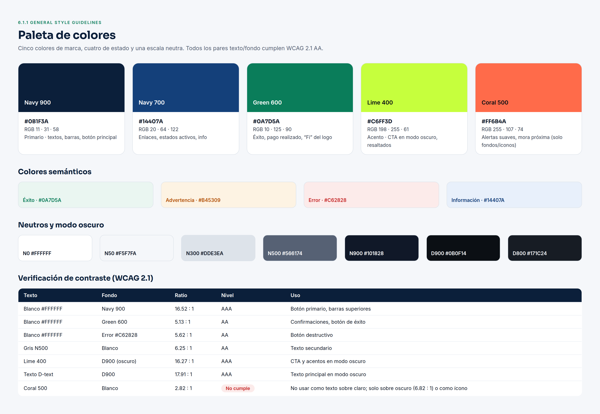

#### Tipografía

| Estilo | Fuente | Tamaño / interlineado | Uso |
|---|---|---|---|
| Display | Sora Bold | 32 / 40 | Saldos y montos |
| Headline | Sora SemiBold | 24 / 32 | Título de pantalla |
| Title | Sora SemiBold | 18 / 24 | Secciones y tarjetas |
| Body L | Inter Regular | 16 / 24 | Texto principal |
| Body M | Inter Regular | 14 / 20 | Listas y tarjetas |
| Label | Inter SemiBold | 14 / 20 | Botones, tabs y chips |
| Caption | Inter Medium | 12 / 16 | Ayudas y metadatos |

Ambas familias son gratuitas (Google Fonts) y se complementan: Sora aporta personalidad a títulos y cifras, e Inter ofrece alta legibilidad en pantallas pequeñas.

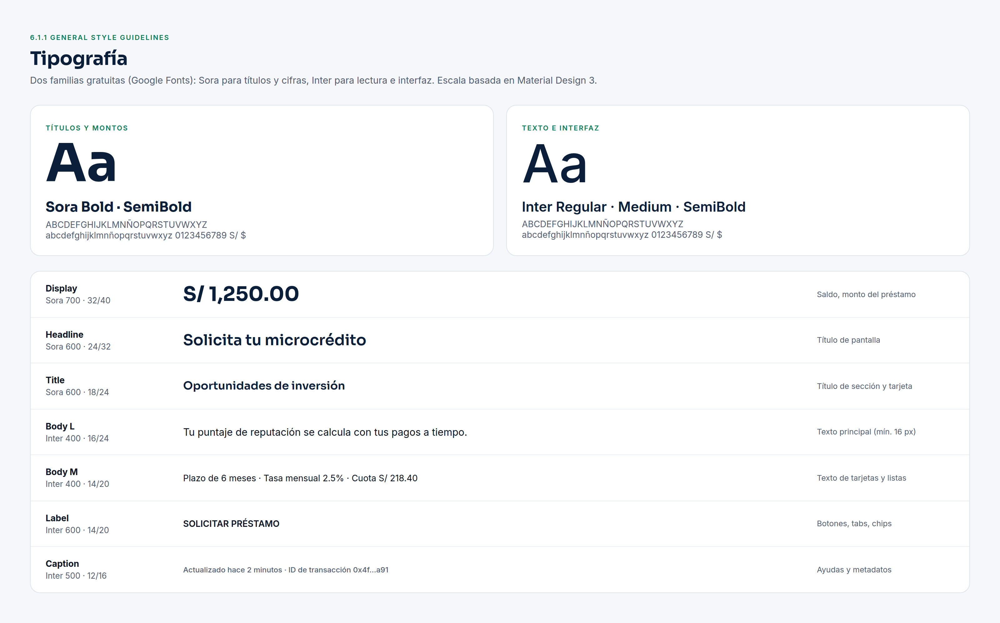

#### Fundamentos de diseño

- **Espaciado:** escala de base 4 pt (4, 8, 12, 16, 24, 32, 48). Margen lateral de 16 dp y separación entre tarjetas de 12 a 16 dp.
- **Formas:** radios de 8 (campos), 12 (chips), 16 (tarjetas) y 28 (hojas inferiores).
- **Elevación:** tres niveles (borde, tarjeta y diálogo) con sombras suaves.
- **Iconografía:** Material Symbols Rounded en Android y SF Symbols en iOS, con trazo de 2 dp. Todo ícono va acompañado de una etiqueta de texto.
- **Accesibilidad:** áreas táctiles de 48 dp (Android) y 44 pt (iOS), compatibilidad con TalkBack y VoiceOver, y texto escalable hasta 200 %.
- **Idioma y tema:** interfaz en español (es_419) con preparación para inglés (en_US), y modo claro y oscuro.

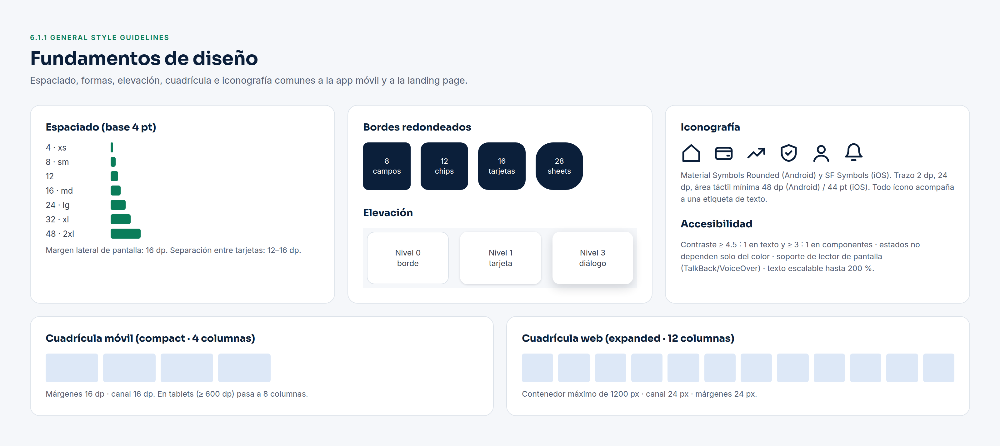

### 6.1.2. Web, Mobile & Devices Style Guidelines

#### Aplicación móvil

La aplicación se desarrolla de forma nativa para Android (Kotlin) e iOS (Swift), por lo que sigue las guías de cada plataforma: Material Design 3 en Android y Human Interface Guidelines en iOS. Se diseña primero para teléfono (clase compact) y escala a tablet con un riel lateral de navegación.

Los componentes base son:

| Componente | Especificación |
|---|---|
| Botón primario | Altura de 48 dp, esquinas totalmente redondeadas. Navy 900 con texto blanco en modo claro; Lime 400 con texto oscuro en modo oscuro. |
| Botón secundario | Contorno de 1.5 dp y texto del mismo color. |
| Botón deshabilitado | Fondo gris neutro y texto atenuado. |
| Campo de texto | Altura de 56 dp, etiqueta flotante, borde de 1.5 dp. En error cambia a rojo y muestra un mensaje explícito. |
| Chips de estado | Pagado, Pendiente, En mora y En revisión. Incluyen ícono y texto además del color. |
| Tarjeta de préstamo | Monto, plazo, tasa, estado y barra de progreso de cuotas. |
| Barra superior | Título de pantalla y botón de regreso. |
| Navegación inferior | Cuatro destinos por rol, con indicador de pestaña activa. |

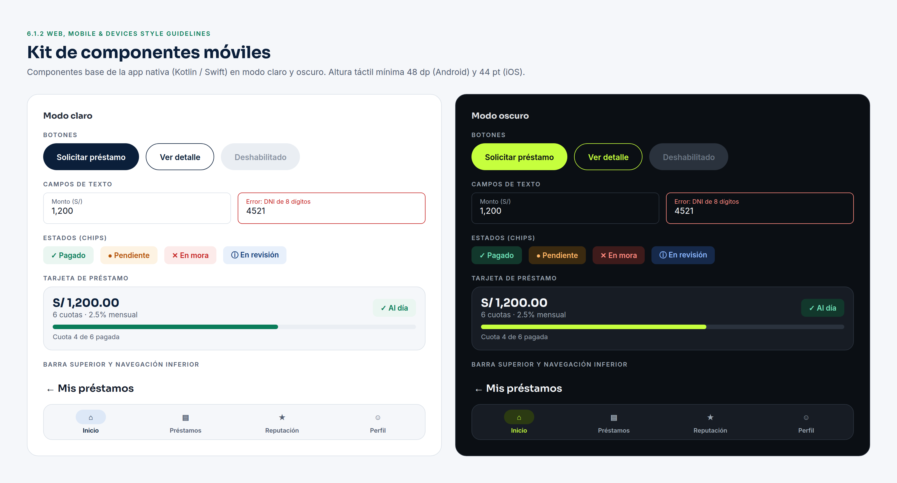

#### Landing page

La landing page se construye con HTML5, CSS3 y JavaScript, siguiendo Material Design. Usa un enfoque mobile-first con tres clases de tamaño.

| Clase | Rango | Columnas | Margen / canal | Navegación | Dispositivos |
|---|---|---|---|---|---|
| Compact | 0 – 599 px | 4 | 16 / 16 | Menú hamburguesa | Teléfonos |
| Medium | 600 – 1023 px | 8 | 24 / 16 | Menú compacto | Tablets |
| Expanded | ≥ 1024 px | 12 | 24 / 24 | Menú horizontal completo | Laptops y monitores |

El contenedor máximo es de 1200 px. Las imágenes son fluidas, los textos usan unidades relativas (rem) y los botones mantienen al menos 48 px de alto en todos los tamaños.

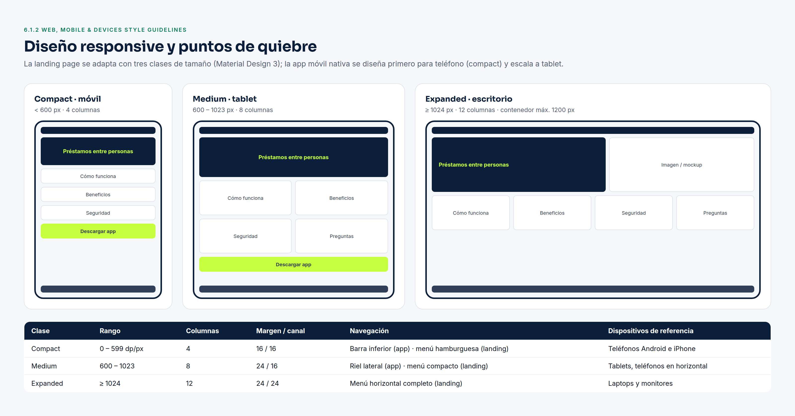

### 6.2. Information Architecture

La arquitectura de información de LatiFi decide cómo se agrupa, se ordena y se nombra el contenido para que un prestatario sin experiencia financiera digital y un prestamista que evalúa riesgo encuentren lo que buscan sin esfuerzo. Las cinco subsecciones siguientes recorren esas decisiones: organización, etiquetado, búsqueda, etiquetas para buscadores y navegación.

#### 6.2.1. Organization Systems

El equipo combina tres esquemas de organización visual y cuatro esquemas de categorización, y asigna cada uno al tipo de información que mejor sirve.

##### Organización visual del contenido

| Esquema | Dónde aplica | Decisión |
|---|---|---|
| Jerárquico (visual hierarchy) | Pantalla Inicio de cada rol, tarjetas de préstamo y feed de Invertir | El dato que decide la acción va primero y más grande: el saldo o el monto en tipografía Display, luego el plazo y la tasa, y al final los metadatos en Caption. El botón primario ocupa un solo lugar por pantalla. |
| Secuencial (step by step) | Solicitud de préstamo, fondeo, pago de cuota, onboarding y verificación de identidad | Un objetivo por paso, con indicador de avance y botón Atrás. La barra inferior se oculta durante estos flujos y cada flujo termina en una pantalla de confirmación con comprobante. |
| Matricial | Portafolio del prestamista, lista de préstamos y comparación de oportunidades | Filas de tarjetas con los mismos campos en la misma posición, de modo que el prestamista compare riesgo, tasa y plazo de varias solicitudes con un vistazo. En tablet las tarjetas pasan a una cuadrícula de dos columnas. |

En la landing page, la jerarquía visual manda sobre las demás: el hero con la propuesta de valor y el llamado a la acción ocupa la primera pantalla, y las secciones siguientes bajan de lo general (cómo funciona) a lo específico (seguridad y preguntas). El paso a paso de Cómo funciona usa un esquema secuencial numerado con los pasos de cada segmento.

##### Esquemas de categorización

| Esquema | Dónde aplica | Decisión |
|---|---|---|
| Por audiencia | Estructura general de la app y contenido de la landing | La app ofrece dos recorridos separados, uno para el prestatario y otro para el prestamista, con su propia barra inferior. La landing presenta bloques diferenciados para cada segmento, en línea con US-LAND-01. |
| Por tópicos | Sección de ayuda, preguntas frecuentes y perfil | Las preguntas se agrupan por tema: cómo funciona, seguridad, pagos y reputación. El perfil agrupa sus ajustes en datos personales, billetera, seguridad e idioma. |
| Cronológico | Historial de operaciones, eventos de reputación y lista de cuotas | El orden por defecto es del más reciente al más antiguo. En cuotas pendientes, la más próxima a vencer va primero. |
| Alfabético | Selector de idioma | Solo donde el usuario conoce el nombre exacto de lo que busca. El resto del contenido no usa orden alfabético porque el valor está en el riesgo, el plazo o la fecha y no en el nombre. |

##### Agrupación de la información por pantalla

| Grupo de información | Contenido | Esquema principal |
|---|---|---|
| Resumen financiero | Saldo, préstamos activos, próximo vencimiento | Jerárquico |
| Oportunidades | Solicitudes abiertas con la reputación visible del solicitante | Matricial, ordenado por reputación |
| Mis préstamos y mi portafolio | Estado, monto, plazo, tasa y progreso de cuotas | Matricial y cronológico |
| Operaciones críticas | Solicitar, fondear, pagar | Secuencial |
| Reputación | Nivel actual y eventos que lo modificaron | Jerárquico y cronológico |
| Ayuda y cuenta | Preguntas frecuentes, perfil, seguridad, idioma | Por tópicos |

Estas decisiones responden a lo que las entrevistas mostraron: el prestamista pide ver el historial de pagos del solicitante antes de decidir, y el prestatario desconfía de las plataformas poco claras. Por eso la reputación y las condiciones del préstamo ocupan el nivel más alto de la jerarquía en cada pantalla donde aparecen.

#### 6.2.2. Labeling Systems

Las etiquetas de LatiFi usan el menor número de palabras posible y el mismo término en la aplicación, la landing page y este informe. El equipo parte del lenguaje ubicuo del Capítulo II y evita la jerga de blockchain en toda pantalla que ve un prestatario sin experiencia previa con criptomonedas, como pide la historia US-AUTH-03. Cuando un término técnico no tiene reemplazo, la interfaz lo acompaña con una explicación breve en el momento en que aparece.

Cada tipo de etiqueta sigue una regla fija:

| Tipo | Regla | Ejemplos |
|---|---|---|
| Destinos de navegación | Un sustantivo, máximo dos palabras | Inicio, Préstamos, Reputación, Invertir, Portafolio, Perfil |
| Acciones | Verbo en infinitivo seguido del objeto | Solicitar préstamo, Fondear, Pagar cuota, Conectar billetera, Ver detalle |
| Estados | Un adjetivo o participio, siempre con ícono y texto | Abierta, Pendiente, Pagado, En mora, En revisión |
| Datos del préstamo | Un sustantivo y su unidad visible | Monto, Tasa, Plazo, Cuota |
| Secciones de la landing | Una o dos palabras, igual al texto del ancla | Cómo funciona, Beneficios, Seguridad, Preguntas, Descargar app |

El equipo reemplaza el vocabulario técnico por palabras que el usuario ya conoce:

| Término técnico | Etiqueta en la interfaz | Motivo |
|---|---|---|
| Wallet | Billetera | Remite a las billeteras digitales cotidianas que el usuario ya conoce. |
| Gas fee | Comisión de red | Se lee como cualquier comisión financiera. |
| Transaction hash | Comprobante | Es lo que el usuario espera recibir tras pagar o invertir. |
| Stablecoin | Moneda digital de prueba, con su equivalente en soles | Aclara que el monto no tiene valor real y evita el término técnico en las pantallas de monto. |
| Default | En mora | Es un término financiero que el usuario ya reconoce. |

Los montos aparecen siempre en la stablecoin y en soles (S/), como exige US-LEND-06. Los estados de una transacción on-chain (pendiente, confirmando, confirmada y fallida) conservan estas mismas palabras en toda la app, de modo que el usuario no necesita consultar un explorador de bloques.

La interfaz sale en español (es_419) y deja listas las equivalencias en inglés (en_US):

| es_419 | en_US |
|---|---|
| Inicio | Home |
| Préstamos | Loans |
| Reputación | Reputation |
| Invertir | Invest |
| Portafolio | Portfolio |
| Perfil | Profile |
| Solicitar préstamo | Request a loan |
| Pagar cuota | Pay installment |

Ningún ícono aparece sin etiqueta de texto. Los íconos decorativos se ocultan a los lectores de pantalla, y los que activan una acción llevan una etiqueta accesible equivalente al texto visible.

#### 6.2.3. Searching Systems

LatiFi no ofrece un buscador global. El contenido de la app se organiza en listas acotadas (solicitudes abiertas, préstamos propios, inversiones y operaciones), y en ese contexto un campo de texto libre aporta menos que un filtro bien ubicado. El equipo prioriza tres medios de ayuda: filtros por chips, criterios de orden y una búsqueda por texto solo en la sección de ayuda, donde el volumen de contenido sí crece.

| Zona | Quién la usa | Filtros | Orden | Resultado |
|---|---|---|---|---|
| Invertir (feed de oportunidades) | Prestamista | Riesgo, plazo y rango de monto | Reputación del solicitante (por defecto), tasa, plazo y más recientes | Tarjeta de solicitud con monto en stablecoin y en soles, tasa, plazo, chip de reputación y botón Fondear |
| Préstamos | Prestatario | Estado: Todos, Abierta, Pendiente, Pagado y En mora | Más reciente primero | Tarjeta de préstamo con monto, plazo, tasa, estado y barra de progreso de cuotas |
| Portafolio | Prestamista | Estado: Todos, Pendiente, Pagado y En mora | Próximo vencimiento primero | Tarjeta de inversión con monto prestado, retorno esperado, estado y fecha de la siguiente cuota |
| Reputación | Prestatario | Resultado: A tiempo, Tardío e Incumplido | Cronológico, del más reciente al más antiguo | Lista de eventos con fecha, monto, resultado y efecto sobre la reputación |
| Ayuda | Ambos | Búsqueda por texto y temas sugeridos | Relevancia | Lista de preguntas con la respuesta resumida y un enlace al detalle |

Los filtros de riesgo se apoyan en la reputación híbrida del solicitante (US-REP-02), y el orden por reputación responde a US-REP-03: el prestamista ve primero los perfiles que le piden menos esfuerzo de revisión, pero siempre puede cambiar el criterio.

Todas las listas filtrables comparten el mismo comportamiento:

1. Los filtros viven en una fila de chips sobre la lista. Cada chip activo muestra una marca y se quita con un toque.
2. Un contador indica cuántos resultados quedan, por ejemplo "12 solicitudes". El lector de pantalla anuncia ese número cada vez que cambia.
3. El botón Limpiar filtros aparece en cuanto hay al menos un filtro activo.
4. Si no hay coincidencias, la pantalla explica la causa y ofrece la salida: "No hay solicitudes con estos filtros. Limpia los filtros para ver todas."
5. La app conserva los filtros elegidos mientras dura la sesión, para que el usuario no los repita al volver desde un detalle.
6. Mientras llegan los datos, la lista muestra marcadores de carga con la forma de las tarjetas.

La landing page tampoco incluye buscador. Es una página única con cinco secciones ancladas, de modo que el encabezado fijo y los enlaces internos llevan al visitante a cualquier contenido en un toque. La sección de preguntas frecuentes agrupa las respuestas por tema (cómo funciona, seguridad y descarga) en un acordeón navegable con teclado.

#### 6.2.4. SEO Tags and Meta Tags

Los SEO tags y los meta tags corresponden a la landing page, el único producto web de LatiFi. La aplicación es nativa y no tiene versión web, así que su visibilidad depende de las fichas de las tiendas, que esta sección cubre al final con los elementos ASO. La landing publica sus textos en español (es_419) y en inglés (en_US), de acuerdo con US-LAND-02.

Los límites de longitud siguen las prácticas habituales de los buscadores: títulos de hasta 60 caracteres y descripciones de hasta 155.

##### Landing page: página de inicio

| Etiqueta | Valor es_419 | Valor en_US |
|---|---|---|
| title | LatiFi: microcréditos P2P con reputación verificable | LatiFi: P2P microloans with verifiable reputation |
| meta description | LatiFi conecta a prestatarios y prestamistas con microcréditos P2P sobre blockchain. No custodia tu dinero y muestra la reputación de cada solicitante. | LatiFi connects borrowers and lenders through blockchain-based P2P microloans. It never holds your funds and shows each applicant's reputation. |
| meta keywords | microcréditos, préstamos P2P, blockchain, stablecoins, reputación crediticia, billetera digital, LatiFi Wallet, Perú | microloans, P2P loans, blockchain, stablecoins, credit reputation, digital wallet, LatiFi Wallet, Peru |
| meta author | LatiFi | LatiFi |

Google ignora la etiqueta keywords para posicionar, pero el enunciado del curso la exige y otros buscadores todavía la leen, por lo que la landing la incluye con ocho términos como máximo.

Etiquetas complementarias de la landing:

| Etiqueta | Valor |
|---|---|
| html lang | es-419 en la versión en español y en-US en la versión en inglés |
| meta viewport | width=device-width, initial-scale=1 |
| meta robots | index, follow |
| link rel="canonical" | La URL pública de cada página |
| link rel="alternate" hreflang | es-419, en-US y x-default hacia la versión en español |
| og:title, og:description | Los mismos textos del title y la meta description |
| og:type y og:site_name | website y LatiFi |
| og:image | Imagen de 1200 x 630 px con el logotipo sobre el azul de marca |
| twitter:card | summary_large_image |

##### Landing page: páginas legales

| Página | title | meta description |
|---|---|---|
| Términos y condiciones | LatiFi: términos y condiciones | Condiciones de uso de LatiFi Wallet: reglas para solicitar, fondear y pagar microcréditos P2P. |
| Política de privacidad | LatiFi: política de privacidad | Cómo LatiFi trata tus datos de perfil y por qué nunca custodia tus llaves privadas ni tus fondos. |

Estas páginas heredan author, robots, viewport y las etiquetas de idioma de la página de inicio.

##### Elementos ASO de las tiendas de aplicaciones

| Elemento | Google Play | App Store |
|---|---|---|
| App Title (30 caracteres) | LatiFi Wallet | LatiFi Wallet |
| App Subtitle (30 caracteres) | No aplica | es_419: Microcréditos entre personas. en_US: Peer-to-peer microloans |
| Descripción corta (80 caracteres) | es_419: Pide o invierte en microcréditos P2P con reputación verificable. en_US: Borrow or lend in P2P microloans with verifiable reputation. | No aplica |
| App Keywords (100 caracteres) | No aplica | es_419: préstamos,microcréditos,p2p,blockchain,stablecoin,billetera,inversión,reputación,crédito,Perú. en_US: loans,microloans,p2p,blockchain,stablecoin,wallet,lending,reputation,credit,Peru |
| Categoría | Finanzas | Finanzas |

Descripción completa (es_419), igual en ambas tiendas:

> LatiFi Wallet conecta a personas que necesitan un microcrédito con personas que tienen capital disponible para prestarlo. Si pides un préstamo, publicas el monto, la tasa y el plazo, y los prestamistas ven tu reputación antes de decidir. Si inviertes, revisas las solicitudes abiertas, filtras por riesgo y plazo, y fondeas la que prefieras. Los acuerdos corren en un contrato automático sobre la red de pruebas Polygon Amoy: LatiFi no custodia tus fondos ni tus llaves privadas. Esta versión es una demostración académica y opera con una stablecoin de prueba sin valor monetario real.

Descripción completa (en_US):

> LatiFi Wallet connects people who need a microloan with people who have spare capital to lend. If you borrow, you post the amount, rate and term, and lenders see your reputation before they decide. If you lend, you review open requests, filter by risk and term, and fund the one you prefer. Agreements run on an automated contract on the Polygon Amoy test network: LatiFi never holds your funds or your private keys. This version is an academic demonstration and uses a test stablecoin with no real monetary value.

#### 6.2.5. Navigation Systems

El sistema de navegación define cómo el usuario se desplaza por la aplicación y la landing page. Se organiza en cuatro tipos de navegación (global, local, contextual y suplementaria), de acuerdo con los principios de arquitectura de información de Rosenfeld y Morville.

##### Navegación de la aplicación móvil

Después de iniciar sesión y verificar su identidad, el usuario elige su rol (prestatario o prestamista). Cada rol tiene una barra de navegación inferior propia con cuatro destinos, un número dentro del límite recomendado por Material Design.

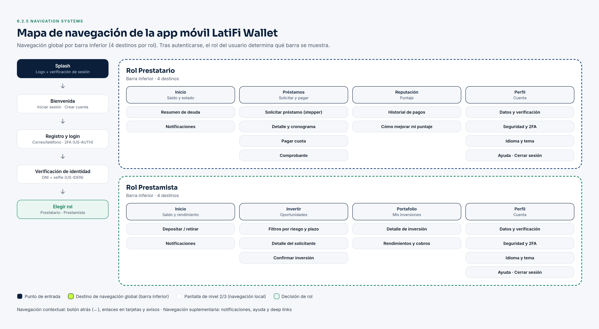

| Tipo | Elemento | Descripción |
|---|---|---|
| Global | Barra inferior (prestatario) | Inicio, Préstamos, Reputación y Perfil. Siempre visible en las pantallas principales. |
| Global | Barra inferior (prestamista) | Inicio, Invertir, Portafolio y Perfil. |
| Local | Pasos de solicitud de préstamo | Stepper de varios pasos con indicador de avance y botón “Atrás”. |
| Local | Filtros de oportunidades | Chips de riesgo y plazo dentro de “Invertir”. |
| Contextual | Tarjetas y avisos | Una tarjeta de préstamo lleva a su detalle; un aviso de cuota próxima lleva a “Pagar cuota”. |
| Contextual | Botón de regreso (←) | Vuelve a la pantalla anterior en pantallas de nivel 2 y 3. |
| Suplementaria | Notificaciones, ayuda y cerrar sesión | Accesibles desde Inicio y Perfil. |
| Suplementaria | Enlaces profundos (deep links) | Abren directamente el detalle de un préstamo o una inversión desde una notificación. |

Reglas de navegación:

1. La barra inferior solo aparece en las pantallas principales y se oculta durante flujos de varios pasos (solicitud, pago, inversión) para no distraer.
2. Cada pantalla de nivel 2 o 3 tiene un botón de regreso y el gesto de retroceso del sistema.
3. Las operaciones críticas (pagar, invertir) terminan en una pantalla de confirmación y un comprobante.
4. Las pantallas de autenticación y verificación de identidad no muestran la barra inferior.
5. Al reabrir la app con sesión activa, el usuario llega directamente a Inicio de su rol.

Trazabilidad con las historias de usuario:

| Pantalla o sección | Historias de usuario |
|---|---|
| Registro, login y 2FA | US-AUTH-01 a US-AUTH-04 |
| Verificación de identidad | US-IDEN-01, US-IDEN-02 |
| Invertir, Portafolio y Billetera del prestamista | US-LEND-01 a US-LEND-06 |
| Reputación | US-REP-01 a US-REP-04 |

##### Navegación de la landing page

La landing page es de una sola página con secciones ancladas. El encabezado fijo lleva a cada sección y el botón principal conduce a la descarga de la aplicación. En móvil el menú se colapsa en un ícono de hamburguesa.

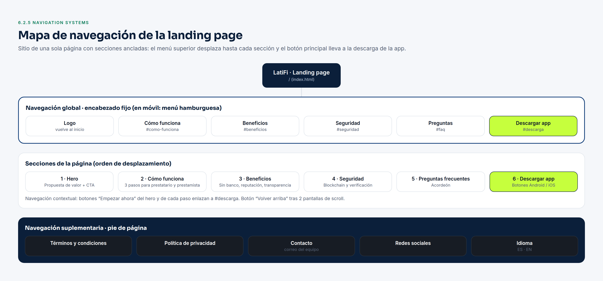

| Tipo | Elemento | Descripción |
|---|---|---|
| Global | Encabezado fijo | Logo, Cómo funciona, Beneficios, Seguridad, Preguntas y Descargar app. |
| Local | Anclas de sección | Desplazamiento suave hacia #como-funciona, #beneficios, #seguridad, #faq y #descarga. |
| Contextual | Botones “Empezar ahora” | Aparecen en el hero y en cada paso, y llevan a la sección de descarga. |
| Contextual | Botón “Volver arriba” | Aparece tras dos pantallas de desplazamiento. |
| Suplementaria | Pie de página | Términos y condiciones, política de privacidad, contacto, redes sociales y selector de idioma. |

Trazabilidad: la landing responde a las historias US-LAND-01 y US-LAND-02.

### 6.3. Landing Page UI Design

#### 6.3.1. Landing Page Wireframe
> **Trazabilidad:** La landing page responde a las historias de usuario **US-LAND-01** y **US-LAND-02**.

#### 6.3.1. Landing Page Wireframe
A continuación, se presenta el diseño estructural de baja fidelidad (Wireframe) de la landing page de la plataforma, el cual define la distribución espacial, la jerarquía de la información y la disposición de los componentes clave antes de la aplicación de la interfaz gráfica final. El diseño se ha estructurado en tres secciones para asegurar su correcta visualización y legibilidad en la documentación:

* **Parte 1: Cabecera, Hero Section y Simulador de Microcrédito**
  Muestra la barra de navegación principal (*Navbar*), el título de alto impacto con la propuesta de valor del protocolo, los botones de acción rápida (*CTAs* para prestatario y prestamista) y el simulador de microcrédito interactivo en la parte superior.
  <div align="center">
    
  </div>

* **Parte 2: Flujo de Funcionamiento y Finanzas Justas**
  Detalla la sección explicativa *"¿Cómo Funciona LatiFi?"* mediante un diagrama de flujo en tres pasos secuenciales (Solicitud, Reputación y Desembolso), seguido de la comparativa de finanzas justas y las métricas de impacto social orientadas a bodegas y pequeños negocios locales.
  <div align="center">
    
  </div>

* **Parte 3: Seguridad Criptográfica, Preguntas Frecuentes (FAQ) y Footer**
  Agrupa los módulos de seguridad de grado institucional (arquitectura non-custodial y scoring híbrido), el acordeón interactivo de preguntas frecuentes para resolver fricciones del usuario, y el pie de página (*Footer*) institucional con accesos a la red de pruebas (Testnet) y documentación legal.
  <div align="center">
    
  </div>

#### 6.3.2. Landing Page Mock-up

> **Trazabilidad:** La landing page responde a las historias de usuario **US-LAND-01** y **US-LAND-02**.

#### 6.3.1. Landing Page Wireframe
*(Aquí puedes colocar el esquema o wireframe de baja fidelidad inicial)*

#### 6.3.2. Landing Page Mock-up (Parte 1: Hero & Onboarding)
Esta primera sección comprende la cabecera de la página (*Header*), el *Hero Section* con la propuesta de valor principal, el simulador de préstamos flotante y los primeros accesos directos (*CTAs*).


#### 6.3.3. Landing Page Mock-up (Parte 2: Funcionamiento y Propuesta de Valor)
La segunda sección detalla el flujo de funcionamiento de la plataforma en tres pasos clave, junto con el comparativo de finanzas justas y el impacto social en bodegas y comercio local.


#### 6.3.4. Landing Page Mock-up (Parte 3: Seguridad, FAQ y Footer)
Esta última sección muestra los estándares de seguridad criptográfica de grado institucional, el módulo de preguntas frecuentes (FAQ) interactivo y el pie de página institucional con sus respectivos enlaces legales.


### 6.4. Mobile Applications UX/UI Design

#### 6.4.1. Mobile Applications Wireframes

#### 6.4.2. Mobile Applications Wireflow

> **Trazabilidad:** Las interfaces móviles responden a las historias de usuario del flujo transaccional y de gestión de microcréditos de la aplicación.

#### 6.4.1. Onboarding y Autenticación
Esta primera sección comprende la pantalla de bienvenida (Splash/Onboarding), el inicio de sesión, el flujo de registro de cuenta nueva y la verificación o autorización segura.

* **Pantalla de Bienvenida / Onboarding:**
  <div align="center"></div>

* **Inicio de Sesión:**
  <div align="center"></div>

* **Formulario de Registro:**
  <div align="center"></div>

* **Autorización Segura (WhatsApp):**
  <div align="center"></div>

* **Firma Criptográfica:**
  <div align="center"></div>

#### 6.4.2. Dashboard Principal y Solicitud de Microcréditos
Muestra el panel de control principal del usuario con la línea de crédito aprobada, el estado de actividad y la configuración de solicitudes.

* **Dashboard General / Resumen:**
  <div align="center"></div>

* **Configuración y Solicitud de Microcrédito (Parte 1):**
  <div align="center"></div>

* **Configuración y Solicitud de Microcrédito (Parte 2):**
  <div align="center"></div>

#### 6.4.3. Reputación On-Chain, Billeteras y Perfil de Usuario
Agrupa las vistas del puntaje de reputación on-chain, la vinculación de billeteras, la selección de rol y la configuración completa del perfil.

* **Reputación Financiera On-Chain:**
  <div align="center"></div>

* **Vinculación de Billetera y Perfil Ligero:**
  <div align="center"></div>

* **Selección de Rol (Prestamista / Inversionista):**
  <div align="center"></div>

* **Perfil de Usuario y Configuración General (Parte 1):**
  <div align="center"></div>


<div style="page-break-after: always;"></div>

# Avance de Conclusiones

Con las cuatro entrevistas realizadas, tres del segmento prestatario y una del prestamista, el equipo contrasta de forma preliminar los supuestos del Capítulo I. Los tres prestatarios confirman que el crédito formal les ofrece montos bajos o les exige documentos que no tienen, y que en esos casos recurren a su familia, a juntas o a un prestamista del barrio que, en un caso, cobra cerca de 10% semanal. Eso respalda el problema de acceso al crédito formal. En el segmento prestamista, el entrevistado ya presta excedentes a conocidos con una tasa base desde el 5% mensual y ahorra en stablecoins, lo que respalda la existencia de capital ocioso dispuesto a colocarse.

Ambos segmentos coinciden en un punto que sustenta la propuesta de valor: la confianza depende de señales verificables. Los prestatarios proponen demostrar que son de fiar con pagos puntuales, calificaciones en aplicaciones de reparto o el testimonio de sus clientes y proveedores, y el prestamista exige ver préstamos anteriores y un indicador claro de cumplimiento antes de prestar a un desconocido. Los prestatarios piden además condiciones explicadas sin tecnicismos y con el costo total a la vista, y el prestamista rechaza que la plataforma custodie los fondos, lo que es coherente con la decisión de una wallet non-custodial.

Estos resultados provienen de cuatro entrevistas, por lo que no permiten generalizar. Como siguientes pasos, el equipo completará el registro de entrevistas hasta el mínimo por segmento, con prioridad en el segmento prestamista, y validará el modelo de reputación con prototipos para contrastar el resto de las hipótesis del Lean UX Canvas.

<div style="page-break-after: always;"></div>

# Bibliografía

- Gan@Más. (2025). *Inclusión financiera en Perú sube al 61.6% en el segundo trimestre de 2025*. https://revistaganamas.com.pe/inclusion-financiera-en-peru-sube-al-616-en-el-segundo-trimestre-de-2025/
- Gestión / INEI. (s.f.). *4 de cada 10 peruanos está fuera del sistema financiero*. https://gestion.pe/tu-dinero/4-de-cada-10-peruanos-esta-fuera-del-sistema-financiero-inei-prestamos-informales-noticia/
- World Bank Global Findex. (2025). *Financial inclusion at record high, but 1.3 billion still unbanked*. https://www.biia.com/financial-inclusion-at-record-high-but-1-3-billion-still-unbanked-world-bank-global-findex-2025-report/
- INEI. (2025). *Informalidad en Perú: Encuesta Permanente de Empleo Nacional*. https://gestion.pe/economia/informalidad-en-peru-cayo-pero-en-10-ciudades-la-situacion-fue-otra-como-entenderlo-empleo-en-peru-puestos-de-trabajo-inei-mercado-laboral-noticia/
- ComexPerú. (2024). *Mypes representaron el 99.7% de las empresas en Perú y más del 14% del PBI nacional en 2024*. Forbes Perú. https://forbes.pe/economia-y-finanzas/2025-07-16/mypes-representaron-el-997-de-las-empresas-en-peru-y-mas-del-14-del-pbi-nacional-en-2024/
- Infobae. (2025). *Perú supera el millón de usuarios de criptomonedas y escala al puesto 42 en el ranking mundial*. https://www.infobae.com/peru/2025/09/13/peru-supera-el-millon-de-usuarios-de-criptomonedas-y-escala-al-puesto-42-en-el-ranking-mundial/
- Forbes Perú. (2026). *Mercado cripto en Perú crece ante auge de las stablecoins*. https://forbes.pe/activos-digitales/2026-01-05/mercado-cripto-en-peru-crece-ante-auge-de-las-stablecoins-las-criptoapps-aumentan-sus-usuarios-y-la-banca-estudia-su-incursion/
- Gemini. (s.f.). *GFI Token & Goldfinch crypto loans without collateral*. https://www.gemini.com/cryptopedia/gfi-token-goldfinch-crypto-loans-without-collateral
- Goldfinch Foundation. (s.f.). *Emerging market opportunities*. Medium. https://medium.com/goldfinch-fi/emerging-market-opportunities-aa842c89b5e7
- DL News. (2026). *Goldfinch borrower Lend East defaults, says Warbler Labs*. https://www.dlnews.com/articles/defi/goldfinch-borrower-lend-east-defaults-says-warbler-labs/
- BitKE. (2026). *The Goldfinch case study*. https://bitcoinke.io/2026/06/the-goldfinch-case-study/
- Mad Devs. (s.f.). *DeFi case study: RociFi: Under-collateralized credit protocol on Polygon*. https://maddevs.io/case-studies/rocifi/
- CoinDesk. (2022). *RociFi Labs raises $2.7M to enable on-chain credit scoring for DeFi*. https://www.coindesk.com/business/2022/04/12/rocifi-labs-raises-27m-to-enable-on-chain-credit-scoring-for-defi
- CryptoTotem. (s.f.). *RociFi NFCS ratings*. https://cryptototem.com/rocifi-nfcs/
- Aave. (s.f.). *Credit Delegation*. Documentación oficial. https://aave.com/docs/aave-v3/guides/credit-delegation
- Messari. (s.f.). *Aave announces Credit Delegation, enabling uncollateralized lending*. https://messari.io/report/aave-announces-credit-delegation-enabling-uncollateralized-lending
- Yellow.com. (2026). *Decentralized lending 2026: Aave on-chain money markets*. https://yellow.com/research/decentralized-lending-2026-aave-on-chain-money-markets

<div style="page-break-after: always;"></div>

# Anexos

## Anexo A. Videos de Exposiciones

| Entrega | Enlace privado en Microsoft Stream | Archivo |
|---|---|---|
| TB1 | _Pendiente de agregar: el enlace se obtiene al publicar el video de exposición en Microsoft Stream_ | upc-pre-202401-si728-2620-9046-latifi-expo-tb1.mp4 |
